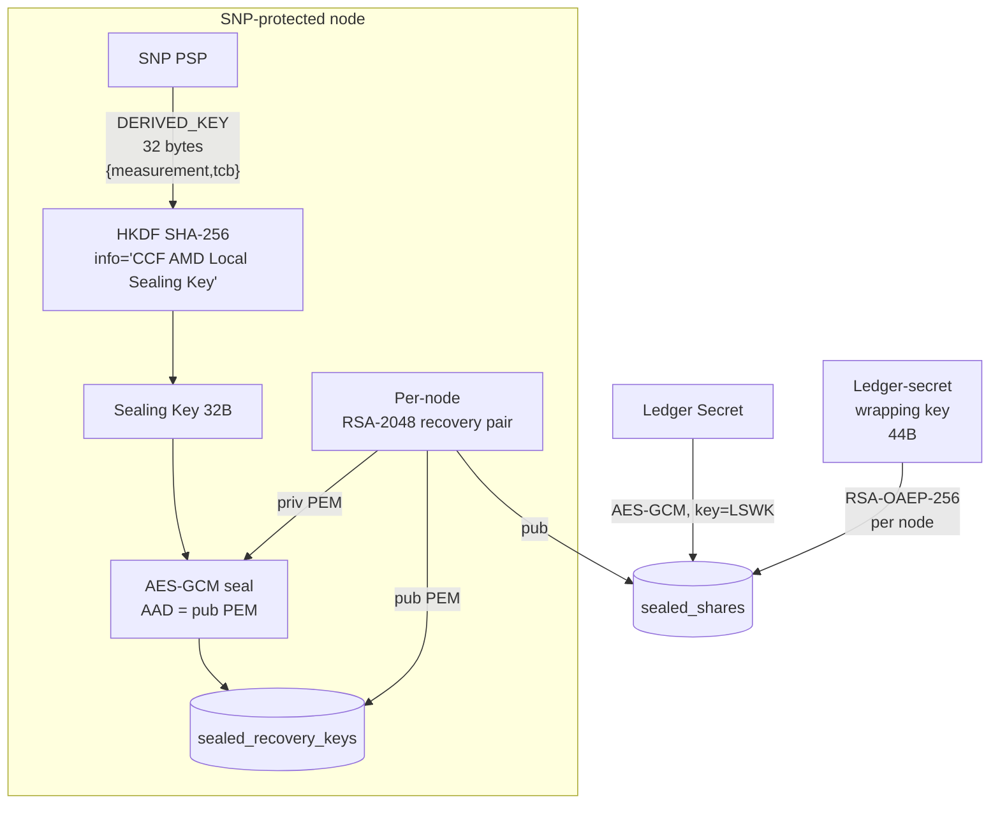

# CCF Member Identity, COSE Sign1 Governance & Recovery Shares — Deep Dive

> Companion to `ccf_identity_primer.md`. The primer sketches the four identity
> classes at a 5-minute level; this document drills into **everything an engineer
> needs to evaluate post-quantum migration** of the Member identity, the COSE
> Sign1 governance envelope, and the RSA-OAEP recovery-share machinery.
> Every claim is cited as `path/file.h:line`. Where the answer wasn't found, the
> doc says so explicitly.

---

## 1. What a Member is

A **member** is an external principal registered in the KV by governance. They
hold one or two key pairs: an EC **identity** key used to sign every governance
request, and an optional RSA **encryption** key used only to receive recovery
shares. CCF distinguishes three recovery roles:
`NonParticipant`, `Participant`, `Owner`
(`include/ccf/service/tables/members.h:25-39`).

Membership state lives in three tables:

| Purpose | Table constant | Type |
|---|---|---|
| Cert (DER-derived `MemberId` is the key) | `public:ccf.gov.members.certs` | `RawCopySerialisedMap<MemberId, Pem>` |
| Status + role + member_data | `public:ccf.gov.members.info` | `ServiceMap<MemberId, MemberDetails>` |
| Optional RSA encryption pubkey | `public:ccf.gov.members.encryption_public_keys` | `RawCopySerialisedMap<MemberId, Pem>` |

Constants are declared in
`include/ccf/service/tables/members.h:96-108`. `MEMBER_ACKS`
(`public:ccf.gov.members.acks`, `:162`) records the latest signed state-digest
ACK per member.

`MemberStatus` is just `ACCEPTED` (registered, not yet acked) or `ACTIVE`
(`include/ccf/service/tables/members.h:16-23`). Only `ACTIVE` members may
propose, vote, or submit recovery shares — see
`ActiveMemberCOSESign1AuthnPolicy`
(`include/ccf/endpoints/authentication/cose_auth.h:153-169`).

A member becomes a **recovery member** the moment a non-empty
`encryption_pub_key` is present in their KV record
(`src/service/internal_tables_access.h:79-87`). Whether they receive a *partial*
Shamir share (role `Participant`, default when key present) or a *full*
single-handed-recovery key (role `Owner`) is decided per role at share-issuing
time (`:123-185`).

---

## 2. Key generation — `python/utils/keygenerator.sh`

The reference key-generator is a small `bash` wrapper around OpenSSL. The
identity curve is `secp384r1` by default, with `secp256r1` as a `--curve`
opt-in fast option (`python/utils/keygenerator.sh:7-9`).

```bash
openssl ecparam -out "$privk" -name "$curve" -genkey                       # :77
openssl req -new -key "$privk" -x509 -nodes -days 365 \                    # :78
            -out "$cert" -"$digest" -subj=/CN="$name"
```

The digest is `sha384` for `secp384r1`, else `sha256`
(`python/utils/keygenerator.sh:64-68`). The cert is **self-signed** — CCF
itself does not chain member certs to any external CA; trust is established
solely by the `set_member` proposal accepted by the existing consortium.

With `--gen-enc-key`, the script additionally creates a 2048-bit RSA key pair
for recovery-share decryption (`python/utils/keygenerator.sh:14, 88-90`):

```bash
openssl genrsa -out "$enc_priv" "$RSA_SIZE"   # RSA_SIZE=2048
openssl rsa -in "$enc_priv" -pubout -out "$enc_pub"
```

The script **only** supports `secp384r1` and `secp256r1`
(`python/utils/keygenerator.sh:8-9, 59-62`); `secp521r1` is accepted by the
server-side COSE verifier (see §5) but the helper does not generate one. There
is no Ed25519 path for members today.

---

## 3. Registration — `set_member`

`set_member` is the governance action that registers a member. Its JS
implementation lives in
`samples/constitutions/default/actions.js:417-486`. Apply phase (`:443-485`):

```js
const memberId = ccf.pemToId(args.cert);                                  // :444
const rawMemberId = ccf.strToBuf(memberId);
ccf.kv["public:ccf.gov.members.certs"].set(rawMemberId,                   // :447
                                            ccf.strToBuf(args.cert));
if (args.encryption_pub_key == null) {                                    // :452
  ccf.kv["public:ccf.gov.members.encryption_public_keys"].delete(rawMemberId);
} else {
  ccf.kv["public:ccf.gov.members.encryption_public_keys"].set(            // :457
    rawMemberId, ccf.strToBuf(args.encryption_pub_key));
}
// member_info = { member_data, recovery_role, status: "Accepted" }       // :463-470
ccf.kv["public:ccf.gov.members.acks"].set(rawMemberId, ...);              // :475-484
```

The validator (`:419-441`) enforces that `encryption_pub_key == null` is
incompatible with any non-default `recovery_role`. Note that
`set_member` is **idempotent on cert** but expressed at the JS level — the C++
helper `InternalTablesAccess::add_member`
(`src/service/internal_tables_access.h:187-264`) implements the same logic for
non-governance call sites (e.g. service creation).

### MemberId derivation

`ccf.pemToId` is a QuickJS binding to
`src/js/extensions/ccf/converters.cpp:166-197`. Concretely the member ID is the
hex of **SHA-256 of the DER-encoded certificate**:

```cpp
auto pem = ccf::crypto::Pem(*pem_str);
auto der = ccf::crypto::make_verifier(pem)->cert_der();
auto id  = ccf::crypto::Sha256Hash(der).hex_str();              // :186-188
```

The same formula is reused in
`src/service/internal_tables_access.h:194-196`. Note: this is the **cert
fingerprint**, *not* the SPKI fingerprint — a member who rotates their cert
keeps no continuity of `MemberId` (this is by design, since the new cert may
also rotate the key).

> NB: `cose.py` ships *both* helpers — `cert_fingerprint`
> (`python/src/ccf/cose.py:82-84`, SHA-256 of full cert, matches the
> `MemberId`) and `key_fingerprint_from_cert` (`:87-92`, SHA-256 of SPKI). The
> first is what the server's `kid` lookup expects (see §5).

---

## 4. Activation — `state_digest` ↔ `ack`

A newly-registered member is `ACCEPTED`. They become `ACTIVE` by acknowledging
the current Merkle-tree root, in a two-step flow. All endpoints live under the
`/gov` actor prefix (`src/ds/actors.h:24-31`).

### Step A: refresh state digest

`POST /gov/members/state-digests/{memberId}:update`
(`src/node/gov/handlers/acks.h:156-163`) is protected by
`MemberCOSESign1AuthnPolicy("state_digest")` (`:161`). Handler
(`:76-155`):
- Reads the current serialised Merkle tree from
  `public:ccf.internal.tree` and computes the root hex (`:130-145`).
- Writes `{ state_digest: <hex> }` into `MEMBER_ACKS` for this member.
- Returns the same digest to the caller.

### Step B: ack the digest

`POST /gov/members/state-digests/{memberId}:ack`
(`src/node/gov/handlers/acks.h:317-324`) — auth =
`MemberCOSESign1AuthnPolicy("ack")`. Payload must contain
`{ "stateDigest": "<hex>" }` (`:223-241`), which the handler checks against the
expected digest in `MEMBER_ACKS`. On match (`:247-251`):

```cpp
ack->cose_sign1_req = std::vector<uint8_t>(
    cose_ident.envelope.begin(), cose_ident.envelope.end());
acks_handle->put(member_id, ack.value());
```

The **entire signed COSE Sign1 envelope** is persisted in `MEMBER_ACKS` as
non-repudiable proof of acceptance.

The handler then calls
`InternalTablesAccess::activate_member`
(`src/service/internal_tables_access.h:266-283`) which sets `MemberStatus` to
`ACTIVE`. If activation is a *transition* and the member is a recovery
participant/owner *and* the service is `OPEN`, the handler immediately calls
`share_manager.shuffle_recovery_shares(ctx.tx)`
(`src/node/gov/handlers/acks.h:272-307`) to issue them a share without waiting
for the next rekey.

```mermaid
sequenceDiagram
    participant M as Member
    participant CCF as CCF /gov
    Note over M,CCF: registered via set_member (status=Accepted)
    M->>CCF: POST :update  (COSE Sign1, type=state_digest)
    CCF-->>M: 200 OK { stateDigest: <Merkle root> }
    Note over M: sign { "stateDigest": <root> }
    M->>CCF: POST :ack  (COSE Sign1, type=ack)
    CCF->>CCF: verify digest matches KV;<br/>store envelope in MEMBER_ACKS;<br/>activate_member()
    CCF-->>M: 204 No Content
    Note over CCF: if recovery member + service OPEN,<br/>shuffle_recovery_shares()
```

---

## 5. The COSE Sign1 envelope (governance flavour)

Every state-mutating governance call is delivered as a single CBOR
`COSE_Sign1` document (RFC 9052) sent with `Content-Type: application/cose`
(`src/endpoints/authentication/cose_auth.cpp:244-249`).

### Protected header

Three custom string-keyed claims live in the protected header alongside the
standard `alg` (label 1) and `kid` (label 4)
(`src/endpoints/authentication/cose_auth.cpp:27-31`):

```
ccf.gov.msg.type         (string, e.g. "proposal")
ccf.gov.msg.proposal_id  (string, hex; only for ballot/withdrawal)
ccf.gov.msg.created_at   (signed int, unix epoch seconds; non-negative)
```

The Python signer attaches them as a plain dict that is folded into the
protected header (`python/src/ccf/cose.py:362-367, 389-394`):

```python
protected_header = {"ccf.gov.msg.type": args.ccf_gov_msg_type}
if args.ccf_gov_msg_proposal_id:
    protected_header["ccf.gov.msg.proposal_id"] = args.ccf_gov_msg_proposal_id
created_at = datetime.fromisoformat(args.ccf_gov_msg_created_at)
protected_header["ccf.gov.msg.created_at"] = int(created_at.timestamp())
```

`kid` is computed by `cose.py` as the **SHA-256 of the full PEM cert** (lower-
case hex string, encoded as a CBOR byte-string)
(`python/src/ccf/cose.py:82-84, 108, 111, 126-131`). This is exactly the
`MemberId`, so the server uses `kid` directly as a lookup key into
`MEMBER_CERTS` (`src/endpoints/authentication/cose_auth.cpp:261-263`):

```cpp
auto* member_certs = tx.ro(members_certs_table);
auto member_cert = member_certs->get(phdr.kid);
```

### Allowed signature algorithms

CCF accepts ECDSA only. The on-server gate is
`ccf::cose::is_ecdsa_alg` (`src/node/cose_common.h:22-30`):

```cpp
constexpr int COSE_ALGORITHM_ES256 = -7;
constexpr int COSE_ALGORITHM_ES384 = -35;
constexpr int COSE_ALGORITHM_ES512 = -36;
return cose_alg == COSE_ALGORITHM_ES256
    || cose_alg == COSE_ALGORITHM_ES384
    || cose_alg == COSE_ALGORITHM_ES512;
```

It is rejected explicitly in `cose_auth.cpp:255-259` and again at
`:399-401`. **EdDSA / Ed25519 is not accepted** for member auth despite the COSE
spec defining `alg=-8`; PS256/PS384/PS512 are recognised as RSA in
`is_rsa_alg` (`src/node/cose_common.h:32-40`) but are never used for member
verification. The Python `default_algorithm_for_key`
(`python/src/ccf/cose.py:57-72`) maps secp256r1→ES256, secp384r1→ES384,
secp521r1→ES512 and `raise NotImplementedError("unsupported key type")` for
everything else.

### Payload

The payload bytestring is the **literal** governance content: a JSON proposal
body, a JS ballot source string, the `{stateDigest:…}` ack body, or a
`{share:"<b64>"}` recovery-share body. The COSE Sign1 is *attached* (the
payload is in the envelope, not detached) —
`COSEVerifier::verify_decomposed` is used so the server can verify against an
already-parsed payload+phdr without re-serialising
(`src/crypto/openssl/cose_verifier.cpp:239-264`,
 `src/endpoints/authentication/cose_auth.cpp:269-273`).

### Verification path

```
HTTP POST  → MemberCOSESign1AuthnPolicy::authenticate (cose_auth.cpp:231)
            └─ extract_governance_protected_header_and_signature (:41-130)
            └─ is_ecdsa_alg gate (:255)
            └─ MEMBER_CERTS lookup by kid (:262-263)
            └─ make_cose_verifier_from_pem_cert (include/ccf/crypto/cose_verifier.h:34)
                 └─ COSECertVerifier_OpenSSL (src/crypto/openssl/cose_verifier.cpp:119-132)
                    └─ Rust FFI verify (cose_rs_ffi::cose_verify1, :176-185)
            └─ check phdr.gov_msg_type == expected gov_msg_type (:285-303)
            └─ return MemberCOSESign1AuthnIdentity (:306-312)
```

The actual ECDSA verification is delegated to the in-tree **Rust** crate
referenced via `cose/cose_rs_ffi.h`
(`src/crypto/openssl/cose_verifier.cpp:6`), invoked through `cose_verify1`
(`:176-185, 213-222, 248-257`). The crate's internals are out of scope here; for
this doc treat it as "an external library that returns 0 on success", but be
aware it is *another* place that hard-codes the supported algorithm set.

### Signer side

Three CLI entry points are installed by the `ccf` Python package
(`python/pyproject.toml:37-39`):

| CLI | Function | Use case |
|---|---|---|
| `ccf_cose_sign1` | `sign_cli` (`cose.py:343-370`) | Local PEM private key |
| `ccf_cose_sign1_prepare` | `prepare_cli` (`:373-397`) | Returns digest to sign offline |
| `ccf_cose_sign1_finish` | `finish_cli` (`:400-429`) | Bolts an externally-produced signature onto the envelope |

`create_cose_sign1` (`:101-116`) uses `cwt.COSE.new(alg_auto_inclusion=True,
deterministic_header=True)` and forces `kid` into the **protected** header
(deterministic encoding via
`cwt.utils.sort_keys_for_deterministic_encoding`, `:133, 159`). The
prepare/finish split allows the digest to be sent to AKV without ever
exposing the private key — see §12.

---

## 6. `ccf-gov-msg-type` catalogue

The signer accepts seven values (`python/src/ccf/cose.py:34-42`):

| `ccf.gov.msg.type` | Required `proposal_id`? | Endpoint | Handler citation |
|---|---|---|---|
| `proposal` | no | `POST /gov/members/proposals:create` | `src/node/gov/handlers/proposals.h:673-678` |
| `withdrawal` | **yes** | `POST /gov/members/proposals/{proposalId}:withdraw` | `proposals.h:768-773` |
| `ballot` | **yes** | `POST /gov/members/proposals/{proposalId}/ballots/{memberId}:submit` | `proposals.h:1066-1071` |
| `state_digest` | no | `POST /gov/members/state-digests/{memberId}:update` | `acks.h:156-163` |
| `ack` | no | `POST /gov/members/state-digests/{memberId}:ack` | `acks.h:317-324` |
| `recovery_share` | no | `POST /gov/recovery/members/{memberId}:recover` | `recovery.h:218-225` |
| `encrypted_recovery_share` | no | **(legacy)** — present in the Python `GOV_MSG_TYPES` list but **no current handler** in `src/` references it. The `GET …/encrypted-shares/{memberId}` endpoint is `no_auth_required` (`recovery.h:61`), so today this label is dead weight. |

Server-side enforcement of "expected `gov_msg_type`" is performed by passing
the literal string to `MemberCOSESign1AuthnPolicy` /
`ActiveMemberCOSESign1AuthnPolicy` at endpoint registration time, via the
`member_sig_only_policies(...)` /
`active_member_sig_only_policies(...)` helpers
(`src/node/gov/handlers/helpers.h:11-20`). The check itself is at
`cose_auth.cpp:285-303`.

> Implication for PQC: every callable governance endpoint is statically
> coupled to **one** message type, but the `alg` allowed within that envelope
> is set globally by `is_ecdsa_alg`. There is no per-msg-type policy enforcing
> "must use ES384" — that's the *signer*'s choice driven by the key type.

---

## 7. Proposal / ballot lifecycle

### Create

`POST /gov/members/proposals:create` (auth: active member, `gov_msg_type =
"proposal"`, `proposals.h:677`).

The proposal ID is derived in `create_proposal`
(`src/node/gov/handlers/proposals.h:413-452`):

```cpp
auto root_at_read = ctx.tx.get_root_at_read_version();         // :431
auto hasher = ccf::crypto::make_incremental_sha256();          // :442
hasher->update_hash(root_at_read.value().h);
request_digest = ccf::crypto::sha256(cose_ident.signature.data(),
                                     cose_ident.signature.size());
hasher->update_hash(request_digest);
const ccf::crypto::Sha256Hash proposal_hash = hasher->finalise();
proposal_id = proposal_hash.hex_str();
```

So `proposal_id = SHA256( merkle_root_at_read || SHA256(cose_signature) )` —
binding the proposal both to the ledger state it observed and to the signer's
ECDSA signature blob. Replay protection is enforced by
`validate_proposal_submission_time` (`:33-100`), which writes to
`public:ccf.gov.cose_recent_proposals` keyed by
`"<created_at>:<request_digest>"` with a rolling sliding window
(`src/service/tables/governance_history.h:22-26`).

The full envelope is stored in `public:ccf.gov.cose_history`
(`record_cose_governance_history`, `proposals.h:101-110`;
`COSEGovernanceHistory` table at
`src/service/tables/governance_history.h:17-21`).

### Validate + resolve

Both the validator and the resolver are JavaScript functions exported from the
**constitution** module (`samples/constitutions/default/actions.js` and
`resolve.js`). The proposal body is passed to `validate(...)`
(`proposals.h:471-481`), then `resolve_proposal`
(`proposals.h:137-280`) iterates the ballots:

```cpp
for (const auto& [mid, mb] : proposal_info.ballots) {                      // :161
  auto ballot_func = js_context.get_exported_function(mb, "vote", ...);    // :165
  auto val = js_context.call_with_rt_options(ballot_func, argv, ...);      // :178
  if (!val.is_exception()) votes[mid] = val.is_true();                     // :184-186
}
// then call resolve(proposal_body, proposer_id, votes, proposal_id)        // :207-242
```

The resolver returns one of `"Open"`, `"Accepted"`, `"Rejected"`
(`:261-265`); any other value yields `FAILED` (`:271-279`).

### Ballot

`POST /gov/members/proposals/{proposalId}/ballots/{memberId}:submit`
(`proposals.h:1066-1071`, `gov_msg_type = "ballot"`). The handler
(`:902-1070`) verifies that the URL `memberId` and `proposalId` match the
COSE-signed `kid` and the `ccf.gov.msg.proposal_id` protected header
(`try_parse_signed_proposal_id`,
`src/node/gov/handlers/helpers.h:198-223`). The ballot body is the literal JS
source of the voter's `vote(proposal, proposer_id)` function, stored verbatim
in the proposal's `ballots[memberId]` slot (`proposals.h:1027-1029`) and
re-executed by `resolve_proposal` on every subsequent vote.

> Each ballot's COSE Sign1 is **verified once at submission time**, against the
> submitting member's cert; thereafter only the *JS source* of the ballot is
> kept, and the proposal resolver re-evaluates it on each future state change.
> The ballot signatures themselves are persisted in
> `public:ccf.gov.cose_history` keyed by `MemberId`
> (`src/service/tables/governance_history.h:17-21`,
> `proposals.h:101-110`) — note this is *one slot per member*, so a member's
> earlier ballot envelope is overwritten by their later one.

```mermaid
flowchart LR
    P[Member A] -- COSE Sign1<br/>type=proposal --> C[/gov/.../create]
    C --> Store[(public:ccf.gov.cose_history)]
    P -- COSE Sign1<br/>type=ballot --> B1[/gov/.../ballots/A:submit]
    M2[Member B] -- COSE Sign1<br/>type=ballot --> B2[/gov/.../ballots/B:submit]
    B1 --> Res{resolve()<br/>JS}
    B2 --> Res
    Res -- Open --> Wait[Wait for more]
    Res -- Accepted --> Apply[Run apply() actions]
    Res -- Rejected --> Done
```

---

## 8. Recovery members & encryption keys

A registered member is treated as a recovery member purely by the presence of a
row in `MEMBER_ENCRYPTION_PUBLIC_KEYS`
(`src/service/internal_tables_access.h:79-87`):

```cpp
static bool is_recovery_participant_or_owner(
    ccf::kv::ReadOnlyTx& tx, const MemberId& member_id) {
  auto* member_encryption_public_keys =
      tx.ro<ccf::MemberPublicEncryptionKeys>(
          Tables::MEMBER_ENCRYPTION_PUBLIC_KEYS);
  return member_encryption_public_keys->get(member_id).has_value();
}
```

The role distinction is then read out of `MemberInfo.recovery_role`
(`:96-108`). Owners get the *full* secret; Participants get one Shamir share
each (see §9).

The encryption pubkey is delivered with `set_member` in the
`encryption_pub_key` field of `NewMember`
(`include/ccf/service/tables/members.h:41-73`). It is a PEM-encoded RSA public
key (in practice RSA-2048 because that is what the helper script emits and what
AKV's `RSA-OAEP-256` decrypt operation expects, §10/§12) — but no enforced size
check exists in the C++ side: the JS validator only `// Also check that
public encryption key is well formed, if it exists` (literally a TODO,
`samples/constitutions/default/actions.js:440`).

> **TODO: not found** — there is no current code path that rejects, say, an
> RSA-4096 or an EC encryption-pubkey at `set_member` time. The constraint is
> enforced implicitly by what the share-encryption code can do
> (`make_rsa_public_key`, `rsa_oaep_wrap`); a non-RSA pubkey would throw at
> share-issuing time, not at registration time.

---

## 9. Recovery-share generation & encryption

### Secret-sharing — the "simplified" implementation (4.0.9+)

CCF 4.0.9 swapped its old GF(2^n) Shamir implementation for the present
plain-arithmetic prime-field version (`CHANGELOG.md:1269`). The current code
is `src/crypto/sharing.{h,cpp}`:

* The field is **F_p** with the Mersenne prime `p = 2^31 - 1`
  (`src/crypto/sharing.cpp:21-23`).
* A "raw" secret carries `LIMBS = 10` 31-bit field elements, yielding ≥256
  bits of entropy with ~80 bits of margin (`src/crypto/sharing.h:21-22`).
* `Share` is `{ uint32_t x; uint32_t y[10] }`, total **44 bytes**
  serialised (`:25-31, 30`). `x == 0` denotes a *full key*; `x != 0` denotes a
  *partial share at coordinate x* (`:26-27`, `share_manager.h:399-403,
  616-628`).
* `sample_secret_and_shares(secret, shares, threshold)` populates the secret
  and shares (`sharing.h:111-112`).
  `recover_unauthenticated_secret(secret, shares, threshold)` reconstructs
  (`:126-127`). Reconstruction is unauthenticated — anyone holding `t` valid
  shares can recompute `secret`.

The 32-byte AES key for ledger-secret wrapping is derived from the raw secret
via HKDF-SHA256 with `info = "CCF Wrapping Key v1"`
(`sharing.h:23, 41-53`):

```cpp
[[nodiscard]] HashBytes key(size_t key_size) const {
  if (x != 0) throw std::invalid_argument("Cannot derive a key from a partial share");
  const std::span<const uint8_t> ikm(reinterpret_cast<const uint8_t*>(y), sizeof(y));
  const std::span<const uint8_t> label(reinterpret_cast<const uint8_t*>(y), sizeof(y));
  return ccf::crypto::hkdf(MDType::SHA256, key_size, ikm, {}, label);
}
```

Note the curiosity: the HKDF *info* parameter at this call site is the raw `y`
limbs (the same as the IKM), **not** the string `key_label` declared above
(`sharing.h:23`). The string-label is unused here. Don't be misled by the
naming.

### Wrapping the ledger secret

`SharedLedgerSecretWrappingKey::wrap` (`src/node/share_manager.h:73-104`)
takes a `LedgerSecretPtr`, derives a 32-byte AES-GCM key
(`KZ_KEY_SIZE = GCM_DEFAULT_KEY_SIZE`, `:27`), and encrypts with a
**zero IV** (`:88`) — safe only because the key is freshly sampled and used
exactly once (the class throws if `wrap()` is called twice, `:75-78`).

### Per-recipient RSA-OAEP

`compute_encrypted_shares` (`share_manager.h:173-215`) walks
`get_active_recovery_participants(tx)` and writes
`encrypted_shares[member_id] = member_enc_pubk->rsa_oaep_wrap(raw_share);`
for each participant. For each *owner*, it serialises the full secret share
(`x == 0`, 44 bytes) and OAEP-wraps that instead (`:195-212`).

The OAEP parameters are hard-coded in
`src/crypto/openssl/rsa_public_key.cpp:125-141`:

```cpp
Unique_EVP_PKEY_CTX ctx(key);
CHECK1(EVP_PKEY_encrypt_init(ctx));
CHECKPOSITIVE(EVP_PKEY_CTX_set_rsa_padding(ctx, RSA_PKCS1_OAEP_PADDING));
CHECKPOSITIVE(EVP_PKEY_CTX_set_rsa_oaep_md(ctx, EVP_sha256()));
CHECKPOSITIVE(EVP_PKEY_CTX_set_rsa_mgf1_md(ctx, EVP_sha256()));
// optional OAEP label (unused for recovery shares)
```

i.e. **RSA-OAEP-256 with MGF1-SHA256**, no label. The default RSA key size is
declared as `default_rsa_public_key_size = 2048`
(`include/ccf/crypto/rsa_key_pair.h:44`) and that is what
`make_rsa_key_pair()` produces on the sealing path (`local_sealing.cpp:93`).
Members' encryption keys are *not* generated by CCF — they come from outside
via PEM — so the actual modulus size is whatever `set_member` accepted.

### Re-shuffling

`ShareManager::shuffle_recovery_shares(tx)` (`share_manager.h:217-280, 492-495`)
discards the previous wrapping key, samples a fresh one, re-wraps the *same*
ledger secret, recomputes per-member encrypted shares, and writes
`{wrapped_latest_ledger_secret, encrypted_shares, previous_secret_stored_version}`
into `RecoveryShares` (`public:ccf.internal.recovery_shares`,
`src/service/tables/shares.h:114, 122`). It is called on every:

* member set change that adds/removes a recovery member
  (`acks.h:295`, `actions.js:543` via `triggerLedgerRekey`);
* `issue_recovery_shares` (which is itself called on service open, on rekey,
  and on recovery completion — `node_state.h:1891, 2154, 2406`);
* `set_recovery_threshold` action.

`set_recovery_shares_info` (`share_manager.h:282-334`) is what wires
everything together — it calls both `shuffle_recovery_shares` (for ordinary
member shares) **and** `sealing::shuffle_sealed_shares` (for the SNP sealing
path, §11) in the same transaction (`:294, :298`). So every ordinary rekey
*also* rebuilds the sealed shares.

```mermaid
flowchart TB
    LS[Ledger Secret]
    WK[Fresh Wrapping Key<br/>= HKDF(secret, 32B)]
    SS[Shamir Shares<br/>n of t<br/>44B each]
    OWN[Full-key Share<br/>x=0]
    LS -- AES-GCM zero-IV --> W[wrapped_latest_ledger_secret]
    WK -- split --> SS
    WK -- full --> OWN
    SS -- per-Participant<br/>RSA-OAEP-256 --> ES[encrypted_shares]
    OWN -- per-Owner<br/>RSA-OAEP-256 --> ES
    W --> Tab[(public:ccf.internal.recovery_shares)]
    ES --> Tab
```

---

## 10. Recovery-share retrieval & submission

### Retrieval

`GET /gov/recovery/encrypted-shares/{memberId}`
(`src/node/gov/handlers/recovery.h:56-63`).

```cpp
.make_read_only_endpoint(
    "/recovery/encrypted-shares/{memberId}",
    HTTP_GET,
    api_version_adapter(get_encrypted_share_for_member),
    ccf::no_auth_required)        // intentionally unauthenticated
```

The body of the encrypted share is read out of the `SHARES` value
(`ShareManager::get_encrypted_share`, `share_manager.h:497-515`) and returned
base64-encoded as `{"memberId": ..., "encryptedShare": "..."}`. Because the
ciphertext is only decryptable by the member's RSA private key (which lives
outside the service), there is no harm in this endpoint being unauthenticated,
and it is reachable while the service is in `WAITING_FOR_RECOVERY_SHARES`
status when TLS is the only available transport authentication.

### Submission

The reference flow is `python/utils/submit_recovery_share.sh`:

```bash
# Compute member_id locally (must match cert SHA-256 fingerprint)
member_id=$(openssl x509 -in "$member_id_cert" -noout -fingerprint -sha256 \   # :76
             | cut -d "=" -f 2 | sed 's/://g' | awk '{print tolower($0)}')

encrypted_share=$(curl ... "${node}/${get_share_path}" \                       # :83
                    | jq -r ".encryptedShare")

echo "${encrypted_share}" \
  | openssl base64 -d \
  | openssl pkeyutl -inkey "${member_enc_privk}" -decrypt \                    # :89
        -pkeyopt rsa_padding_mode:oaep -pkeyopt rsa_oaep_md:sha256 \
  | openssl base64 -A | jq -c -R '{share: (.)}' \
  | ccf_cose_sign1 --ccf-gov-msg-type recovery_share \                         # :91
                   --ccf-gov-msg-created_at "$(date -uIs)" \
                   --signing-key "${member_id_privk}" \
                   --signing-cert "${member_id_cert}" --content "-" \
  | curl -H "Content-Type: application/cose" \
         -X POST "${node}/${submit_share_path}" --data-binary @-
```

The endpoint hit is `POST /gov/recovery/members/{memberId}:recover`
(`src/node/gov/handlers/recovery.h:218-225`, auth =
`ActiveMemberCOSESign1AuthnPolicy("recovery_share")`). Handler (`:65-216`):

* Refuses unless service is `WAITING_FOR_RECOVERY_SHARES` (`:72-82`).
* Parses the COSE-Sign1 payload as `{"share": "<base64>"}` (`:130-131`).
* Calls `share_manager.submit_recovery_share` which AES-GCM-encrypts the share
  with the current ledger secret and stores it in
  `public:ccf.internal.encrypted_submitted_shares`
  (`share_manager.h:634-654`,
  `src/service/tables/submitted_shares.h:17-25`).
* When the share count reaches `recovery_threshold`, or any Owner submits a
  full share (`x == 0` after decrypt), the handler triggers
  `node_operation->initiate_private_recovery(ctx.tx)` (`:179-204`). The
  combine step is `combine_from_encrypted_submitted_shares`
  (`share_manager.h:376-447`) which short-circuits on the first full share
  and otherwise reconstructs via `recover_unauthenticated_secret`.

> **Note:** as of CCF 5.0 (CHANGELOG line 1218/1470) this endpoint is
> COSE-Sign1 authenticated — earlier releases accepted it unauthenticated, but
> that was a DoS vector. PQC migration must keep that authentication.

---

## 11. Sealing-based recovery (experimental, SNP-only)

The sealing path lets an SNP node recover the ledger by itself without any
member's RSA private key, by deriving a sealing key purely from hardware-rooted
material. It was added experimentally per CHANGELOG line 131 (`#7189, #7554,
#7679`).

### Step 1 — Per-node RSA recovery key, sealed at join

When a node is added to the service, the host calls
`get_snp_sealed_recovery_key(tcb_version)`
(`src/node/local_sealing.cpp:88-113`):

```cpp
auto derived_key = derive_snp_sealing_key(tcb_version);                  // :91
auto recovery_key_pair = crypto::make_rsa_key_pair();                     // :93  (RSA-2048)
auto recovery_pubkey  = recovery_key_pair->public_key_pem();              // :94
auto recovery_privkey = recovery_key_pair->private_key_pem();
crypto::GcmCipher sealed_key = aes_gcm_sealing(                           // :100
    derived_key, plaintext=recovery_privkey, aad=recovery_pubkey);
```

The sealing **AAD is the pubkey PEM**, which authenticates the binding between
the sealed private key and the public half written into the KV. Result is a
`SealedRecoveryKey { version: SNP_v1, ciphertext, pubkey, tcb_version }`
(`src/service/tables/local_sealing.h:39-54`,
 `ccf::DerivedSealingKeyAlgorithm::SNP_v1`,
 `src/node/local_sealing.cpp:102-106`). The whole struct is stored in
`public:ccf.gov.nodes.sealed_recovery_keys`
(`src/service/tables/local_sealing.h:52-53`).

### Step 2 — Sealing-key derivation

`derive_snp_sealing_key` (`local_sealing.cpp:74-86`):

```cpp
auto derived_key = ccf::pal::snp::make_derived_key(tcb_version);   // 32 bytes from PSP
std::vector<uint8_t> salt;
std::vector<uint8_t> info(LOCAL_SEALING_LABEL.begin(),
                          LOCAL_SEALING_LABEL.end());
auto sealing_key = crypto::hkdf(MDType::SHA256, 32,
                                derived_key->get_raw(), salt, info);
```

with `LOCAL_SEALING_LABEL = "CCF AMD Local Sealing Key"`
(`src/node/local_sealing.h:12`). The `make_derived_key` underlying call hits
the SEV-SNP PSP via the `/dev/sev-guest`
`SEV_SNP_GUEST_MSG_DERIVED_KEY` IOCTL
(`include/ccf/pal/snp_ioctl6.h:134-339`), with
`guest_field_select = MEASUREMENT | TCB_VERSION` (`:294-296`). The returned
material is **32 bytes** (`DerivedKeyResp.data[32]`, `:152-155`).

> The derived key thus depends on: the launch **MEASUREMENT**, the requested
> **TCB_VERSION**, the VCEK (implicitly), `VMPL`, `GUEST_SVN`, and the
> per-CPU root key — all properties of the *current* TEE, none of them
> recoverable outside the chip. The HKDF salt is empty.

### Step 3 — Per-node ledger-secret wrap

In the same transaction that issues ordinary recovery shares,
`set_recovery_shares_info` also calls `sealing::shuffle_sealed_shares`
(`share_manager.h:298`, `local_sealing.cpp:146-156`):

```cpp
auto ls_wrapping_key = SharedLedgerSecretWrappingKey(1, 1);              // 1-of-1
auto wrapped_latest_ls = ls_wrapping_key.wrap(latest_ledger_secret);
auto* sealed_ledger_secrets = tx.rw<SealedShares>(Tables::SEALED_SHARES);
sealed_ledger_secrets->put(
    { wrapped_latest_ls,
      compute_encrypted_sealed_shares(tx, ls_wrapping_key),               // :115-144
      latest_ledger_secret->previous_secret_stored_version });
```

`compute_encrypted_sealed_shares` then walks every *trusted* node and, where a
`SealedRecoveryKey` exists, **RSA-OAEP-wraps the 44-byte full share with the
node's sealed-recovery pubkey** (`:130-138`). Output goes into
`public:ccf.internal.sealed_shares`
(`src/service/tables/local_sealing.h:39, 49`).

### Step 4 — Unsealing on recovery

`unseal_share` (`local_sealing.cpp:170-209`):

1. Re-derive the sealing key from the *recorded* TCB version
   (`derive_snp_sealing_key(sealed_recovery_key.tcb_version)`, `:188-190`).
2. AES-GCM-unseal the RSA private key (`unseal_recovery_key`, `:158-168`),
   verifying the AAD (the pubkey PEM, `:162`).
3. `rsa_oaep_unwrap` the sealed share (`:201`).
4. Reconstruct the wrapping key from that full share and `unwrap` the latest
   ledger secret (`ReconstructedLedgerSecretWrappingKey`,
   `share_manager.h:107-155`).

### Reseal-on-rekey

Because `set_recovery_shares_info` calls `shuffle_sealed_shares` on **every**
share-issuing event (`share_manager.h:294, 298`), and `issue_recovery_shares`
is itself called on every ledger rekey
(`node_state.h:2406`), **the sealed shares are rebuilt whenever the ledger is
rekeyed**. The sealing key itself does not change (it is purely a function of
`{measurement, tcb_version, …}`), but the *wrapped* ledger secret does. The
per-node RSA *recovery key pair* persists across rekeys — it is generated once
at join time and stored in `sealed_recovery_keys` until the node retires.

The constitution mention in CHANGELOG ("updated to reseal whenever a node is
added", `CHANGELOG.md:131`) refers to triggering this code path for new nodes;
the per-node RSA key itself is generated on join.



---

## 12. HSM integration (Azure Key Vault)

Documented end-to-end in `doc/governance/hsm_keys.rst`. Member identity keys are
generated as a Key Vault **certificate** on `secp384r1`
(`doc/governance/hsm_keys.rst:19-27`) and the RSA encryption key as a Key Vault
**key** with `--kty RSA --ops decrypt` (`:34-40`, defaults to 2048-bit because
`--key-size` isn't specified).

### Sign

Because AKV does not expose the private key, signing is split into two CCF
Python tools:

* `ccf_cose_sign1_prepare` (`python/src/ccf/cose.py:119-141, 373-397`) writes
  to stdout a JSON object `{ "alg": <int>, "value": <base64-of-digest> }`
  containing the hash of the COSE `Sig_structure` (`["Signature1", phdr, b"",
  payload]`, `:135`). The `alg` is set from
  `default_algorithm_for_key(cert.public_key())` — for secp384r1 that's
  `ES384` (i.e. integer `-35`).
* `ccf_cose_sign1_finish` (`:144-168, 400-429`) reads back a JSON file
  containing the AKV-returned signature in the `value` field, base64-url-
  decodes it (`:162`), and bolts it onto the envelope as the COSE Sign1 final
  CBOR tuple (`CBORTag( COSE_SIGN_1 tag, [phdr_encoded, {}, payload, sig] )`,
  `:163-168`).

The AKV signature is requested via the REST API
(`doc/governance/hsm_keys.rst:97-101`):

```bash
curl -X POST $IDENTITY_AKV_KID/sign?api-version=7.1 \
     --data @tbs \                          # the JSON {"alg":"ES384","value":<b64>}
     -H "Authorization: Bearer ${AZ_TOKEN}" \
     -H "Content-Type: application/json" > signature
```

> The doc snippet renders the `"alg"` field as the string `"ES384"`
> (`hsm_keys.rst:95`) because that is what AKV's REST API expects. The
> in-process Python code path actually emits the *integer* value (e.g. -35)
> in the prepare output (`cose.py:141`) — AKV happens to accept either form,
> but a custom HSM integration must translate.

### Decrypt recovery share

The AKV decrypt path uses the algorithm name `RSA-OAEP-256` directly
(`doc/governance/hsm_keys.rst:144`):

```bash
az keyvault key decrypt --vault-name $VAULT_NAME --name $ENCRYPTION_KEY_NAME \
                        --algorithm RSA-OAEP-256 --value <base64_encrypted_share>
```

This name is the JOSE/JWA label for RSAES-OAEP with SHA-256 and MGF1-SHA-256
— **exactly** what `rsa_oaep_wrap` produces server-side (§9).

---

## 13. Concrete algorithm constants & sizes

| Parameter | Value | Citation |
|---|---|---|
| COSE alg ES256 | `-7` | `src/node/cose_common.h:25` |
| COSE alg ES384 | `-35` | `src/node/cose_common.h:26` |
| COSE alg ES512 | `-36` | `src/node/cose_common.h:27` |
| COSE Sign1 CBOR tag | from `ccf::cbor::tag::COSE_SIGN_1` (RFC 9052 = 18) | `src/crypto/openssl/cose_verifier.cpp:28` |
| Default member curve | `secp384r1` (digest sha384) | `python/utils/keygenerator.sh:7, 67` |
| Recovery RSA key size | 2048 bits (member helper + per-node sealing) | `python/utils/keygenerator.sh:14`; `include/ccf/crypto/rsa_key_pair.h:44` |
| Recovery encryption padding | RSA_PKCS1_OAEP_PADDING | `src/crypto/openssl/rsa_public_key.cpp:127` |
| OAEP message digest | SHA-256 | `:128` |
| OAEP MGF1 digest | SHA-256 | `:129` |
| Ledger-secret wrapping AES | AES-256-GCM, 32-byte key (`GCM_DEFAULT_KEY_SIZE`) | `src/node/share_manager.h:27, 81-93` |
| Wrapping-key IV at first wrap | zero (single-use key) | `src/node/share_manager.h:86-89` |
| Submitted-share IV at re-wrap | random | `src/node/share_manager.h:343` |
| Shamir field | F_p, `p = 2^31 - 1` | `src/crypto/sharing.cpp:21-23` |
| Share size on wire | 44 bytes (`uint32_t x + 10 * uint32_t y`) | `src/crypto/sharing.h:29-31` |
| Share entropy | ≥ 256 bits | `src/crypto/sharing.h:21-22` |
| HKDF for wrapping-key derivation | HKDF-SHA-256, output 32 B | `src/crypto/sharing.h:51-53` |
| SNP `DERIVED_KEY` size | 32 B (`DerivedKeyResp.data[32]`) | `include/ccf/pal/snp_ioctl6.h:152-155` |
| HKDF info on sealing path | `"CCF AMD Local Sealing Key"`, salt empty | `src/node/local_sealing.h:12`; `:79-83` |
| Sealing AES | AES-256-GCM | `src/node/local_sealing.cpp:38-51` |
| Sealing AAD | the per-node RSA pubkey PEM | `src/node/local_sealing.cpp:99` |
| Sealed share wrap | RSA-OAEP-256 (same helper) | `src/node/local_sealing.cpp:135-137` |
| Full-key share marker | `Share.x == 0` | `src/crypto/sharing.h:26-27`; `src/node/share_manager.h:616-628` |
| COSE protected hdr custom labels | `ccf.gov.msg.type`, `ccf.gov.msg.proposal_id`, `ccf.gov.msg.created_at` | `src/endpoints/authentication/cose_auth.cpp:27-31` |

---

## 14. Sharp edges for a PQC migration

The following are the assumptions that will need to be **renegotiated** when
introducing post-quantum schemes. They are *not* bugs; they are baked-in
choices.

### 14.1 The constitution doesn't pin the signature algorithm…

`set_member`'s validator (`samples/constitutions/default/actions.js:419-441`)
only checks that the cert is well-formed — nothing prevents a secp521r1 member
today, *but* the helper key-gen rejects anything outside
`secp256r1|secp384r1` (`python/utils/keygenerator.sh:8-9`) and the offline
prepare/finish tooling rejects anything outside
`SECP{256,384,521}R1` (`python/src/ccf/cose.py:62-72`). Adding a PQC
signature scheme is therefore not a constitution change — it's a change in:
the COSE Rust verifier (`cose/cose_rs_ffi.h`), the
`is_ecdsa_alg`/`is_rsa_alg` gate (`src/node/cose_common.h:22-40`), the
Python `default_algorithm_for_key` (`cose.py:57-72`), and the COSE algorithm
IANA registry needs an assignment.

### 14.2 …but the COSE allowed-alg gate **does**

The string in
`MemberCOSESign1AuthnPolicy::authenticate` (`cose_auth.cpp:255-259`,
again at `:399-401`) is a single function call:
`if (!cose::is_ecdsa_alg(phdr.alg)) reject`. Anyone introducing
`ML-DSA-44/65/87` or `SLH-DSA` will need to widen that gate **and** every
endpoint reachable via the same policy will start accepting those new
algorithms simultaneously — there is no per-endpoint allow-list.

### 14.3 `kid` is `SHA256(full PEM cert)`

`python/src/ccf/cose.py:82-84` and `src/js/extensions/ccf/converters.cpp:186-
188`. This means rotating a member cert (e.g. to upgrade the signature curve)
changes their `MemberId`. There is no notion of "the same member with a
re-keyed identity". A PQC migration path that keeps continuity of membership
would need either a separate `set_member_key` action, or to redefine
`MemberId` derivation.

### 14.4 The COSE Sign1 envelope is **attached**, not detached

`COSEVerifier::verify_decomposed` (`src/crypto/openssl/cose_verifier.cpp:239`)
is used but the payload still ships inside the envelope
(`src/endpoints/authentication/cose_auth.cpp:123-129`). For PQC schemes with
significantly larger signatures (ML-DSA-87 sig is ~4627 B; SLH-DSA-256s sig
is ~49856 B) this is fine on the wire, but watch out for
`COSE_RECENT_PROPOSALS` storing per-window `cose_signature` digests
(`proposals.h:445-446`) and for `COSE_GOV_HISTORY` storing the **whole
envelope** per (member, proposal) (`proposals.h:101-110`,
`src/service/tables/governance_history.h:17-21`): KV-table footprint scales
linearly with signature size.

### 14.5 RSA-OAEP-256 is hard-coded for shares

Three places assume it:

* server share wrapping
  (`src/crypto/openssl/rsa_public_key.cpp:127-129`);
* the `submit_recovery_share.sh` decrypt step
  (`python/utils/submit_recovery_share.sh:89`);
* the AKV decrypt invocation
  (`doc/governance/hsm_keys.rst:144`).

A post-quantum KEM (e.g. ML-KEM-768) cannot be slotted into RSA-OAEP-shaped
APIs — it has a separate `encaps`/`decaps` interface and a different ciphertext
layout. The `EncryptedShare = std::vector<uint8_t>`
(`src/service/tables/shares.h:13`) type is opaque enough that the on-disk
schema is forward-compatible *if* a new wire prefix discriminates KEM
ciphertext from RSA ciphertext.

### 14.6 Share-size constraint = 44 bytes plaintext

The share plaintext is exactly `Share::serialised_size = 44 B`
(`src/crypto/sharing.h:29-31`). For RSA-2048 + OAEP-SHA256 the maximum
plaintext is `256 - 2*32 - 2 = 190 B`, so 44 fits with plenty of headroom; for
ML-KEM the *output* of `encaps` is a 32-byte shared secret which would in turn
need to wrap the 44-byte share with a symmetric cipher — i.e. the natural PQC
shape is `ML-KEM encaps + AES-GCM(share)`, not "encrypt share directly with the
PQC primitive". The decrypted-share validation
(`share_manager.h:392-419`) only accepts exactly 44 B inputs, so the
*plaintext* schema is unaffected.

### 14.7 SNP `DERIVED_KEY` is 32 bytes and `is` the IKM

`src/node/local_sealing.cpp:74-86` HKDF-expands the 32-byte raw derived key
into a 32-byte AES key with `info = "CCF AMD Local Sealing Key"` and empty
salt. This pipeline is **symmetric** end-to-end (HKDF + AES-GCM) so it's
already PQ-safe by Grover-square arguments; the only PQ-vulnerable cog in the
sealed-recovery chain is the **per-node RSA-2048 recovery key pair**
(`src/node/local_sealing.cpp:93-100`), which would also need to be swapped
for a KEM. Note that *replacing the per-node recovery key pair* implicates a
backwards-incompatible KV schema for
`public:ccf.gov.nodes.sealed_recovery_keys` (currently
`SealedRecoveryKey { version, ciphertext, pubkey, tcb_version }`,
`src/service/tables/local_sealing.h:39-43`) — the `version` enum
`DerivedSealingKeyAlgorithm::SNP_v1` is the obvious place to bump.

### 14.8 Python COSE tooling assumes EC

`default_algorithm_for_key` in `python/src/ccf/cose.py:57-72` immediately
raises `NotImplementedError` for anything that isn't an
`EllipticCurvePublicKey`. The `get_priv_key_type` helper (`:75-79`) does the
same. There is no `from_pem`-based JWK loader for PQC keys in the SDK today;
adding one is the smallest discrete pre-requisite for an experimental
member-PQC proof of concept.

### 14.9 The cose-rs Rust crate

Final verification lands in `cose_rs_ffi::cose_verify1`
(`src/crypto/openssl/cose_verifier.cpp:176-185, 213-222, 248-257`). That
crate's source is not in the C++ tree; *its* supported-alg set is the
authoritative one. **TODO: not found** in this repo — to enable PQC member
signing, the cose-rs crate needs to learn the new algorithm too, in addition
to all the C++ gates listed above.

### 14.10 Ballots are re-evaluated, signatures aren't

Once a ballot's COSE Sign1 has been verified at submission time
(`proposals.h:902-1070`), only the JS source survives in the proposal record
(`:1027-1029`). On every later ballot-submission, *all* prior ballots' JS is
re-run inside `resolve_proposal` (`proposals.h:160-198`). PQC migration
therefore does not impose any "verify N PQC signatures per resolve" cost — the
verification cost is paid exactly once per ballot, by the receiving node. The
*stored* envelope per (member, proposal) lives in
`public:ccf.gov.cose_history`
(`src/service/tables/governance_history.h:17-21`) and will balloon if
signatures grow — see §14.4.

---

## Appendix: tables touched by member governance

| Table | Purpose | Citation |
|---|---|---|
| `public:ccf.gov.members.certs` | Member identity certs, keyed by `MemberId` | `include/ccf/service/tables/members.h:98, 105` |
| `public:ccf.gov.members.info` | `{ status, member_data, recovery_role }` | `:96, 104` |
| `public:ccf.gov.members.encryption_public_keys` | RSA pub keys for recovery members | `:99-100, 106-107` |
| `public:ccf.gov.members.acks` | Latest signed state-digest ACK envelope | `:159, 162` |
| `public:ccf.gov.cose_history` | Latest signed governance envelope per member | `src/service/tables/governance_history.h:17-21` |
| `public:ccf.gov.cose_recent_proposals` | Replay-protection sliding window | `:22-26` |
| `public:ccf.internal.recovery_shares` | Wrapped ledger secret + per-member RSA-OAEP shares | `src/service/tables/shares.h:114, 122` |
| `public:ccf.internal.encrypted_submitted_shares` | Shares submitted during recovery, AES-GCM-wrapped with current ledger secret | `src/service/tables/submitted_shares.h:17-25` |
| `public:ccf.gov.nodes.sealed_recovery_keys` | Per-node SNP-sealed RSA recovery key | `src/service/tables/local_sealing.h:52-53` |
| `public:ccf.internal.sealed_shares` | Per-node RSA-OAEP-wrapped full ledger-secret share | `:39, 49` |
