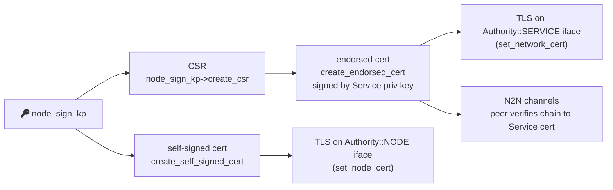
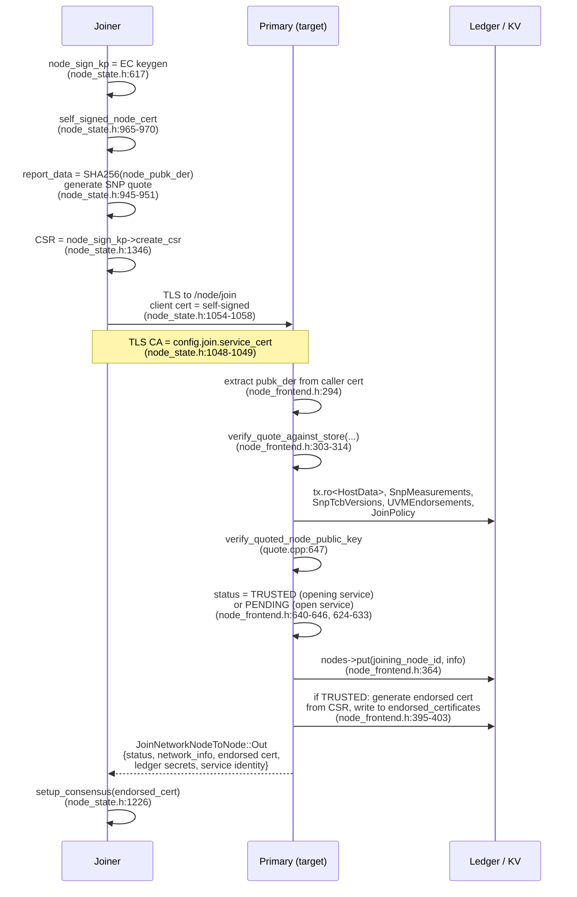

# CCF Node Identity — Deep Dive for PQC Design

> Companion to `ccf_identity_primer.md` §3 ("Node Identity") and §5 ("N2N
> channels"). Extends the primer with exact path:line citations for every
> assumption a PQC author must touch. Sources cited are all in the working
> tree at `/workspaces/CCF` unless noted.

---

## 1. Definition & purpose

A **Node Identity** is a single in-enclave ECDSA key pair (`node_sign_kp`)
generated when the node process starts. Its public half is hashed into the
SNP attestation `report_data`, making the identity a TEE-attested handle for
this concrete enclave instance. The same key pair is used for: TLS server
auth (both Node- and Service-endorsed interfaces), CSR generation, signing
ledger Merkle roots, signing forwarded HTTP traffic, and authenticating the
node-to-node Diffie–Hellman handshake.

The identity is consumed by three independent populations: (a) **clients**
that pin the Service Identity and traverse the endorsement chain to the node
cert, (b) **other nodes** that verify the cert chain during the N2N
handshake, and (c) **receipt verifiers** (anyone replaying the ledger), who
must follow `node_cert → service_cert` to validate ledger signatures.
Citations: declaration `src/node/node_state.h:408`; identity creation
`src/node/node_state.h:617`; node-id derivation `include/ccf/service/tables/nodes.h:43-47`.

The node ID itself is the SHA-256 of the DER-encoded public key
(`compute_node_id_from_kp` → `compute_node_id_from_pubk_der` →
`ccf::crypto::Sha256Hash(node_pubk_der).hex_str()`,
`include/ccf/service/tables/nodes.h:30-47`). PQC public keys are typically
much larger than EC ones but the ID stays 32 bytes after hashing, so this
contract is hash-stable.

---

## 2. Key generation

The key pair is constructed in the `NodeState` member-initializer list,
**before** any quote is generated:

```cpp
node_sign_kp(std::make_shared<ccf::crypto::ECKeyPair_OpenSSL>(curve_id_)),
self(compute_node_id_from_kp(node_sign_kp)),
```
(`src/node/node_state.h:617-618`)

`curve_id_` is plumbed from the run-time config (`StartupConfig`) into the
constructor (`src/node/node_state.h:610-626`); allowed values are the
enum `ccf::crypto::CurveID` declared in `include/ccf/crypto/curve.h:17-28`
— `SECP384R1` (default for the service identity at line 38), `SECP256R1`,
`CURVE25519`, `X25519`. Note `service_identity_curve_choice` is hard-coded
to `SECP384R1` (`include/ccf/crypto/curve.h:38`); node curve is independent
but operationally matched to it for the endorsement chain to work.

The actual EC keygen lives in `ECKeyPair_OpenSSL::ECKeyPair_OpenSSL(CurveID)`
in `src/crypto/openssl/ec_key_pair.cpp:48-66`. It uses `EVP_PKEY_keygen_init`
→ `EVP_PKEY_CTX_set_ec_paramgen_curve_nid` → `EVP_PKEY_keygen`. Entropy
ultimately comes from OpenSSL's CSPRNG (`RAND_bytes`) via
`Entropy_OpenSSL::random` (`src/crypto/openssl/entropy.h:24-30`), which is
also used elsewhere for HKDF salt, IVs, etc. (`src/crypto/entropy.cpp:10-13`).

An *additional* RSA key pair (`node_encrypt_kp`) is generated at the same
point for ledger-secret distribution (`src/node/node_state.h:619`,
`make_rsa_key_pair()`); it is **not** the identity key but its public PEM is
posted to the primary in the join request (`src/node/node_state.h:1335`).
PQC migration must keep them conceptually separate.

---

## 3. Self-signed vs service-endorsed certs

Two certs cover the same `node_sign_kp` public key, presented on different
listening interfaces:

| Cert | Issuer | Built where | Used on TLS interface with |
|---|---|---|---|
| Self-signed node cert | `node_sign_kp` itself | `create_self_signed_cert` in `src/crypto/certs.h:25-49` | `Endorsement.authority == NODE` |
| Service-endorsed node cert | Service Identity | `create_endorsed_cert` in `src/crypto/certs.h:51-92` | `Endorsement.authority == SERVICE` |

The self-signed cert is **always** created at node startup
(`src/node/node_state.h:965-970`, inside `NodeState::create`). It is the
only cert available before the node is trusted, and is used as the TLS
server cert for any RPC interface configured as `endorsement.authority =
"Node"` (`include/ccf/service/node_info_network.h:31-40,103-104`).

The endorsement is selected per RPC interface in
`src/enclave/rpc_sessions.h:298-331`. `set_node_cert(...)` installs the
self-signed cert on every interface with `Authority::NODE`;
`set_network_cert(...)` installs the endorsed cert on every interface with
`Authority::SERVICE`. Default is `SERVICE`
(`src/enclave/rpc_sessions.h:39`).



`accept_node_tls_connections()` plugs the self-signed cert
(`src/node/node_state.h:2493-2500`); `accept_network_tls_connections()`
plugs the endorsed cert (`:2502-2518`). The latter only runs after the
service-endorsed cert appears in the `endorsed_certificates` KV table — see
the table-hook in `src/node/node_state.h:2920-2974`, which both promotes
the cert to TLS and **refreshes the self-signed cert** to match the new
validity window.

**Subject & SAN.** Subject name comes from
`config.node_certificate.subject_name` and is passed verbatim into the
self-signed cert and into the CSR (`src/node/node_state.h:966-968`,
`:1346-1347`). SANs are computed by `get_subject_alternative_names()` in
`src/node/node_state.h:2471-2491`: either the explicit
`config.node_certificate.subject_alt_names` list, or fallback to the
published address of each `rpc_interfaces` entry (auto-detected as IP vs
hostname). The endorsed cert is just `sign_csr` of the same CSR
(`src/crypto/certs.h:51-60`) and inherits the SANs.

**Storage tables.** Endorsed node certs live in the KV map
`public:ccf.gov.nodes.endorsed_certificates`
(`include/ccf/service/tables/nodes.h:20-27`, type
`RawCopySerialisedMap<NodeId, ccf::crypto::Pem>`). The CSR and the
DER-derived public key live in `public:ccf.gov.nodes.info`
(`include/ccf/service/node_info.h:50-53`, fields
`certificate_signing_request` and `public_key`). The self-signed cert is
**never** in the ledger — it is regenerated from `node_sign_kp` on every
restart.

---

## 4. Attestation binding (the `report_data` slot)

This is the critical step. The node hashes its **DER-encoded public key**
with SHA-256 and stuffs the digest into the platform `report_data` field
before requesting the quote:

```cpp
pal::PlatformAttestationReportData report_data =
  ccf::crypto::Sha256Hash((node_sign_kp->public_key_der()));

pal::generate_quote(
  report_data,
  fetch_endorsements,
  config.attestation.snp_endorsements_servers);
```
(`src/node/node_state.h:945-951`, inside `initiate_quote_generation`)

`PlatformAttestationReportData` is a `std::vector<uint8_t>` whose 32-byte
SHA-256 constructor is at `include/ccf/pal/report_data.h:61-63`. On SNP the
on-chip report has a **64-byte** `report_data` field
(`include/ccf/pal/report_data.h:50`, `static constexpr size_t
snp_attestation_report_data_size = 64`); CCF only uses the first 32 bytes,
zero-padding the remainder (the SHA-256 fits, the layout is enforced by
`SnpAttestationReportData = AttestationReportData<64>` at
`report_data.h:51-52` and the on-wire struct at
`include/ccf/pal/attestation_sev_snp.h:399`).

Quote generation is platform-dispatched in `src/pal/quote_generation.h`:
- SNP path: `generate_snp_quote` (`:85-112`) → `snp::get_attestation(report_data)`
- Virtual path: `generate_virtual_quote` (`:63-83`) → writes report_data
  base64-encoded into a JSON file (used for SGX-less CI)

The receiving node verifies this in
`AttestationProvider::verify_quote_against_store`:

```cpp
pal::verify_quote(quote_info, measurement, report_data);
quoted_hash = report_data.to_sha256_hash();
...
return verify_quoted_node_public_key(
  expected_node_public_key_der, quoted_hash);
```
(`src/node/quote.cpp:586-649`; helper `verify_quoted_node_public_key` at
`:123-133` literally compares `quoted_hash != Sha256Hash(expected_pubk_der)`).

`expected_node_public_key_der` on the join-handler side is extracted from
the TLS client cert that the joiner presents
(`src/node/rpc/node_frontend.h:294`,
`public_key_der_from_cert(node_der)`), and on the create path it is the
local `node_sign_kp->public_key_der()` (`src/node/node_state.h:2586`).

**PQC implication.** The binding is `SHA256(SubjectPublicKeyInfo_DER)`.
The DER will get larger with PQC keys (Dilithium2 SPKI ~1.3 KB, ML-DSA-65
SPKI ~2 KB) but the *digest* stays 32 bytes — fits comfortably in the
64-byte SNP slot. What *won't* fit: putting a raw PQC public key directly
in `report_data`. The current code is hash-based, which is friendly to PQC.

---

## 5. Join flow



Citations in execution order:

1. **Joiner generates keys** — `node_sign_kp` and `node_encrypt_kp`
   constructed at `src/node/node_state.h:617-619`.
2. **Joiner builds self-signed cert** — `src/node/node_state.h:965-970`.
3. **Joiner builds attestation** — `initiate_quote_generation` at
   `src/node/node_state.h:870-952`, with the SHA-256-into-report_data step
   at `:945-946`.
4. **Joiner opens TLS to primary** — `initiate_join_unsafe` at
   `src/node/node_state.h:1044-1381`. The TLS client cert is the
   self-signed node cert (`:1054-1058`), keyed by
   `node_sign_kp->private_key_pem()`. The TLS CA pinned by the joiner is
   `config.join.service_cert` (`:1048-1049`) — i.e. the joiner must already
   trust the service identity out-of-band.
5. **Join payload built** — `JoinNetworkNodeToNode::In` populated at
   `:1332-1365`: `quote_info`, `public_encryption_key` (RSA pub),
   `certificate_signing_request` (from `node_sign_kp->create_csr`, line
   `:1346`), `code_transparent_statement`, optional sealing data.
6. **Primary handles `POST /node/join`** — endpoint registered at
   `src/node/rpc/node_frontend.h:655-658` (`no_auth_required`,
   `ForwardingRequired::Never`). The dispatching closure is `accept` at
   `:454-654`.
7. **Primary checks the caller cert ↔ CSR pubkey** — extracts pubkey from
   the TLS client cert and compares it to the CSR's pubkey at
   `node_frontend.h:337-351` (returns `CSRPublicKeyInvalid` on mismatch).
8. **Primary verifies quote against store policy** —
   `node_operation.verify_quote(...)` at `node_frontend.h:303-309`,
   delegating to `verify_quote_against_store` in `src/node/quote.cpp:586-649`.
   That function in order checks: `pal::verify_quote` (signature & SNP
   integrity) → host_data against `public:ccf.gov.nodes.snp.host_data`
   (`src/node/quote.cpp:228-267`, table `include/ccf/service/tables/host_data.h:18`)
   → enclave measurement against `public:ccf.gov.nodes.snp.measurements`
   (`include/ccf/service/tables/snp_measurements.h:16-17`) or UVM
   endorsements → TCB version against
   `public:ccf.gov.nodes.snp.tcb_versions`
   (`include/ccf/service/tables/tcb_verification.h:16`) → finally
   `verify_quoted_node_public_key` (`quote.cpp:647-648`).
9. **Status decision** — `accept` closure at `node_frontend.h:619-646`:
   joiner becomes `TRUSTED` immediately if the service is
   `OPENING`/`RECOVERING`, otherwise `PENDING` and members must vote.
10. **Endorsed cert minted** — only if `TRUSTED`, at
    `node_frontend.h:388-404`. Validity copied verbatim from joiner's
    self-signed cert (`make_verifier(node_der)->validity_period()` at
    `:393-394`).
11. **Response** — `network_info` with `service_cert + priv_key`,
    `ledger_secrets`, `endorsed_certificate`, `cose_signatures_config`
    (`node_frontend.h:406-413`).
12. **Joiner installs cert + secrets** — `:1207-1226` in node_state.h:
    `network.identity = ...`; `network.ledger_secrets->init_from_map(...)`;
    `setup_consensus(..., n2n_channels_cert = endorsed cert)`.

The endpoint is `no_auth_required` because authentication is performed by
the attestation check, not by any CCF cert: the joining node has no cert
the primary trusts yet.

---

## 6. Pending → Trusted promotion

When the service is `OPEN`, joins land as `PENDING` and members must submit
a governance proposal of action `transition_node_to_trusted`. The default
constitution implementation is at
`samples/constitutions/default/actions.js:1269-1343`:

- Validates `node_id` exists and is `Pending` (`actions.js:1295-1302`).
- Sets `nodeInfo.status = "Trusted"` and `ledger_secret_seqno =
  ccf.network.getLatestLedgerSecretSeqno()` (`actions.js:1303-1305`).
- Writes back to `public:ccf.gov.nodes.info` (`:1306-1309`).
- Calls `ccf.node.shuffleSealedShares` if available (`:1310-1312`).
- If the joiner provided a CSR (always true post-2.x), it now mints the
  endorsed cert: `ccf.network.generateEndorsedCertificate(CSR, valid_from,
  validity_period_days ?? max_allowed)` and writes to
  `public:ccf.gov.nodes.endorsed_certificates`
  (`actions.js:1330-1339`).

`maximum_node_certificate_validity_days` is read from
`public:ccf.gov.service.config`; default 365 days if not set
(`actions.js:1317-1320`).

The KV write to `endorsed_certificates` is what *actually* unblocks the
joiner: the joiner has a global hook on that table
(`src/node/node_state.h:2880-2974`) which (a) installs the endorsed cert
into the TLS stack via `accept_network_tls_connections()` (`:2934`) and
(b) regenerates the self-signed cert with the new validity period
(`:2944-2961`). `endorsed_node_cert` field is updated at `:2870-2875`
(earlier in the same hook). Until that happens, the new node only serves
TLS on its self-signed `Authority::NODE` interface.

---

## 7. Node-to-Node channels

CCF does **not** use TLS between nodes. The channel implementation is in
`src/node/channels.h` (1169 lines, all-header). The owning manager is
`NodeToNodeChannelManager` in `src/node/node_to_node_channel_manager.h`.

**Key pair signing the DH share.** The node identity key
(`node_sign_kp`) — passed into the manager via `initialize(...)` at
`src/node/node_to_node_channel_manager.h:108-132` and stored as
`this_node->node_kp`. Each `Channel` is constructed with the same shared
pointer (`channels.h:963-982`). Signatures on each KE step:
- `key_exchange_init`: `node_kp->sign(own_share)` over the **initiator's
  own DH share** (`channels.h:321`).
- `key_exchange_response`: signs `own_share || peer_share` (responder
  proves freshness against initiator's share) — `channels.h:344-350`.
- `key_exchange_final`: signs the **peer's** share (initiator now signs
  responder's share to seal the handshake) — `channels.h:384`.

The signed-share format on the wire prepends the size of the EC point
(`crypto/key_exchange.h:60`), and the cert is sent along with each
message: `append_buffer(payload, node_cert)` (`channels.h:323-325, 358-360`).
Receivers verify the cert chain against the **service cert**
(`channels.h:714-742`, `verifier->verify_certificate({&service_cert}, {},
true /* ignore_time */)`). Note `ignore_time = true`: expired node certs
are deliberately accepted on the N2N path to survive cert renewal windows.

**DH algorithm & curve.** `tls::KeyExchangeContext` at
`src/crypto/key_exchange.h:17-115` uses `ccf::crypto::CurveID::SECP384R1`
hard-coded (`:23`). Shares are computed via
`own_key->derive_shared_secret(peer_key)` (`:39`) which is OpenSSL
`EVP_PKEY_derive` under the hood. Note this is **independent** of the node
identity curve — the DH curve is always P-384 regardless of how the node
identity key was generated.

**KDF.** HKDF-SHA256, producing a 32-byte (256-bit) symmetric key per
direction. Code at `src/node/channels.h:756-787`:

```cpp
const auto key_bytes = ccf::crypto::hkdf(
  ccf::crypto::MDType::SHA256,
  shared_key_size,             // 32, channels.h:198
  kex_ctx.get_shared_secret(),
  hkdf_salt,                   // 32 random bytes, channels.h:197,832-833
  label);                      // self||peer for send, peer||self for recv
send_key = ccf::crypto::make_key_aes_gcm(key_bytes);
```

The salt is fresh per channel and per re-initiation
(`channels.h:832-833,856`, from `get_entropy()->random(32)`). The label
differs by direction (`update_send_key` vs `update_recv_key` at lines 756
and 772 respectively) so the two directions get distinct keys from the
same shared secret.

**AES-GCM IV scheme.** 12-byte IVs (`iv_size = 12`, 96 bits;
`include/ccf/crypto/symmetric_key.h:54`). The IV is a **monotonic 64-bit
counter** (`MsgNonce = uint64_t`, `channels.h:93`) packed into a
`WireNonce` (`channels.h:100-114`) and copied into the IV. The counter
starts at 1 (`send_nonce{1}`, `channels.h:207`; reset to 1 on new keys at
`:769`). The receiver tracks `local_recv_nonce` (`channels.h:222`) and
rejects any nonce `<= local_recv_nonce` (`channels.h:281-291`) — replay
protection. GCM tag is 16 bytes (`GCM_SIZE_TAG = 16`,
`include/ccf/crypto/symmetric_key.h:14`).

**Rotation cadence.** Controlled by `message_limit`
(`channels.h:200,224-255`). The current rule: when `send_nonce +
local_recv_nonce >= message_limit / 2`, trigger a new key exchange
(soft); at `>= message_limit`, drop the keys entirely until a new exchange
completes (hard, no traffic in between). `message_limit` is set from the
node config via `NodeToNodeChannelManager::set_message_limit`
(`src/node/node_to_node_channel_manager.h:141-144`). There is **no
time-based rotation**, only message-count.

**Channel state machine.** `enum ChannelStatus { INACTIVE, INITIATED,
WAITING_FOR_FINAL, ESTABLISHED }` (`channels.h:39-45`). Driven by the
`StateMachine` template at `:195`. Transitions:
`initiate()` (`:823-844`) sets INITIATED and sends init;
`recv_key_exchange_init` (`:437-547`) responder side, advances to
WAITING_FOR_FINAL after sending response;
`recv_key_exchange_response` (`:549-644`) initiator side, sends final and
advances to ESTABLISHED;
`recv_key_exchange_final` (`:646-688`) responder side, advances to
ESTABLISHED.

**Protocol version** is `static constexpr size_t protocol_version = 1`
(`channels.h:961`). Bumping this is the natural extension point for PQC
KEM hybridisation.

**Channel lifetime.** Channels are created lazily per peer
(`node_to_node_channel_manager.h:50-99`) and closed on idle timeout
(`:151-179`, default disabled until `set_idle_timeout` is called). On
close, `Channel::close_channel()` (`channels.h:1107-1117`) sends
`close_node_outbound` to the host and zeros both keys.

---

## 8. Ledger signatures

The current primary periodically signs the Merkle root of the replicated
state. Two formats coexist:

1. **`PrimarySignature` (legacy / Dual mode).** ECDSA over SHA-256 of the
   tree root, by `node_sign_kp`:

   ```cpp
   auto primary_sig =
     node_kp.sign_hash(root_hash.data(), root_hash.size());
   ```
   (`src/node/history.h:357-358`). The `PendingTx` then writes a
   `PrimarySignature{node_id, seqno, view, root, {}, primary_sig,
   endorsed_cert}` to the value table `public:ccf.internal.signatures`
   (`src/node/history.h:355-369`; table constant
   `src/service/tables/signatures.h:71`).

2. **COSE signature (CoseOnly or Dual).** By the **service** key, not the
   node key (`src/node/history.h:386-415`); written to
   `public:ccf.internal.cose_signatures`
   (`src/service/tables/signatures.h:72-73`).

`ledger_sign_mode` (per-network) gates which of the two is emitted
(`src/node/history.h:353`). The joiner advertises its mode in the join
request and is rejected if it asks for `Dual` on a `CoseOnly` network
(`src/node/rpc/node_frontend.h:316-327`).

**Format of the legacy signature.** `PrimarySignature` (struct at
`src/service/tables/signatures.h:13-50`) carries `seqno`, `view`,
`root` (32-byte SHA-256 Merkle root, `:23`), the raw signature
`std::vector<uint8_t> sig` (inherited from `NodeSignature` — variable
length, the ECDSA DER blob), and the **service-endorsed node cert**
itself (`:25,28-49`). Embedding the cert lets external receipt verifiers
chain to the service identity without consulting the ledger.

**Trigger.** Two paths:

- Tx-count gating: `try_emit_signature` (`src/node/history.h:922-935`)
  checks `store.committable_gap() >= sig_tx_interval` on every commit.
- Timer: `start_signature_emit_timer` (`src/node/history.h:648-704`),
  delay = `sig_ms_interval`, registered via `ccf::tasks::add_periodic_task`
  (`:703`). The task consults consensus's
  `SignatureDisposition` and only fires if `SHOULD_SIGN` or (when in
  `CAN_SIGN`) there is a committable gap or a pending snapshot.

**Defaults.** `sig_tx_interval = 5000`, `sig_ms_interval = 1000ms`
(`src/node/rpc/frontend.h:49-50`). Both are configurable via host config;
the values are plumbed in `NodeState::initialize`
(`src/node/node_state.h:669-670`).

**Curve / hash.** Driven by the node's curve via `sign_hash` →
`EVP_PKEY_sign` (`src/crypto/openssl/ec_key_pair.cpp:201-208`). Note this
is `sign_hash`, not `sign`: the SHA-256 root is signed as-is; no second
hashing pass is applied. For `SECP384R1` keys, the actual signing scheme
is therefore ECDSA-with-SHA256 on the *root hash* (the root has already
been hashed during Merkle construction). PQC signatures of variable size
will need to flow through `std::vector<uint8_t> sig` unchanged — the
schema is length-agnostic.

---

## 9. Cert renewal

The endorsed cert can be re-issued without a new key pair via the
`set_node_certificate_validity` or `set_all_nodes_certificate_validity`
proposal actions
(`samples/constitutions/default/actions.js:1380-1418` and `:1420-1454`).
Both delegate to the helper `setNodeCertificateValidityPeriod` at
`actions.js:268-308`:

- Reads the joiner's CSR back out of `nodes_info` (`:274-276`).
- Reads the service-wide max validity from `service.config`
  (`:278-288`).
- Calls `ccf.network.generateEndorsedCertificate(CSR, validFrom,
  validityPeriodDays)` (`:299-303`) — same code path as initial issuance.
- Writes the new cert into `public:ccf.gov.nodes.endorsed_certificates`
  (`:304-307`).

The CSR is reused as-is — **so the node's private key never changes**.
Only the validity window in the X.509 wrapper changes. The same global
hook (`src/node/node_state.h:2880-2974`) detects the new cert and
- reinstalls it as the Service TLS cert (`:2934`,
  `accept_network_tls_connections`);
- regenerates the self-signed cert with matching validity
  (`:2944-2958`), then reinstalls it for the Node TLS interface
  (`:2961`).

Caller authorisation is whatever the constitution requires for the action
— in the default constitution that's a member proposal that passes the
operator-or-quorum threshold. There is no separate "ops" path: renewals
go through governance.

The service identity has its own renewal action,
`set_service_certificate_validity` (`actions.js:1456-1481`), which calls
`NetworkIdentity::renew_certificate` (`src/node/identity.h:51-60`) — same
"new cert, same key" pattern.

---

## 10. Node retirement

`NodeStatus::RETIRED` is set by the `remove_node` action
(`samples/constitutions/default/actions.js:1346-1378`); the transition
flips `nodeInfo.status = "Retired"` in `public:ccf.gov.nodes.info`.

`retired_committed` is a separate boolean
(`include/ccf/service/node_info.h:69-74,87`) flipped only **after** the
RETIRED status has been globally committed, by a self-call to
`POST /node/network/nodes/set_retired_committed`
(`src/node/rpc/node_frontend.h:660-687`). The retired node itself issues
that request via `RetiredNodeCleanup::send_cleanup_retired_nodes`
(`src/node/retired_nodes_cleanup.h:21-32`).

What happens to the key material:

- **Node private key (`node_sign_kp`)** — never erased on retire; lives
  only in enclave memory and dies with the process. There is no explicit
  "wipe on retire" path.
- **Endorsed cert in KV** — the `endorsed_certificates` row is **not
  deleted** by `remove_node` (the action only touches the `nodes.info`
  row, `actions.js:1359-1374`). This is intentional: historical receipts
  signed by that node still reference that cert, and the verifier needs
  to fetch it from the ledger to chain to the service identity.
- **N2N channels** — retirement removes the peer from the active
  consensus configuration through `ConfigurationChangeHook` in
  `src/node/hooks.h:54-58` (`cfg_delta.try_emplace(node_id, std::nullopt)`).
  This stops the local node from sending new consensus messages to the
  retiree, but **does not** call `close_channel()` on the existing N2N
  channel. The only explicit channel closure today is the idle timeout
  in `node_to_node_channel_manager.h:151-179`. The retired node typically
  terminates its process on its own and the OS tears down its sockets.
- **TLS certs** — the retiring node may continue presenting its endorsed
  cert until it exits; client traffic will fail at the load-balancer or
  policy layer rather than at TLS.

In short: retirement is a logical/consensus event, not a cryptographic
revocation event. The endorsed cert remains valid for receipt
verification until it expires naturally.

---

## 11. Algorithm constants & sizes

Everything below is what a PQC redesign must match or replace. All
citations are in-tree.

| Thing | Value | Citation |
|---|---|---|
| Node identity curve (default) | `SECP384R1` | `include/ccf/crypto/curve.h:38` |
| Node identity hashing for ID | `SHA-256` of DER pubkey, 32-byte node_id | `include/ccf/service/tables/nodes.h:30-47` |
| ECDSA sig size (P-384, DER) | ~104 bytes typical, ≤ `EVP_PKEY_size(key)` | `src/crypto/openssl/ec_key_pair.cpp:189` |
| Self-signed cert builder | `create_self_signed_cert` (CA flag = true) | `src/crypto/certs.h:25-49` |
| Endorsed cert builder | `create_endorsed_cert` (CA flag = false) | `src/crypto/certs.h:51-92` |
| SNP `report_data` slot | **64 bytes** (fixed) | `include/ccf/pal/report_data.h:50`, `include/ccf/pal/attestation_sev_snp.h:399` |
| Virtual / SGX `report_data` slot | 32 bytes | `include/ccf/pal/report_data.h:40,45` |
| Quote binding hash | `SHA256(node_pubk_der)` | `src/node/node_state.h:945-946` |
| N2N DH curve | `SECP384R1` (hard-coded) | `src/crypto/key_exchange.h:23` |
| N2N DH share format | raw EC point + 1-byte size prefix | `src/crypto/key_exchange.h:54-61` |
| N2N HKDF | HKDF-SHA256, 32-byte salt, 32-byte output | `src/node/channels.h:197-198,761-766` |
| N2N AEAD | AES-256-GCM | `src/node/channels.h:767,784` (`make_key_aes_gcm`) |
| N2N IV size | **12 bytes (96 bits)** | `include/ccf/crypto/symmetric_key.h:54` |
| N2N IV scheme | monotonic 64-bit nonce, replay-checked | `src/node/channels.h:93,207,222,281-291` |
| N2N GCM tag | **16 bytes** | `include/ccf/crypto/symmetric_key.h:14` |
| N2N protocol version | `1` | `src/node/channels.h:961` |
| N2N rotation trigger | `message_limit/2` (soft), `message_limit` (hard) | `src/node/channels.h:224-255` |
| Ledger sig hash | SHA-256 (Merkle root, signed as-is) | `src/node/history.h:357-358` |
| Ledger sig table | `public:ccf.internal.signatures` (Value) | `src/service/tables/signatures.h:71` |
| Default sig cadence | 5000 tx or 1000 ms | `src/node/rpc/frontend.h:49-50` |

---

## 12. Sharp edges for PQC

These are the concrete assumptions a PQC redesign must address. Each is
backed by a specific line in the tree.

1. **64-byte SNP `report_data` is the *only* binding slot.** It is a
   fixed-size, **non-extensible** byte array
   (`include/ccf/pal/report_data.h:50`,
   `include/ccf/pal/attestation_sev_snp.h:399`). Anything larger than 64
   bytes — and certainly raw ML-DSA public keys — must be referenced by
   hash. The existing `SHA256(pubk_der)` indirection
   (`src/node/node_state.h:945-946`) is PQC-compatible *as long as* the
   verifier can reconstruct that same DER blob from whatever transport
   carries the PQC pubkey. The cert/CSR pubkey path is the natural
   carrier, but PQC SPKIs are ~1.3–2 KB and currently flow over TLS
   handshakes that assume EC-sized keys.

2. **Ledger signature buffer is variable-length but inline.**
   `PrimarySignature::sig` is `std::vector<uint8_t>`
   (`src/service/tables/signatures.h:13-50`, inherits from `NodeSignature`)
   so size growth is structurally fine. **However**, the cert is embedded
   in every signature row (`:25`, `cert`), so each ML-DSA-2-signed
   transaction would carry a ~2-3 KB cert plus a ~2.5 KB signature in
   *every* `signatures` row. Ledger growth is non-trivial — both for
   storage and for snapshot/replication bandwidth.

3. **N2N DH curve is hard-coded `SECP384R1`** in
   `src/crypto/key_exchange.h:23`, completely independent of the node
   identity curve. A hybrid PQC KEM (e.g. X25519+ML-KEM) needs a new
   `KeyExchangeContext` and a bump of `protocol_version`
   (`src/node/channels.h:961`). The single-byte-length-prefixed share
   format (`crypto/key_exchange.h:54-61`) caps the share at 255 bytes —
   ML-KEM-768 ciphertexts are 1088 bytes and **will not fit**. This is
   a hard compatibility break.

4. **N2N signed-DH binding uses the node identity key.** Each KE step
   signs a short blob (one or two DH shares) with `node_kp->sign(...)`
   at `src/node/channels.h:321,349,384`. PQC sigs are ~2.5–4.6 KB; this
   inflates every KE round-trip. Each KE message currently fits in a
   single host-bound ringbuffer write — that path may need re-chunking.

5. **N2N message AAD assumes fixed header size with no length
   prefix.** The payload layout comment at
   `src/node/channels.h:940-946` states the receiver "knows the fixed
   size of the aad and gcm header" with no length prefixes. PQC-induced
   header growth (e.g. larger key-IDs, hybrid nonces) requires either
   wire-format versioning or a new framing.

6. **Cert chain hash is SHA-256 throughout.** Node ID
   (`include/ccf/service/tables/nodes.h:33`), receipt root, and ledger
   signature root all use SHA-256. SHA-256 is not directly threatened by
   Grover at the security levels CCF targets (effective 128-bit), but
   the document trail assumes a 32-byte digest in many places (e.g.
   `Sha256Hash::SIZE` used as a literal in `src/node/quote.cpp:478-482`).
   PQC migrations sometimes pair with SHA-3/SHAKE upgrades; check
   every `SIZE` literal before changing.

7. **`EVP_PKEY_size(key)` is used to pre-allocate signature buffers**
   (`src/crypto/openssl/ec_key_pair.cpp:189`). For OpenSSL PQC providers
   this still returns the correct max size, but assumes the algorithm is
   *known to OpenSSL*. CCF wraps OpenSSL via
   `include/ccf/crypto/openssl/openssl_wrappers.h` — any new algorithm
   has to be exposed through that same wrapper layer.

8. **TLS join uses self-signed node cert as TLS client cert.**
   `src/node/node_state.h:1054-1058` wraps `self_signed_node_cert` plus
   `node_sign_kp->private_key_pem()` into the `::tls::Cert`. The pinned
   service CA is `config.join.service_cert` (`:1048-1049`). Both
   endpoints of that TLS handshake assume EC keys; switching to PQC
   identities requires PQC-aware TLS (OpenSSL 3.x with the appropriate
   provider) on both sides, in lockstep.

9. **N2N message limit is the only rotation trigger.** No time-based
   rotation; if a quiet channel sits below its `message_limit/2`
   forever, the AES-GCM key never rotates
   (`src/node/channels.h:224-255`). For PQC hybrids this is fine, but
   note that the *replay window* is also message-count-based
   (`local_recv_nonce`, `:222,281-291`).

10. **Service-endorsed cert validity defaults to 1 day** for nodes
    (this fact is in the primer; the path is the `valid_from`/
    `validity_period_days` carried in `transition_node_to_trusted` args
    at `actions.js:1273-1339`). Renewals re-mint the *cert*, never the
    *key* (`actions.js:268-308`). A PQC redesign that introduces
    stateful signatures (HSS/LMS, not currently planned) would have to
    rethink this assumption end-to-end.

11. **Retirement does not invalidate the endorsed cert.** The cert
    stays in `endorsed_certificates` after `remove_node`
    (`actions.js:1346-1378`) so historical receipts remain verifiable.
    For PQC, this means *the historical cert + the historical PQC sig
    on the ledger sig table row* must remain verifiable for the cert's
    full validity window — a long-tail concern if PQC parameters get
    deprecated.

12. **Channels are not torn down on retire.** Only the idle-timeout
    path closes channels (`node_to_node_channel_manager.h:151-179`). A
    compromised-key revocation event would need a new mechanism;
    today's PQC equivalent (post-key-compromise) has no in-tree
    rotation path.

---

*Last updated against the working tree at the time of writing
(`maxtropets/CCF`, working directory `/workspaces/CCF`).*
