# CCF Identity & Crypto — Current State (5-min Read)

> Background for designing PQC identity support. **Describes today only**; no PQC suggestions.
> Sources: `doc/architecture/cryptography.rst`, `doc/architecture/node_to_node.rst`,
> `doc/governance/*`, `doc/operations/recovery.rst`, `doc/build_apps/auth/*`,
> `include/ccf/crypto/curve.h`.

---

## 1. Four classes of identity

CCF has **four** identity classes, all currently X.509-based with elliptic-curve keys.
Members and users are external principals; the service and nodes are internal to the
TEE-protected network. The **Service Identity** is the root of trust that every other
internal identity ultimately chains back to. Members and users are *registered* in the
ledger by governance, not endorsed by the service certificate.

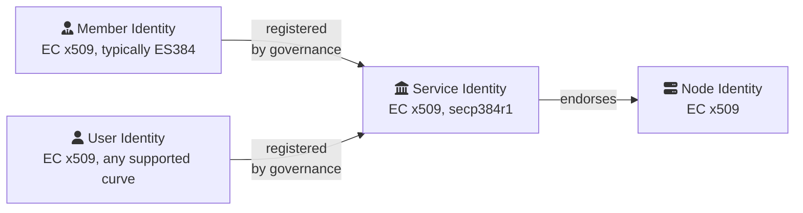

---

## 2. Service Identity = root of trust

The Service Identity is a public-key cert + private key generated by the *first* node
of a network at startup. The cert is the CA that clients pin (`service_cert.pem`) and
the same cert that endorses every node cert. It is shared between trusted nodes only
over authenticated TLS, and is **rotated on disaster recovery** (a new identity is
generated, and clients must re-trust it). Default curve: `secp384r1`
(`service_identity_curve_choice` in `include/ccf/crypto/curve.h`).

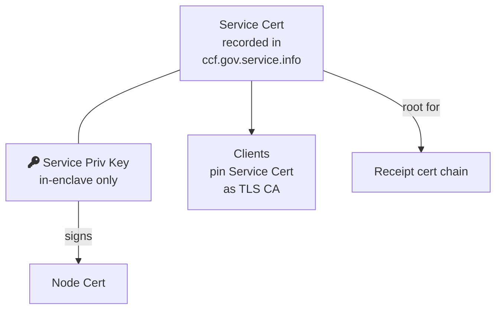

---

## 3. Node Identity bound to a TEE via attestation

Each node generates its own EC key pair in-enclave at startup. The **hash of the node
public key is embedded in the SNP attestation report**, cryptographically binding the
identity to a specific TEE running approved code. Two flavours of cert exist for the
same key: a self-signed one (served on the `Node`-endorsed RPC interface) and the
service-endorsed one (served on the `Service`-endorsed interface, stored in
`ccf.gov.nodes.endorsed_certificates`). Node certs are short-lived (default 1 day) and
renewed by member proposals.

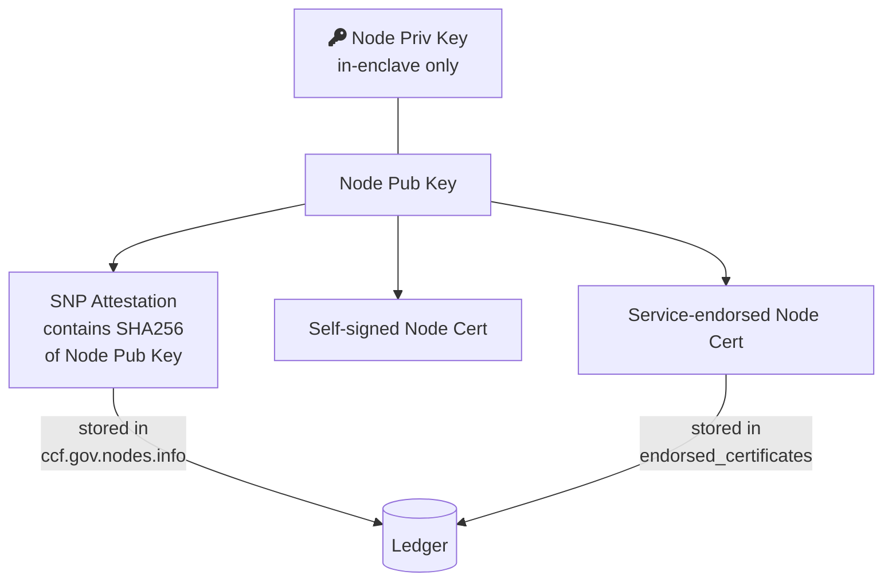

---

## 4. Joining the network

A joining node opens TLS to an existing node, presents its **attestation report +
endorsement collateral** (VCEK chain, UVM endorsements). The primary verifies the
attestation against the join policy (`nodes.snp.host_data`, `nodes.snp.measurement`,
TCB version), checks the report contains the joiner's public key hash, then ships the
shared Service Identity and current Ledger Secret(s) over the TLS channel. Members
later vote (`transition_node_to_trusted`) before the new node is fully part of the
network.

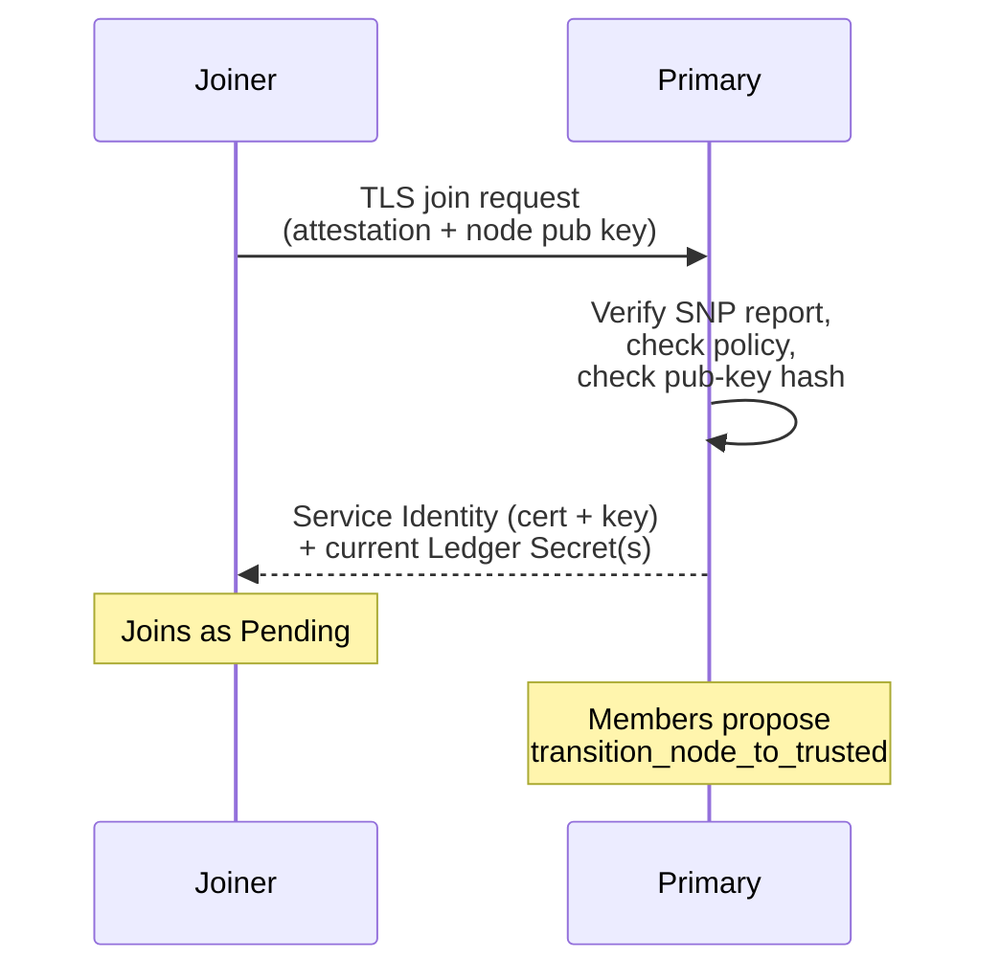

---

## 5. Node-to-node channels (consensus + forwarding)

CCF does **not** use TLS between nodes (to avoid double-encrypting ledger entries).
Instead, each pair runs an authenticated Diffie–Hellman key exchange where each side's
DH public share is signed with its **node identity private key**, and the receiver
verifies the signature against the node cert (whose chain ends in the Service
Identity). The derived 256-bit key feeds AES-GCM for integrity-protected consensus
headers and encrypted forwarded HTTP requests. Keys are rotated periodically (RFC 8446
§5.5 style).

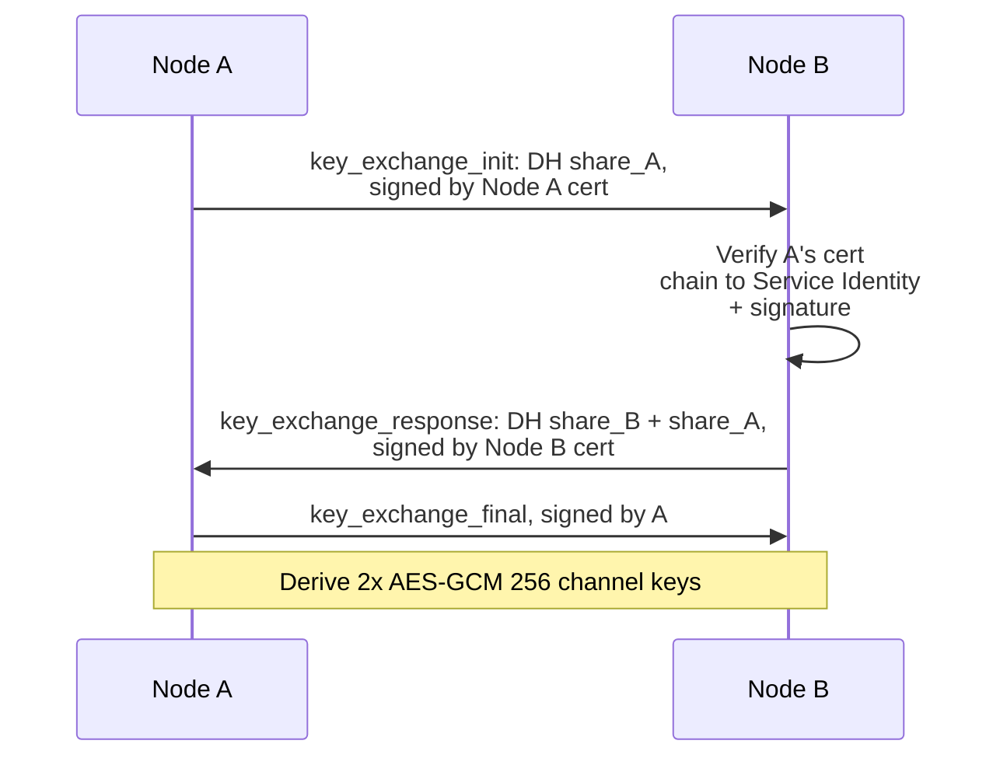

---

## 6. Member identity + COSE Sign1 for governance

Members hold an EC identity key (recommended `secp384r1`, HSM-friendly — Azure Key
Vault is the documented HSM path). **All governance traffic** (proposals, ballots,
ack/state-digest, recovery-share submission) is wrapped in a **COSE Sign1** envelope
signed by the member's identity key (`ES384`). The cert itself accompanies the
request; the service verifies the signature, looks up the cert hash in
`public:ccf.gov.members.certs`, and dispatches the action. HTTP request signing was
removed in 4.0 in favour of COSE Sign1.

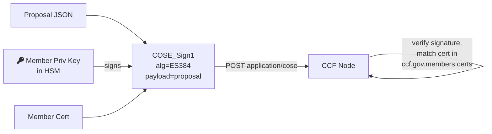

---

## 7. Recovery members: RSA-OAEP encryption of shares

A member is a *recovery* member iff they registered an additional **encryption public
key** (RSA 2048). On `transition_service_to_open` and on every ledger rekey, the
ledger-secret wrapping key is split into `k-of-n` shares; each share is encrypted with
one recovery member's RSA pub key (`RSA-OAEP-256`). Shares are pulled from the service
post-recovery and decrypted by the member (the AKV path uses `az keyvault key decrypt`).
This is the *only* place in CCF where asymmetric **encryption** (not signing) is
exposed to an external party.

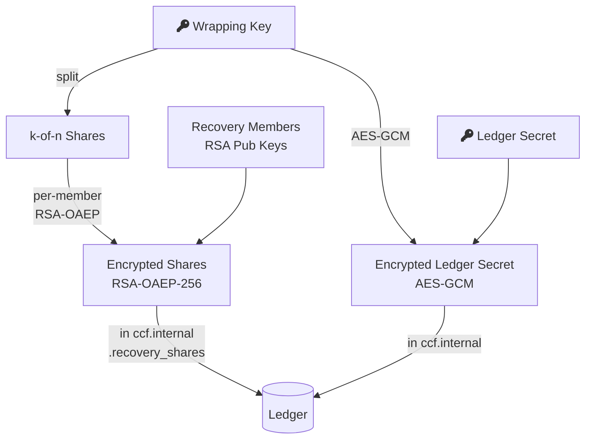

---

## 8. Users: cert-TLS auth OR JWT bearer

User identities are also X.509 certs registered by governance (`set_user`). Two
authentication paths:

1. **Mutual-TLS** — the client proves possession of the user priv key during the TLS
   handshake (`curl --key --cert`). User ID = `sha256(DER(cert))`.
2. **JWT** — the user presents an OAuth-style bearer token signed by an *external* IdP
   (e.g. Entra). CCF caches the issuer's JWKS (`ccf.gov.jwt.public_signing_keys`,
   typically RSA), verifies `alg`/`kid`/`nbf`/`exp` and trusts the embedded claims.

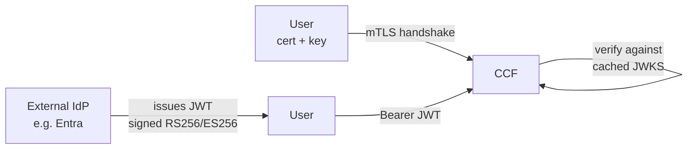

---

## 9. Ledger signatures & receipts

The current primary periodically signs the **root of the Merkle Tree** over all
transactions with its **node identity private key** and writes that as a ledger entry
(`ccf.internal.signatures`). A *receipt* is then `{leaf_components, Merkle proof, node
cert, signature}`. Verification: walk the proof to the root, then verify the signature
with the node cert (which the verifier in turn checks against the pinned Service
Identity). All hashing uses SHA-256.

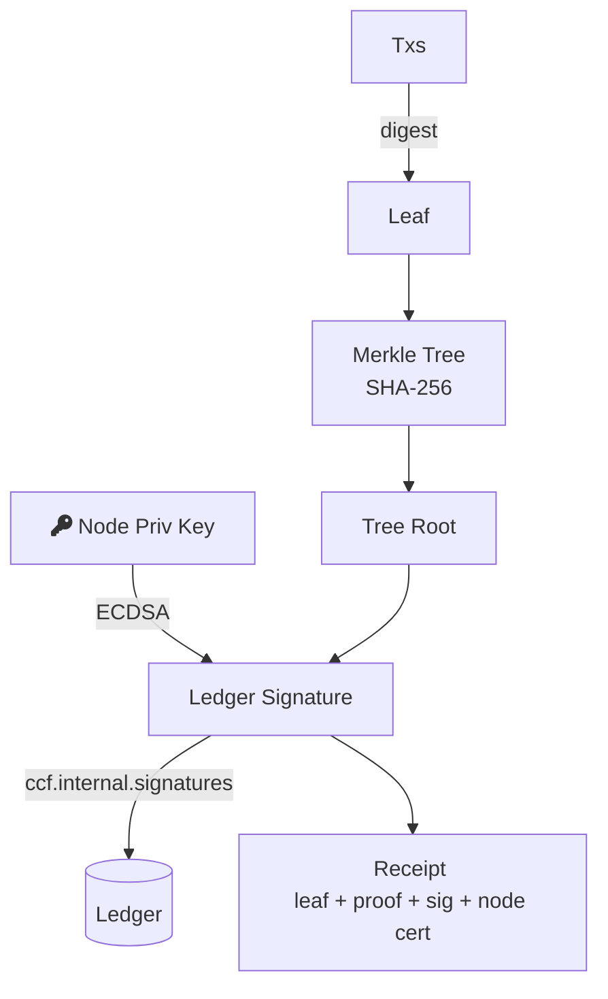

---

## 10. Sealing-based recovery (experimental, SNP only)

Each node generates an extra **RSA recovery key pair** at join time. The private half
is sealed with an AES-GCM key derived (via HKDF) from the SNP `DERIVED_KEY` (which is
itself a function of `VCEK + Measurement + Policy + TCB`), and stored in
`ccf.gov.nodes.sealed_recovery_keys`. The ledger-secret wrapping key is then encrypted
per-node with each sealed-recovery RSA pubk. On recovery the same TEE rederives the
sealing key without member intervention.

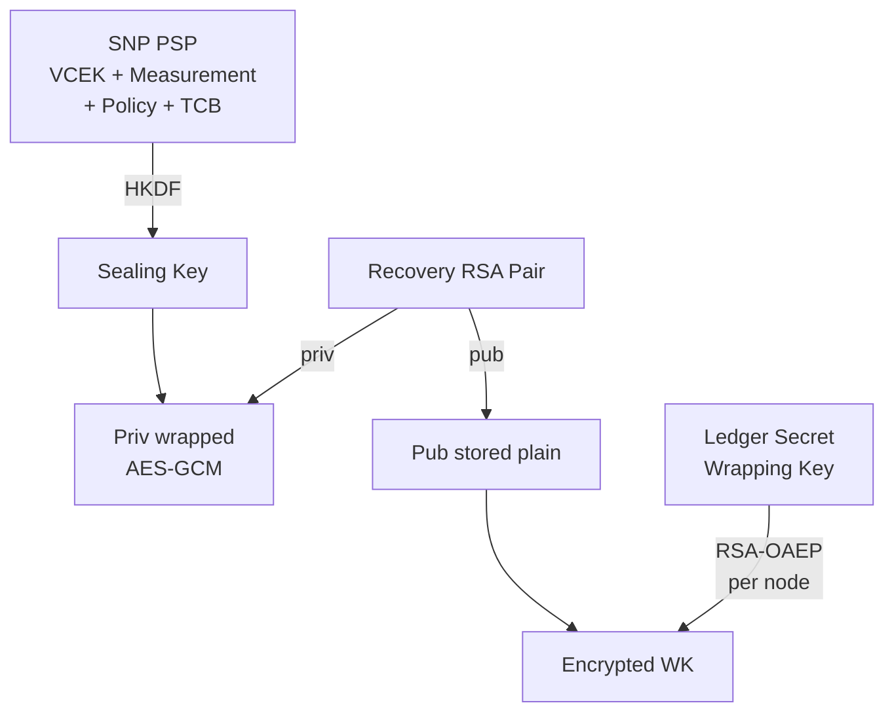

---

## 11. Algorithm inventory (today)

| Purpose | Primitive |
|---|---|
| Service / Node / User / Member identity certs | X.509, ECDSA on `secp384r1` (default), `secp256r1`, `curve25519`/`x25519` enumerated in `curve.h` |
| Service-signed node cert | ECDSA |
| Ledger signatures (Merkle root) | ECDSA over `secp384r1` (SHA-384) by default |
| Receipts | Same as ledger signatures + SHA-256 Merkle |
| Governance signatures | COSE Sign1, `ES384` |
| TLS to clients | TLS 1.3 via OpenSSL 3.3, ECDHE + ECDSA |
| Node-to-node key exchange | EC Diffie–Hellman, authenticated by node cert ECDSA |
| Node-to-node bulk | AES-256-GCM, monotonic-IV |
| Ledger at rest | AES-256-GCM (per-transaction nonce) |
| Recovery share encryption | RSA-2048-OAEP (SHA-256) |
| Sealed recovery (experimental) | HKDF + AES-256-GCM (sealing), RSA-2048-OAEP (wrap) |
| JWT verification | Whatever the IdP advertises in JWKS (commonly RS256) |
| Hashing throughout | SHA-256 (some SHA-384 paired with secp384r1) |

---

## Quick mental model

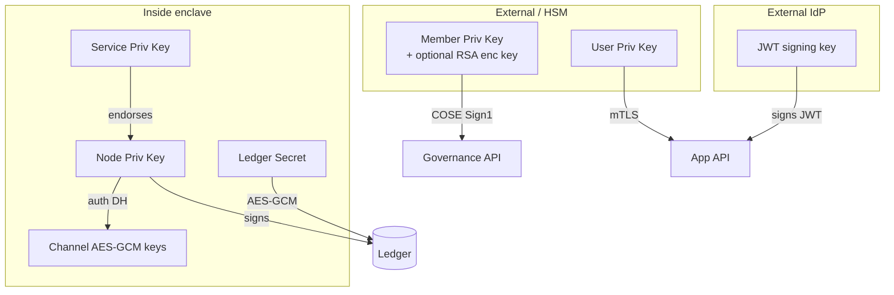
