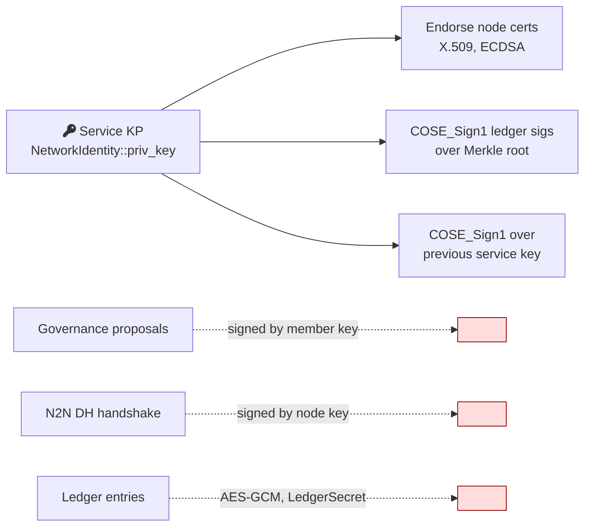
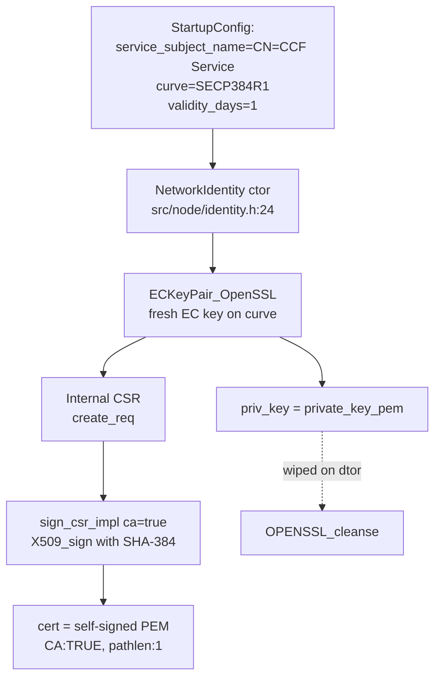
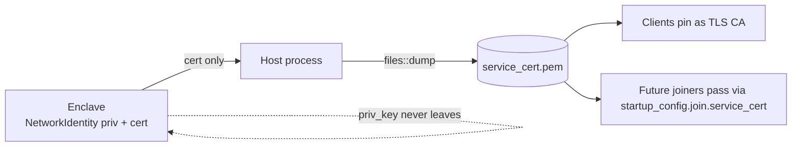
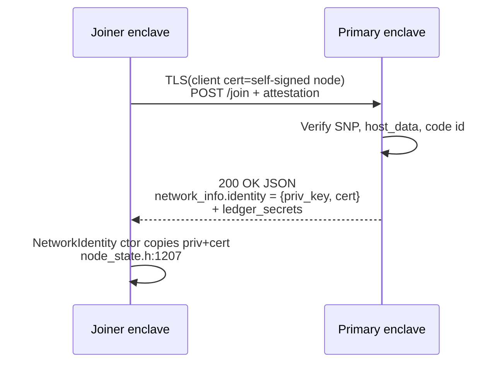
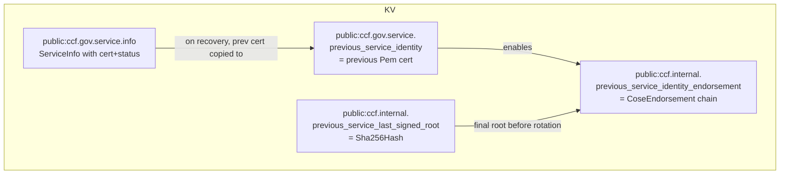
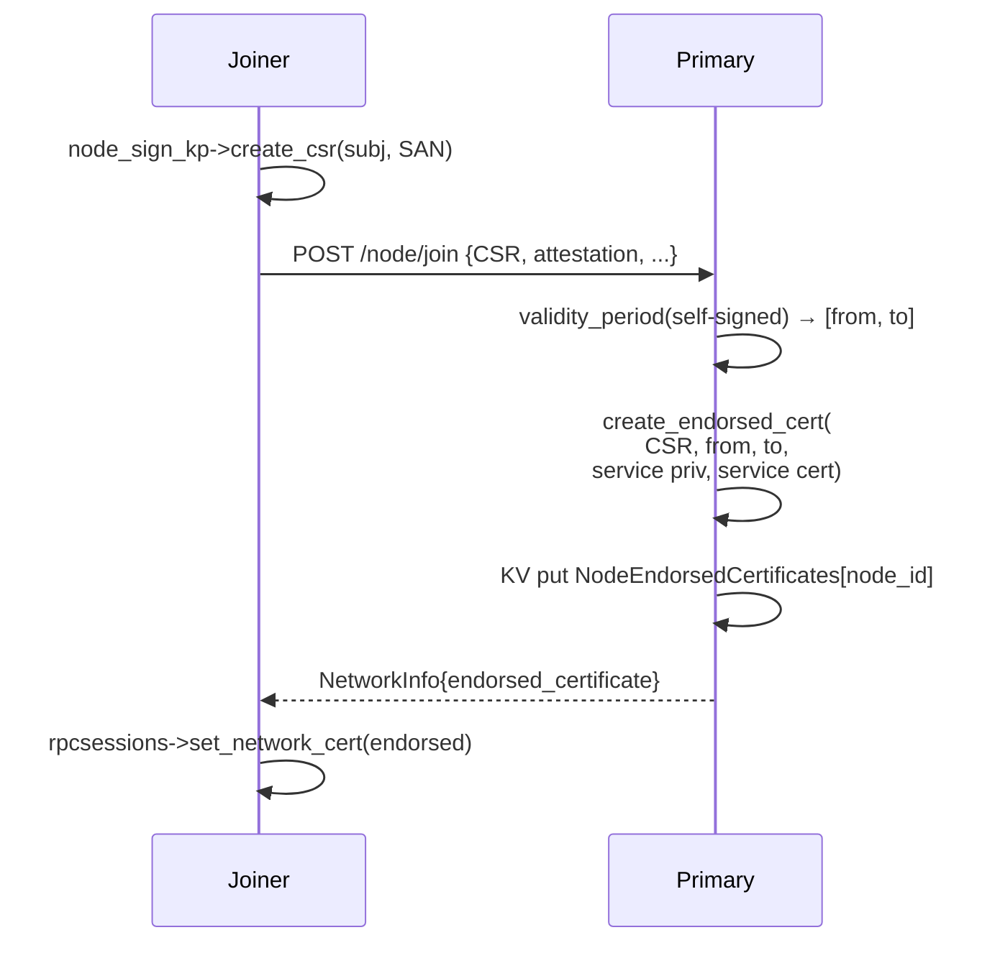
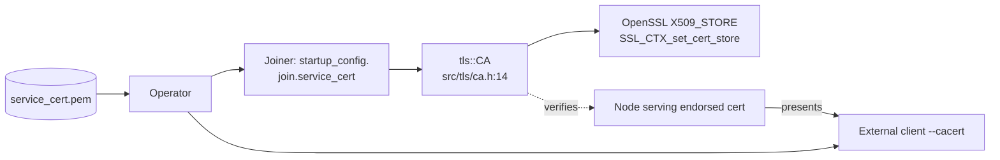
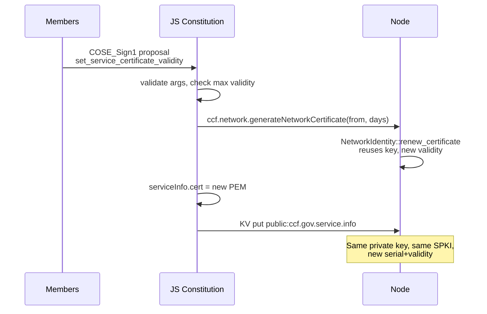
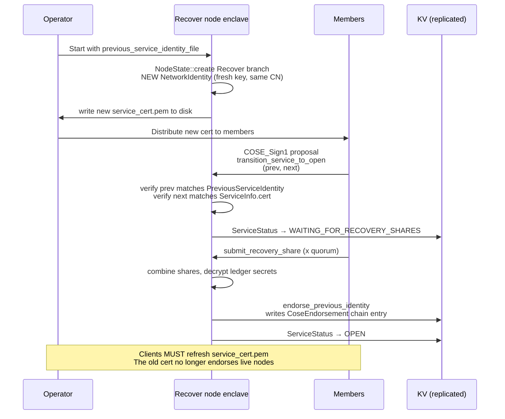

# CCF Service Identity — Deep Dive (Code-Level)

> Companion to `ccf_identity_primer.md` §2. Assumes the primer has been read;
> does not re-state high-level definitions. Every claim below is anchored to
> a `path:line` in the repo. Goal: surface every concrete fact needed to
> design a Post-Quantum replacement of the Service Identity.

---

## 1. What it is, what it signs, what it doesn't

The Service Identity is held in memory as `ccf::NetworkIdentity { Pem priv_key;
Pem cert; }` (`src/node/identity.h:17-21`). Note the name: in source the type
is `NetworkIdentity` — "service identity" is the documentation name and the
table name (`public:ccf.gov.service.info`). The private key is wiped from
memory on destruction with `OPENSSL_cleanse(priv_key.data(), priv_key.size())`
(`src/node/identity.h:46-49`) but the cert is left intact.

It signs three things, **all via the same EC key pair**:

1. **X.509 endorsements of every node's cert** (`src/crypto/certs.h:51-60`
   called from `src/node/rpc/node_frontend.h:395-401` for joiners and
   `src/node/node_state.h:2573-2579` for the genesis node).
2. **COSE_Sign1 ledger signatures** over the Merkle root of every
   signature transaction (`src/node/history.h:402-425`, with the service
   key passed in via `set_service_signing_identity` at
   `src/node/history.h:613-633`).
3. **COSE_Sign1 endorsements of the previous service's public key**, written
   into `previous_service_identity_endorsement` whenever a disaster
   recovery completes (`src/service/internal_tables_access.h:545-654`).

It does **not** sign: governance actions (those are COSE_Sign1 by member
keys), node-to-node DH handshakes (those use the node's private key — the
service identity is only the trust anchor on the verifier side), or ledger
encryption (handled by the symmetric `LedgerSecret`).



---

## 2. Generation

Generation happens inside `NodeState::create()` (`src/node/node_state.h:954-1038`),
which dispatches on `StartType`:

- **`StartType::Start`** (genesis): a fresh `NetworkIdentity` is constructed
  with `config.service_subject_name`, `curve_id`,
  `config.startup_host_time`, and
  `config.initial_service_certificate_validity_days`
  (`src/node/node_state.h:987-991`).
- **`StartType::Recover`**: a *new* `NetworkIdentity` is constructed (key +
  cert), reusing the previous identity's subject name extracted from
  `config.recover.previous_service_identity`
  (`src/node/node_state.h:1020-1027`). This is the disaster-recovery
  rotation point.
- **`StartType::Join`** never calls the constructor; the joiner receives
  the existing identity over the wire (see §3).

The `NetworkIdentity` ctor itself (`src/node/identity.h:24-40`) does:

1. `ECKeyPair_OpenSSL(curve_id)` — fresh key on the chosen curve
   (`src/node/identity.h:30-31`).
2. `priv_key = identity_key_pair->private_key_pem()`
   (`src/node/identity.h:32`).
3. `cert = create_self_signed_cert(...)` (`src/node/identity.h:34-39`) with
   **empty SAN list** (`{} /* SAN */`) — only the CN distinguishes service
   certs.

Defaults are noteworthy:

- `curve_id` is `ccf::crypto::service_identity_curve_choice =
  CurveID::SECP384R1` (`include/ccf/crypto/curve.h:38`).
- `service_subject_name` defaults to `"CN=CCF Service"`
  (`src/host/configuration.h:96`).
- `initial_service_certificate_validity_days` defaults to **1** day
  (`src/host/configuration.h:95`, `src/host/configuration.h:121`). The very
  first cert is intentionally short-lived because the operator must
  immediately propose `set_service_certificate_validity` once governance
  is open.

The actual self-sign happens in
`ECKeyPair_OpenSSL::sign_csr_impl(..., ca=true)`
(`src/crypto/openssl/ec_key_pair.cpp:304-468`):

- 16-byte random serial number (`src/crypto/openssl/ec_key_pair.cpp:329-340`).
- `notBefore` / `notAfter` from the supplied strings; cert is rejected if
  `notBefore > notAfter` (`src/crypto/openssl/ec_key_pair.cpp:365-374`).
- Basic constraints: `critical,CA:TRUE,pathlen:1` — explicitly to allow a
  one-level intermediate when re-endorsing historical receipts
  (`src/crypto/openssl/ec_key_pair.cpp:388-394`).
- Key usage: `critical, keyCertSign, digitalSignature`
  (`src/crypto/openssl/ec_key_pair.cpp:404-415`).
- Subject Key Identifier and Authority Key Identifier are populated
  (`src/crypto/openssl/ec_key_pair.cpp:417-429`).
- Signature MD chosen by `get_md_for_ec(curve)` → SHA-384 for secp384r1,
  SHA-256 for secp256r1 (`include/ccf/crypto/curve.h:42-60`, applied at
  `src/crypto/openssl/ec_key_pair.cpp:449`).



---

## 3. Persistence model

**The service private key is never written to disk by CCF.** It lives only as
`NetworkIdentity::priv_key` (`src/node/identity.h:19`) inside the enclave.
The destructor explicitly `OPENSSL_cleanse`s the buffer
(`src/node/identity.h:48`). There is no on-disk file equivalent of
`ledger_secret` for the service key.

The *cert* (public material) is written to disk by the host process — but
only on `Start` or `Recover` — at `src/host/run.cpp:521-529`, into the file
named by `command.service_certificate_file` (default `"service_cert.pem"`,
`src/host/configuration.h:88`). Operators distribute that file to clients
and to subsequent joiners.



### Sharing during join

A joiner gets the **full** `NetworkIdentity` (priv + cert) over a TLS
channel authenticated against the operator-provided service cert. The
flow:

1. Joiner opens TLS using the operator-supplied service cert as its
   `tls::CA` (`src/node/node_state.h:1048-1058`, `src/tls/ca.h:14`).
2. After attestation verification, the primary serialises the live
   `NetworkIdentity` into `JoinNetworkNodeToNode::Out::NetworkInfo` and
   transmits it: see `network_info` populated at
   `src/node/rpc/node_frontend.h:406-413` — `*this->network.identity` is
   passed by value (priv + cert).
3. Joiner deserialises and installs:
   `network.identity = std::make_unique<NetworkIdentity>(resp.network_info->identity)`
   (`src/node/node_state.h:1207-1208`).

The protection of the priv-key copy in transit is therefore: (a) attestation
of the primary's enclave (binds the receiver of the request to genuine
code), (b) the TLS channel encryption, and (c) the operator-pinned service
cert. There is **no separate envelope encryption of the private key** — the
TLS record is the only cryptographic boundary.



### Sharing during recovery

On `StartType::Recover`, the new node **does not import** the old identity
— it generates a fresh one (`src/node/node_state.h:1023-1027`). The
operator passes only the **public** cert of the previous service via
`config.recover.previous_service_identity` (file path
`previous_service_identity_file`, `src/host/configuration.h:122`,
loaded at `src/host/run.cpp:445`). This file is what the COSE endorsement
chain (§9) uses to prove the transition.

---

## 4. Storage in the KV

Three governance tables and one internal table participate.

```cpp
// include/ccf/service/tables/service.h:27-58
struct ServiceInfo {
  ccf::crypto::Pem cert;                        // current service cert
  ServiceStatus status = ServiceStatus::OPENING;
  std::optional<ccf::kv::Version> previous_service_identity_version;
  std::optional<size_t> recovery_count;
  nlohmann::json service_data;
  std::optional<ccf::TxID> current_service_create_txid;
};
using Service = ServiceValue<ServiceInfo>;
namespace Tables { static constexpr auto SERVICE = "public:ccf.gov.service.info"; }
```

```cpp
// src/service/tables/previous_service_identity.h:13-54
using PreviousServiceIdentity = ServiceValue<ccf::crypto::Pem>;
using PreviousServiceLastSignedRoot = ServiceValue<ccf::crypto::Sha256Hash>;
struct CoseEndorsement {
  std::vector<uint8_t> endorsement;   // COSE_Sign1 over previous pubkey
  std::vector<uint8_t> endorsing_key; // service pubkey at signing time (DER)
  ccf::TxID endorsement_epoch_begin;
  std::optional<ccf::TxID> endorsement_epoch_end;
  std::optional<ccf::kv::Version> previous_version; // back-pointer
};
using PreviousServiceIdentityEndorsement = ServiceValue<CoseEndorsement>;
namespace Tables {
  static constexpr auto PREVIOUS_SERVICE_IDENTITY =
    "public:ccf.gov.service.previous_service_identity";
  static constexpr auto PREVIOUS_SERVICE_LAST_SIGNED_ROOT =
    "public:ccf.internal.previous_service_last_signed_root";
  static constexpr auto PREVIOUS_SERVICE_IDENTITY_ENDORSEMENT =
    "public:ccf.internal.previous_service_identity_endorsement";
}
```

`PreviousServiceIdentity` is a single-value table that **only stores the
cert of the immediately-previous service** (written on every
`create_service` when `service->has()` returns true,
`src/service/internal_tables_access.h:499-501`). Older entries are not
retained directly — they are *implicitly* reconstructible by walking the
COSE endorsement chain in `PreviousServiceIdentityEndorsement` (which has
`previous_version` back-links, `src/service/tables/previous_service_identity.h:35`).

These tables are wired into `NetworkTables` at
`src/service/network_tables.h:177-184`. Only `service`, `config`,
`constitution`, and `previous_service_identity` are part of
`get_all_service_tables()` (`src/service/network_tables.h:188-192`); the
endorsement table is treated as internal (`ccf.internal.*`).



---

## 5. Endorsement of node certificates

Two call sites mint a service-endorsed node cert; both go through
`ccf::crypto::create_endorsed_cert` (`src/crypto/certs.h:51-60`), which
calls `ECKeyPair_OpenSSL::sign_csr_impl(..., ca=false)`
(`src/crypto/openssl/ec_key_pair.cpp:304-468`).

**Site A — genesis self-endorsement.** When the first node starts, it
builds its own CSR and endorses it before writing the `create` transaction
(`src/node/node_state.h:2570-2584`):

```cpp
create_params.certificate_signing_request =
    node_sign_kp->create_csr(config.node_certificate.subject_name,
                             subject_alt_names);
create_params.node_endorsed_certificate =
    ccf::crypto::create_endorsed_cert(
        create_params.certificate_signing_request,
        config.startup_host_time,
        config.node_certificate.initial_validity_days,
        network.identity->priv_key,    // service priv key
        network.identity->cert);       // service cert as issuer
history->set_endorsed_certificate(create_params.node_endorsed_certificate);
```

**Site B — join endorsement.** The primary endorses each joiner's CSR
inside `NodeRpcFrontend::add_node` (`src/node/rpc/node_frontend.h:387-404`):

```cpp
auto [valid_from, valid_to] =
    ccf::crypto::make_verifier(node_der)->validity_period();
endorsed_certificate = ccf::crypto::create_endorsed_cert(
    in.certificate_signing_request.value(),
    valid_from, valid_to,
    this->network.identity->priv_key,
    this->network.identity->cert);
node_endorsed_certificates->put(joining_node_id, {endorsed_certificate.value()});
```

Note the validity window is **copied verbatim** from the joiner's
self-signed cert, not chosen by the primary
(`src/node/rpc/node_frontend.h:391-394`). The endorsed cert is then
written to `NodeEndorsedCertificates` keyed by node id; the joiner reads
it from `JoinNetworkNodeToNode::Out::network_info.endorsed_certificate`
(`src/node/rpc/node_call_types.h:120`, `src/node/node_state.h:1218-1224`).

### What goes into the endorsed cert

From `sign_csr_impl` with `ca=false` (`src/crypto/openssl/ec_key_pair.cpp:304-468`):

- Issuer name = subject of `network.identity->cert` (line 343-349).
- Issuer-signed CSR is re-verified against the **issuer's** pubkey when
  `signer == ISSUER` is used (lines 351-357). For the join path the
  caller does **not** pass `Signer::ISSUER` (default is `Signer::SUBJECT`
  per the simpler `create_endorsed_cert` overload at
  `src/crypto/certs.h:51-60`); the CSR is verified with the *requester's*
  pubkey only.
- `BasicConstraints: critical, CA:FALSE` (lines 388-401).
- No `keyCertSign` key usage extension (the `ca` branch is skipped, lines
  404-415).
- Subject Alternative Names are read from the CSR and copied verbatim
  (lines 432-446).
- Signature MD = `get_md_for_ec(service curve)` → **SHA-384 for secp384r1**
  (line 449). The hash is intrinsically tied to the curve.



---

## 6. Use as a TLS CA

Operators and clients consume the service cert as a PEM file written to
disk by the host (`src/host/run.cpp:521-529`). Two consumers in CCF
itself:

1. **Joiners** load it into a `tls::CA` and use it to verify the primary's
   server certificate during join: `network_ca` at
   `src/node/node_state.h:1048-1049`, wired into `tls::Cert` at
   `src/node/node_state.h:1054-1058`. The peer-CA wiring is at
   `src/tls/cert.h:84-87` (`peer_ca->use(ssl_ctx)`), and `tls::CA::use`
   installs the cert into the OpenSSL `X509_STORE`
   (`src/tls/ca.h:63-74`).

2. **Endpoint TLS server**. Once a node has an endorsed cert, it serves it
   (along with its private key) on the "network" TLS interface:
   `accept_network_tls_connections()` at `src/node/node_state.h:2502-2517`
   calls `rpcsessions->set_network_cert(endorsed_cert,
   node_sign_kp->private_key_pem())`. The endorsed cert chains directly
   to the service cert, so clients only need to trust the service cert as
   a CA.

External clients (curl, ccf-py SDK) pin the same PEM as `--cacert`. There
is no OCSP / CRL / SCT mechanism — pinning is the only revocation
mechanism, and revocation is achieved by rotating the identity on
disaster recovery (§9) or renewing it (§8).



---

## 7. Root of trust for receipts

A receipt is `{leaf_components | signed_root, Merkle proof, node cert,
signature, service_endorsements}` (`include/ccf/receipt.h:17-126`). The
`service_endorsements` vector exists because a receipt may have been
created by a node endorsed by a **previous** service identity; if so, the
field carries the bridging cert(s).

### Python verifier (off-enclave consumer)

`python/src/ccf/receipt.py` is the reference verifier:

```python
def check_endorsements(node_cert, service_cert, endorsements):
    cert_i = node_cert
    for endorsement in endorsements:
        check_endorsement(cert_i, endorsement)
        cert_i = endorsement
    check_endorsement(cert_i, service_cert)
```
(`python/src/ccf/receipt.py:56-68`). `check_endorsement` does a raw ECDSA
verification over `tbs_certificate_bytes` using the receipt's declared
`signature_hash_algorithm` (`python/src/ccf/receipt.py:40-53`). The
top-level `verify(root, signature, cert)` does ECDSA-SHA-256 over the
Merkle root (`python/src/ccf/receipt.py:26-37`). An alternative path uses
`cryptography.x509.verification.PolicyBuilder` with a trust store
containing only the pinned service cert
(`python/src/ccf/receipt.py:71-86`).

### In-enclave verifier and historical receipts

When a node serves a historical receipt, it checks whether the node cert
inside is endorsed by the *current* service identity; if not, it walks
backwards to the previous identity from `Tables::SERVICE` history and
mints an X.509 endorsement bridging the two:
`src/node/historical_queries_utils.cpp:140-180`. The bridging cert is
cached in `service_endorsement_cache` keyed by node pubkey.

For COSE receipts, the trust anchor is *not* a cert but the raw EC public
key. `NetworkIdentitySubsystem::build_trusted_key_chain`
(`src/node/rpc/network_identity_subsystem.h:480-556`) loads every
`CoseEndorsement` from `PreviousServiceIdentityEndorsement`, verifies each
COSE_Sign1 against the *next* endorsement's `endorsing_key`, and produces
a `TrustedKeys` map `seqno → ECPublicKey` (`include/ccf/network_identity_interface.h:34`).
`get_trusted_identity_for(seqno)` (`src/node/rpc/network_identity_subsystem.h:184-214`)
then picks the right key for any historical seqno.

```mermaid
flowchart LR
    Receipt[Receipt JSON<br/>leaf+proof+node_cert+sig<br/>+service_endorsements] --> Recompute[root = walk(proof, leaf)]
    Recompute --> Verify[ECDSA-SHA256 verify<br/>root with node pubkey]
    Receipt --> Chain[for each endorsement:<br/>check signature_hash_algorithm]
    Chain --> Anchor[Final endorsement <br/>signed by pinned <br/>service_cert]
    Anchor --> OK[Receipt valid]
```

---

## 8. Lifecycle — renewal (`set_service_certificate_validity`)

This action **renews the cert, keeps the key**. Defined twice:

- **JS constitution**: `samples/constitutions/default/actions.js:1456-1481`
  (proposal action) calls helper `setServiceCertificateValidityPeriod` at
  `samples/constitutions/default/actions.js:227-266`. That helper reads
  the current `ServiceInfo`, calls
  `ccf.network.generateNetworkCertificate(validFrom, validityDays)`, and
  writes the new cert back into `public:ccf.gov.service.info`.

- **C++ binding**: `js_network_generate_certificate` at
  `src/js/extensions/ccf/network.cpp:132-179` invokes
  `network->identity->renew_certificate(valid_from, validity_period_days)`.

- **Renewal itself**: `NetworkIdentity::renew_certificate`
  (`src/node/identity.h:51-60`):

```cpp
ccf::crypto::Pem renew_certificate(const std::string& valid_from,
                                   size_t validity_period_days) {
  return ccf::crypto::create_self_signed_cert(
      get_key_pair(),                                 // reuse existing kp
      ccf::crypto::get_subject_name(cert),            // reuse subject
      {} /* SAN */,
      valid_from, validity_period_days);
}
```

Crucially this calls **`create_self_signed_cert`**, not
`create_endorsed_cert`, on the *same key pair* obtained from the existing
PEM (`get_key_pair()` at `src/node/identity.h:67-70`). Therefore:

- Public key bytes are identical before and after renewal — clients that
  pinned the cert by SPKI (subject-public-key-info) keep verifying.
- Clients that pinned the entire cert (DER hash, default for many naive
  pinners) **must** fetch the new PEM.
- The serial number changes (random 16 bytes, `src/crypto/openssl/ec_key_pair.cpp:329-336`).
- Existing node-endorsed certs and existing COSE signatures stay valid
  because the signing key is unchanged.

The action validates that `validity_period_days` does not exceed
`service.config.maximum_service_certificate_validity_days` (default 365
when unset) at `samples/constitutions/default/actions.js:235-247`.

There is **no separate "rotate service key" governance action.** Key
rotation only happens via disaster recovery (§9).



---

## 9. Lifecycle — rotation on disaster recovery (`transition_service_to_open`)

This is the **only** path that produces a fresh service key. The sequence
spans three phases:

1. **Operator boots a `Recover` node** with the old service cert as
   `previous_service_identity_file`
   (`src/host/configuration.h:122`, loaded at `src/host/run.cpp:445`).
   `NodeState::create` takes the `StartType::Recover` branch and *generates
   a brand-new `NetworkIdentity`* with the **same subject name** as the
   old cert (`src/node/node_state.h:1023-1027`):

```cpp
network.identity = std::make_unique<ccf::NetworkIdentity>(
    ccf::crypto::get_subject_name(previous_service_identity_cert),
    curve_id,                                       // SECP384R1
    config.startup_host_time,
    config.initial_service_certificate_validity_days);
```

  The host writes the new public cert to `service_cert.pem`
  (`src/host/run.cpp:521-529`). The old `previous_service_identity` is
  also written to KV by `create_service` when it sees `service->has()` is
  true (`src/service/internal_tables_access.h:499-501`).

2. **Members propose `transition_service_to_open`**. The JS action is at
   `samples/constitutions/default/actions.js:670-723`; it requires
   `next_service_identity` (PEM of the new cert) and, if the service is
   `Recovering`, also `previous_service_identity`. The action calls
   `ccf.node.transitionServiceToOpen(prev, next)` which bridges to C++
   `NodeState::transition_service_to_open`
   (`src/js/extensions/ccf/node.cpp:67-145`, then
   `src/node/node_state.h:2043-2171`).

3. **C++ handler**:
   - Verifies `previous_service_identity` from the proposal matches
     what's in `PreviousServiceIdentity` (`src/node/node_state.h:2069-2093`).
   - Verifies `next_service_identity` matches the cert currently in
     `ServiceInfo` (`src/node/node_state.h:2095-2103`).
   - If `is_part_of_public_network()` (public recovery): moves status to
     `WAITING_FOR_RECOVERY_SHARES`, clears submitted shares
     (`src/node/node_state.h:2105-2145`).
   - If `is_part_of_network()` (private recovery already done or normal
     open): calls `share_manager.issue_recovery_shares`,
     `InternalTablesAccess::open_service`, then
     `InternalTablesAccess::endorse_previous_identity(tx,
     *network.identity->get_key_pair())`
     (`src/node/node_state.h:2147-2167`).

4. **Endorsing the old key.** `endorse_previous_identity`
   (`src/service/internal_tables_access.h:545-654`) writes a new
   `CoseEndorsement` entry into
   `public:ccf.internal.previous_service_identity_endorsement`:
   - `endorsing_key = service_key.public_key_der()` of the *new* service
     (`src/service/internal_tables_access.h:559`).
   - The signed payload includes the previous service's public key (DER)
     and `previous_service_last_signed_root` (`src/service/internal_tables_access.h:590-610`).
   - `previous_version` back-links to the previous endorsement entry,
     forming a chain.

The old service key has now been **retired**: it is not held anywhere in
the new enclave because the new node never received it. Old receipts
remain verifiable only because their signing key is endorsed by the new
key via the COSE chain.



What clients must do:

- Replace the pinned `service_cert.pem` with the new one — TLS to live
  nodes will fail otherwise (no shared trust anchor).
- For **historical** receipts that were produced by the *old* service,
  fetch a `service_endorsements` array from the new node (built via
  `populate_service_endorsements`,
  `src/node/historical_queries_utils.cpp:105-193`) and walk it back to
  the cert that *was* current when the receipt was signed. Alternatively,
  for COSE receipts, the new node serves a `CoseEndorsementsChain` via
  the `NetworkIdentitySubsystem`
  (`src/node/rpc/network_identity_subsystem.h:142-182`).

---

## 10. Verification surfaces — every place the Service Identity is checked

Inventory of every code path that uses `network.identity->cert` or
`network.identity->priv_key` as a trust anchor or signing key. Each is a
candidate replacement point in a PQC migration.

| # | Surface | Citation |
|---|---|---|
| 1 | Self-sign of service cert at genesis / recovery | `src/node/node_state.h:987-991`, `src/node/node_state.h:1023-1027` |
| 2 | Mint genesis node endorsed cert | `src/node/node_state.h:2573-2579` |
| 3 | Mint joiner endorsed cert | `src/node/rpc/node_frontend.h:395-403` |
| 4 | Mint endorsed cert for renewing a node cert (via JS `generateEndorsedCertificate`) | `src/js/extensions/ccf/network.cpp:116-129` |
| 5 | Re-issue self-signed service cert (renew) | `src/node/identity.h:51-60`, `src/js/extensions/ccf/network.cpp:170-173` |
| 6 | Bridge historical node cert to current service cert (X.509) | `src/node/historical_queries_utils.cpp:140-180` |
| 7 | Snapshot receipt verification at recovery (JSON form) | `src/node/snapshot_serdes.h:116-168` (`verify_certificate({&prev_pem})`) |
| 8 | Snapshot receipt verification at recovery (COSE form) | `src/node/snapshot_serdes.h:79-114` (`make_cose_verifier_from_pem_cert`) |
| 9 | N2N channel: peer node cert verified against service cert | `src/node/channels.h:714-731` (`verifier->verify_certificate({&service_cert}, {}, true)`) — `service_cert` is `NetworkIdentity::cert` passed at `src/node/channels.h:184,965-972` |
| 10 | COSE_Sign1 of Merkle root per ledger signature, using service kp | `src/node/history.h:402-425`, set up via `set_service_signing_identity` (`src/node/history.h:613-633`, called at `src/node/node_state.h:995-996` and `1212-1216` and `1674`) |
| 11 | COSE_Sign1 of previous service's pubkey on recovery | `src/service/internal_tables_access.h:545-654` |
| 12 | Build trusted-keys timeline from KV-stored endorsements | `src/node/rpc/network_identity_subsystem.h:480-556` |
| 13 | TLS server identity (endorsed node cert presented to clients) — service cert is the chain anchor clients pin | `src/node/node_state.h:2502-2517`, `src/tls/cert.h:46-72`, `src/tls/ca.h:63-74` |
| 14 | Node-signature verification falls back to `NodeEndorsedCertificates` (which were minted by the service kp) | `src/node/node_signature_verify.h:20-50` |

Note that several **member-facing** surfaces (recovery-share submission,
governance proposals) do **not** verify against the service identity —
they verify against `members.certs`. The service identity is internal-
authority-only.

---

## 11. Concrete algorithm constants

All in one place for PQC swap-out planning:

| Constant | Value | Citation |
|---|---|---|
| Service curve (default & only used) | `CurveID::SECP384R1` | `include/ccf/crypto/curve.h:38` (`service_identity_curve_choice`) |
| Curve enum (other allowed values, not used for service) | `SECP256R1`, `CURVE25519`, `X25519`, `NONE` | `include/ccf/crypto/curve.h:17-28` |
| Cert signature MD (derived from curve) | `MDType::SHA384` for secp384r1 | `include/ccf/crypto/curve.h:42-60`, applied at `src/crypto/openssl/ec_key_pair.cpp:449` |
| CSR signature MD (hard-coded) | `EVP_sha512()` | `src/crypto/openssl/ec_key_pair.cpp:263` |
| Cert serial size | 16 random bytes | `src/crypto/openssl/ec_key_pair.cpp:329-336` |
| Service cert BasicConstraints | `critical, CA:TRUE, pathlen:1` | `src/crypto/openssl/ec_key_pair.cpp:388-394` |
| Service cert KeyUsage | `critical, keyCertSign, digitalSignature` | `src/crypto/openssl/ec_key_pair.cpp:407-412` |
| Endorsed node cert BasicConstraints | `critical, CA:FALSE` | `src/crypto/openssl/ec_key_pair.cpp:388` |
| Default subject | `CN=CCF Service` | `src/host/configuration.h:96` |
| Default initial validity | 1 day | `src/host/configuration.h:95`, `:121` |
| Max validity ceiling (governance) | `service.config.maximum_service_certificate_validity_days`, default 365 | `samples/constitutions/default/actions.js:235-238` |
| Receipt root MD | SHA-256 | `python/src/ccf/receipt.py:20-22`, `include/ccf/receipt.h:80-101` |
| Receipt signature scheme | `ECDSA(Prehashed(SHA-256))` | `python/src/ccf/receipt.py:33-37` |
| COSE ledger sig algorithm | Derived from service kp (`ES384` for secp384r1) | `src/node/history.h:402-425`; `kid_from_key` at `src/node/history.h:375` |

---

## 12. Open questions / sharp edges (for PQC design)

1. **Same key, three signature schemes.** The service kp must produce
   (a) X.509 ECDSA signatures with curve-derived hash, (b) COSE_Sign1
   `ES384` over the Merkle root, and (c) COSE_Sign1 endorsements over the
   previous service's *raw EC public key bytes*
   (`src/service/internal_tables_access.h:559,650-654`). A PQC scheme
   must support all three or the call sites must be split.

2. **`kid_from_key` uses raw DER pubkey bytes** (`src/node/history.h:375`).
   PQC pubkeys are much larger; the `kid_from_key` derivation should be
   re-examined for size and uniqueness.

3. **CSR self-verification uses `EVP_sha512()` hard-coded**
   (`src/crypto/openssl/ec_key_pair.cpp:263`) regardless of the curve.
   This is inconsistent with the cert-signature MD path, and would need
   to be parameterised for PQC.

4. **`generate_endorsed_cert` re-verifies the issuer-signed CSR with
   `X509_REQ_verify(csr, issuer_pubkey)`** in the `Signer::ISSUER` path
   (`src/crypto/openssl/ec_key_pair.cpp:351-357`) — i.e. the issuer
   pre-signs the CSR. The default join path doesn't use this
   (`src/crypto/certs.h:51-60` doesn't pass `Signer::ISSUER`), so today
   the CSR is verified only with the joiner's own pubkey. A PQC stack
   may have different verifier shapes for ISSUER vs SUBJECT signers.

5. **In-transit replication of the service private key** during join is
   protected only by the TLS record layer (server-side service cert,
   client-side attestation). No envelope encryption, no key splitting
   (`src/node/rpc/node_frontend.h:406-413` ships
   `*this->network.identity` by value into the JSON response). PQC swap
   here means swapping both the TLS suite and the on-wire format
   simultaneously.

6. **The service private key is never rotated by governance — only by
   disaster recovery.** There is no `rotate_service_key` action; only
   `set_service_certificate_validity` (which renews the cert with the
   *same* key) and `transition_service_to_open` (which only "opens" an
   already-generated new identity). Any PQC migration that wants
   crypto-agility *without* full DR will require a new governance
   primitive.

7. **The COSE endorsement chain stores keys as raw DER**
   (`CoseEndorsement::endorsing_key`, `src/service/tables/previous_service_identity.h:23`)
   while X.509 endorsements live in the `service_endorsements` field of a
   receipt (`include/ccf/receipt.h:30`). A hybrid stack would have to
   decide whether to encode PQC keys in both forms or migrate one to a
   common envelope.

8. **`NetworkIdentity` destructor cleanses only `priv_key`**
   (`src/node/identity.h:46-49`); `get_key_pair()` constructs a brand-new
   `ECKeyPair_OpenSSL` from the PEM on every call
   (`src/node/identity.h:67-70`) — i.e. the parsed key lives transiently
   in OpenSSL heap on each use. PQC implementations whose `key->raw`
   pages cannot trivially be re-parsed will need to cache the parsed
   handle.

9. **The very first cert is valid for 1 day** (`src/host/configuration.h:95`).
   This means a `set_service_certificate_validity` proposal must succeed
   in under 24 h or the service self-locks out of TLS. For a PQC migration
   that increases handshake / cert sizes, ensure the initial-validity
   default and the maximum cap are still adequate.

10. **No SAN on the service cert** (`{} /* SAN */` at
    `src/node/identity.h:37` and `:58`). All trust is by CN equality
    and direct cert pinning. PQC migration won't change that, but any
    automated PKI tooling that assumes a SAN will need to be told
    otherwise.

11. **Subject name on recovery is re-extracted from the old cert**
    (`get_subject_name(previous_service_identity_cert)` at
    `src/node/node_state.h:1024`). If the old cert has a malformed or
    non-UTF8 subject, recovery aborts — worth keeping in mind when
    designing a long-term migration where subjects might change.

12. **The `pathlen:1` constraint on the service cert**
    (`src/crypto/openssl/ec_key_pair.cpp:392-394`) explicitly enables a
    one-level intermediate. This is used by the
    `populate_service_endorsements` path
    (`src/node/historical_queries_utils.cpp:167-176`) to create
    bridging certs for historical receipts whose original signer was
    endorsed by a previous service identity. A PQC scheme that doesn't
    support intermediate CAs (e.g. hash-based one-shot signatures)
    breaks this.

