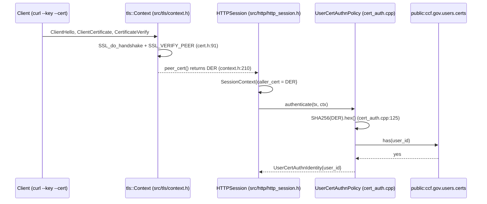
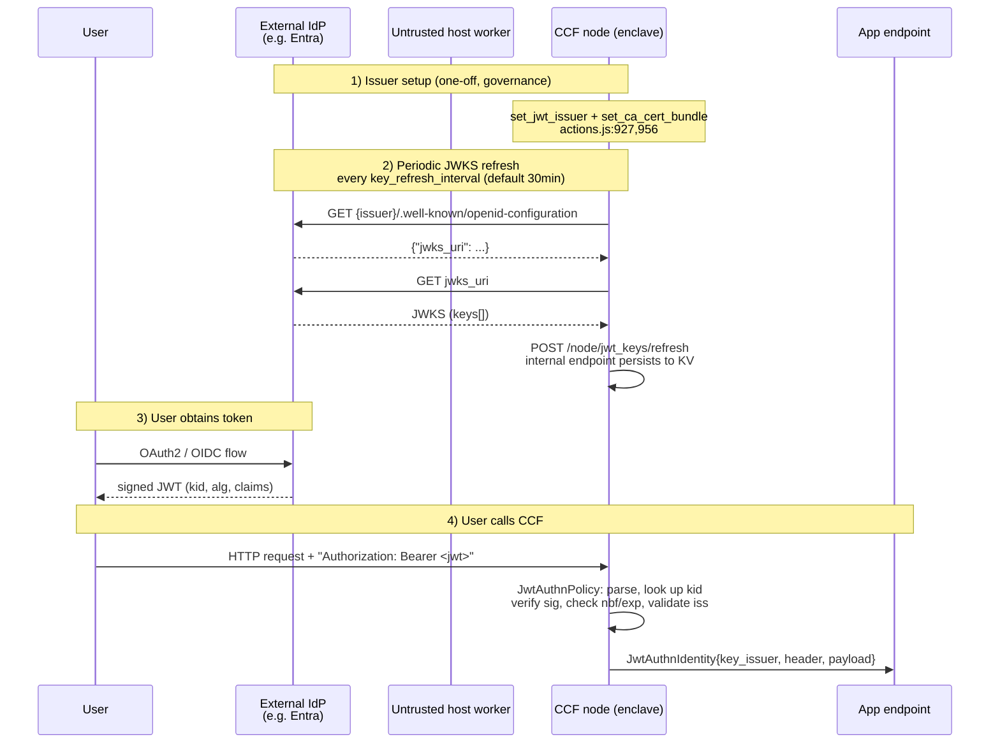

# CCF Identity Deep Dive — User mTLS & JWT Bearer Auth

> Companion to `ccf_identity_primer.md` §8. Focused on the **two external
> client-auth paths into application endpoints**: X.509 (mutual-TLS) and JWT
> bearer tokens. Everything below describes the code on `main` today; no PQC
> proposals — see only the final “Sharp edges for PQC” section.
>
> Cross-cutting facts (Service / Node / Member identity, COSE Sign1
> governance, ledger signatures, recovery shares) are in the primer and not
> repeated here.

---

## Part A — Cert-based user identity (mTLS)

### A1. What a *user* actually is

A **user** in CCF is just `{ user_id, X.509 cert (PEM), optional user_data
JSON }`, persisted in the public KV by governance. Users are not endorsed by
the service: they’re *registered*. Conceptually they’re the principals that
call application endpoints — distinct from **members** (consortium governors,
COSE Sign1) and **operators** (no separate identity class; operators are just
members holding a specific `member_data.is_operator` claim or, more recently,
the `OperatorFeature` mechanism in `include/ccf/service/operator_feature.h`).

Same crypto material as members (X.509/EC) but different KV table, different
auth policy, and different frontend (`user_frontend.h` vs
`member_frontend.h`). Concretely the two are distinguished only by where the
SHA-256 of the cert is looked up at request time
(`Tables::USER_CERTS` vs `Tables::MEMBER_CERTS`,
`src/endpoints/authentication/cert_auth.cpp:127,159`).

### A2. Registration — the `set_user` governance action

User registration is a constitution action implemented in JS, not a C++
handler. The reference constitution at
`samples/constitutions/default/actions.js:570-597` does exactly:

```js
let userId = ccf.pemToId(args.cert);            // SHA-256 of DER(cert)
ccf.kv["public:ccf.gov.users.certs"].set(rawUserId, ccf.strToBuf(args.cert));
if (args.user_data) {
  ccf.kv["public:ccf.gov.users.info"]
     .set(rawUserId, ccf.jsonCompatibleToBuf({ user_data: args.user_data }));
}
```

`ccf.pemToId` is the binding that runs the same SHA-256 the auth policy uses
at request time. The companion action `remove_user`
(`samples/constitutions/default/actions.js:599-609`) deletes both rows.

The two tables are declared in `include/ccf/service/tables/users.h:36-37`:

```cpp
static constexpr auto USER_CERTS = "public:ccf.gov.users.certs";
static constexpr auto USER_INFO  = "public:ccf.gov.users.info";
```

with value types `UserCerts = RawCopySerialisedMap<UserId, Pem>` and
`UserInfo = ServiceMap<UserId, UserDetails>` (`users.h:31-32`). `UserDetails`
is `{ nlohmann::json user_data }` (`users.h:22-29`).

### A3. `set_user_data` and how apps read it

`set_user_data` (`actions.js:612-633`) overwrites just the `users.info` row
without touching the cert, so members can change roles/permissions without
forcing the user to re-key. The user-data blob is opaque to the framework
— the framework only requires it to be `object?` (`actions.js:616`).

Application code reaches it through the v1 helper
`get_user_data_v1(tx, user_id, out_json)` declared in
`include/ccf/common_endpoint_registry.h` and used in the logging sample at
`samples/apps/logging/logging.cpp:2107-2136` (the `record_admin_only`
endpoint), which checks `user_data["isAdmin"] == true` and returns 403
otherwise. Same pattern in the `describe_identity` helper at
`samples/apps/logging/logging.cpp:303-309` which simply echoes the
user-data JSON.

### A4. mTLS handshake: how the client cert reaches the endpoint

Every public RPC interface configured with `endorsement.authority` ≠ `Node`
gets a `tls::Cert` set up with `auth_required = true`. The wiring lives in
`src/tls/cert.h:88-110`:

```cpp
if (auth_required) {
  int opts = SSL_VERIFY_PEER | SSL_VERIFY_FAIL_IF_NO_PEER_CERT;
  SSL_CTX_set_verify(ssl_ctx, opts, cb);
  SSL_set_verify(ssl, opts, cb);
}
```

So OpenSSL refuses the handshake if the client does not present a cert (the
verification callback only logs and returns the OpenSSL `ok` flag, no
custom override). Chain validation runs against `peer_ca`
(`src/tls/cert.h:84-87`) using the same `tls::CA` the service uses for
node-to-node TLS — see `src/tls/ca.h` for the OpenSSL `X509_STORE` setup.

After `SSL_do_handshake()` finishes in
`ccf::tls::Context::handshake()` (`src/tls/context.h:102-139`), the parsed
peer cert is pulled out via `SSL_get_peer_certificate` and DER-encoded in
`Context::peer_cert()` (`src/tls/context.h:210-249`). The HTTP session
materialises a `ccf::SessionContext` exactly once per request, copying that
DER blob into `caller_cert`:

```cpp
session_ctx = std::make_shared<ccf::SessionContext>(
  session_id, tls_io->peer_cert(), interface_id);
// src/http/http_session.h:142-144 (HTTP/1.1)
// src/http/http2_session.h:200-205 (HTTP/2)
```

`SessionContext::caller_cert` is the DER-encoded original caller and is
also propagated through forwarding (`src/node/rpc/forwarder.h:93-170`) so
the user ID computed by the cert auth policy is identical on the receiving
node.



### A5. The `UserCertAuthnPolicy`

Definition: `include/ccf/endpoints/authentication/cert_auth.h:18-52`. The
shared instance is `ccf::user_cert_auth_policy` in
`include/ccf/common_auth_policies.h:26-27`.

Per-request body (`src/endpoints/authentication/cert_auth.cpp:107-137`):

1. Read `caller_cert` from the session (`cert_auth.cpp:112`); fail if empty.
2. Check NotBefore/NotAfter via a cached verifier
   (`ValidityPeriodsCache::is_cert_valid_now`,
   `cert_auth.cpp:68-98`) using `std::chrono::system_clock::now()` — note
   this is *host-supplied wall clock*; CCF deliberately does not have an
   in-enclave trusted time source.
3. Compute `user_id = SHA256(caller_cert_DER).hex_str()`
   (`cert_auth.cpp:125`).
4. Look up `Tables::USER_CERTS` (`cert_auth.cpp:127-128`); if present,
   return `UserCertAuthnIdentity{user_id}`.

The whole policy state is the SHA-256 of the **whole DER cert** (issuer,
SAN, validity, public key, signature — everything), so any reissue with a
different cert blob counts as a different user even with the same key
material. That’s deliberate but worth knowing for any PQC migration that
keeps a key but reissues the cert envelope.

> **`user_signature_auth_policy` is gone.** HTTP request signing was
> removed in CCF 4.0 in favour of COSE Sign1 (warning preserved at
> `doc/governance/proposals.rst:441` and
> `doc/use_apps/issue_commands.rst:57`). The replacement for users is
> `ccf::user_cose_sign1_auth_policy`
> (`include/ccf/common_auth_policies.h:52-53`,
> `include/ccf/endpoints/authentication/cose_auth.h:176-198`), which
> verifies a COSE Sign1 envelope signed by the user cert and looks up the
> same `public:ccf.gov.users.certs` table.

### A6. Accepted curves and algorithms

There is no enforcement *inside the user-auth path itself* — the policy
just runs OpenSSL’s X.509 verification and a SHA-256 over the DER. What
actually restricts the algorithms is the TLS layer:

- Curves on the TLS side are restricted in `src/tls/context.h:60-61`:

  ```cpp
  SSL_CTX_set1_curves_list(cfg, "P-521:P-384:P-256");
  SSL_set1_curves_list(ssl, "P-521:P-384:P-256");
  ```

- Ciphersuites are ECDHE-ECDSA / ECDHE-RSA AES-GCM only for TLS 1.2 and
  `TLS_AES_256_GCM_SHA384` / `TLS_AES_128_GCM_SHA256` for TLS 1.3
  (`src/tls/context.h:43-57`). TLS 1.3 ciphersuite strings are
  authentication-agnostic; the signature algorithm is whatever the cert
  carries, subject to OpenSSL’s default `signature_algorithms` list.
- The CCF-internal `crypto::CurveID` enum
  (`include/ccf/crypto/curve.h:17-39`) lists `SECP384R1, SECP256R1,
  CURVE25519, X25519`. This drives identities that *CCF generates*
  (service, node, member when CCF mints them); a user PEM produced
  externally is parsed by OpenSSL unconstrained.

So in practice today: any TLS 1.2/1.3 client cert whose key is verifiable
by OpenSSL 3.x and whose signature uses an algorithm in OpenSSL’s default
list, with curve in {P-256, P-384, P-521}, will be accepted at the TLS
layer; the CCF policy adds zero further constraints.

---

## Part B — JWT bearer authentication

### B1. End-to-end overview



### B2. JWT issuer management

`set_jwt_issuer`, `remove_jwt_issuer`, `set_jwt_public_signing_keys` and
`set_ca_cert_bundle` are constitution actions defined in
`samples/constitutions/default/actions.js:927-1052`. The body of
`set_jwt_issuer` (`actions.js:956-1016`) validates:

- `issuer` is a string;
- `auto_refresh` is `boolean?`;
- `ca_cert_bundle_name` is `string?`;
- `jwks` is `object?`; if present, passes `checkJwks`;
- if `auto_refresh === true`: `ca_cert_bundle_name` is **required**, the
  bundle must already exist in `public:ccf.gov.tls.ca_cert_bundles`, and
  `issuer` must be an `https://` URL with no query/fragment
  (`actions.js:966-1002`).

On commit it writes `public:ccf.gov.jwt.issuers` with value
`JwtIssuerMetadata{ ca_cert_bundle_name?, auto_refresh }`
(`include/ccf/service/tables/jwt.h:22-33,66,70`), and if a `jwks` was
inlined, ships it to the C++ helper via
`ccf.setJwtPublicSigningKeys(issuer, metadata, jwks)`
(`actions.js:1008-1010`). That binding lives at
`src/js/extensions/ccf/gov_effects.cpp:239-247` and forwards to
`ccf::set_jwt_public_signing_keys` in
`src/node/rpc/jwt_management.h:197-361`.

`remove_jwt_issuer` (`actions.js:1038-1052`) deletes
`public:ccf.gov.jwt.issuers[issuer]` and then calls
`ccf.removeJwtPublicSigningKeys(issuer)` which walks the keys table and
removes only the metadata entries with a matching issuer
(`jwt_management.h:168-195`).

### B3. JWKS storage

There is exactly **one** JWT key table in code today:

```cpp
static constexpr auto JWT_PUBLIC_SIGNING_KEYS_METADATA =
  "public:ccf.gov.jwt.public_signing_keys_metadata_v2";
// include/ccf/service/tables/jwt.h:72-73
```

The value type is `ServiceMap<JwtKeyId, std::vector<OpenIDJWKMetadata>>`
(`jwt.h:50-51`) with

```cpp
struct OpenIDJWKMetadata {
  ECPublicKey public_key;          // = std::vector<uint8_t>, jwt.h:38
  JwtIssuer  issuer;
  std::optional<JwtIssuer> constraint;
};                                 // jwt.h:40-48
```

Despite the name `ECPublicKey`, this field stores **DER-encoded
SubjectPublicKeyInfo** of *either* an RSA *or* an EC public key — it’s
just an alias for `std::vector<uint8_t>`. The DER is what
`crypto::make_rsa_public_key` / `make_ec_public_key` produces via
`public_key_der()` in
`src/node/rpc/jwt_management.h:36-37,64-65,96-97`.

Multiple issuers can share a `kid` (key id): the value is a *vector* of
metadata so signature verification iterates all entries whose `kid`
matches (`jwt_auth.cpp:189-247`).

> ⚠️ The user-facing docs `doc/build_apps/auth/jwt.rst:135-137` still
> reference `public:ccf.gov.jwt.public_signing_keys` and
> `public:ccf.gov.jwt.public_signing_key_issuer` — those tables no longer
> exist in code. There is a `JwtPublicSigningKeysMetadataLegacy` type
> declared at `include/ccf/service/tables/jwt.h:53-64` for migration
> readers but no constant references it. **Treat the docs as stale on
> this point; the code is source of truth.** TODO: docs PR worth opening.

### B4. Manual JWKS upload — `set_jwt_public_signing_keys`

Action: `samples/constitutions/default/actions.js:1018-1036`. Body:

```js
const metadata = ccf.bufToJsonCompatible(
  ccf.kv["public:ccf.gov.jwt.issuers"].get(issuerBuf));
ccf.setJwtPublicSigningKeys(issuer, metadata, jwks);
```

So you must `set_jwt_issuer` first or the JS will throw `issuer ... not
found` (`actions.js:1029`).

The JWKS schema is `JsonWebKeySet { JsonWebKeyData[] keys }`
(`include/ccf/service/tables/jwt.h:76-87`). Each `JsonWebKeyData`
(`include/ccf/crypto/jwk.h:49-66`) carries:

- `kty`: `EC | RSA | OKP` (enum `JsonWebKeyType`, `jwk.h:13-23`);
- `kid` (required by `try_parse_jwk` in
  `src/node/rpc/jwt_management.h:109-112`);
- optional `n,e` (RSA), `x,y,crv` (EC), `x5c` (X.509 chain in base64), and
  CCF-specific `issuer` constraint.

`set_jwt_public_signing_keys` in `jwt_management.h:197-361` parses each
JWK in priority order (`try_parse_jwk`, `jwt_management.h:106-132`):

1. Raw RSA (`n`, `e`) → `make_rsa_public_key().public_key_der()`
   (`jwt_management.h:18-44`);
2. Raw EC (`x`, `y`, `crv`) →
   `make_ec_public_key().public_key_der()` (`jwt_management.h:46-72`);
3. Fall back to `x5c[0]` → base64-decode → `make_unique_verifier(der)` →
   `public_key_der()` (`jwt_management.h:74-104`).

Whatever path matched, only the public-key DER is persisted; the X.509
chain is **not stored**. The optional per-key `issuer` field becomes a
`constraint` that’s subdomain-checked against the host of the configured
issuer (`check_issuer_constraint`, `jwt_management.h:137-166`).

### B5. Auto-refresh subsystem

There are two cooperating components:

| Component | Where | Role |
|---|---|---|
| `JwtKeyAutoRefresh` (enclave) | `src/node/jwt_key_auto_refresh.h:16-356` | Periodic task that issues outbound HTTPS via `rpcsessions->create_client()`, fetches OIDC metadata + JWKS, then `POST`s to its own `/node/jwt_keys/refresh` |
| `NodeEndpoints::refresh_jwt_keys` | `src/node/rpc/node_frontend.h:1761-1788` | Internal endpoint, `NodeCertAuthnPolicy`, persists the JWKS into the KV via `ccf::set_jwt_public_signing_keys` (jwt_management.h) |

Lifecycle: `NodeState::auto_refresh_jwt_keys()`
(`src/node/node_state.h:1407-1433`) constructs the task with
`config.jwt.key_refresh_interval.count_s()` and installs a KV map hook on
`network.jwt_issuers` so any change to issuers schedules a one-off
refresh in addition to the periodic schedule
(`node_state.h:1426-1432`).

The cadence is `config.jwt.key_refresh_interval`, defined in
`include/ccf/node/startup_config.h:65-71`:

```cpp
struct JWT {
  ccf::ds::TimeString key_refresh_interval = {"30min"};
};
```

i.e. **default 30 min = 1800 s**. (The user-facing docs name the field
`jwt.key_refresh_interval_s`, `doc/build_apps/auth/jwt.rst:110` — this is
the operator-config field name in the configuration JSON schema; in code
it’s the `TimeString` type that parses `"30min"`, `"1800s"`, etc.)

Per tick (`JwtKeyAutoRefresh::refresh_jwt_keys`,
`src/node/jwt_key_auto_refresh.h:279-349`):

1. **Only the primary refreshes** (`consensus->can_replicate()` guard at
   `jwt_key_auto_refresh.h:57-65, 87-95`). Followers skip silently.
2. Iterate `network.jwt_issuers`; skip any with `auto_refresh == false`
   (`jwt_key_auto_refresh.h:287-294`).
3. Look up the `ca_cert_bundle_name`’s PEM in
   `public:ccf.gov.tls.ca_cert_bundles`
   (`include/ccf/service/tables/cert_bundles.h:9-14`,
   `jwt_key_auto_refresh.h:302-313`).
4. Build `metadata_url = issuer + "/.well-known/openid-configuration"`
   (`jwt_key_auto_refresh.h:315`), open a TLS connection authenticated by
   the CA bundle (`tls::CA` + `tls::Cert` with peer hostname = SNI;
   `jwt_key_auto_refresh.h:320-324`), and `GET` the OIDC discovery
   document.
5. Callback `handle_jwt_metadata_response`
   (`jwt_key_auto_refresh.h:188-277`) parses `jwks_uri`, opens a fresh
   TLS connection to it, and `GET`s the JWKS.
6. Callback `handle_jwt_jwks_response`
   (`jwt_key_auto_refresh.h:132-186`) parses the JWKS, optionally
   propagates the OIDC document’s `"issuer"` field as a per-key
   constraint, and `send_refresh_jwt_keys()` POSTs the result internally
   to `/node/jwt_keys/refresh` (built at
   `jwt_key_auto_refresh.h:100-122`, using the **node identity cert** as
   the session’s `caller_cert` so the receiving `NodeCertAuthnPolicy`
   accepts it).
7. The receiver, the `/jwt_keys/refresh` handler at
   `src/node/rpc/node_frontend.h:1761-1788`, calls
   `ccf::set_jwt_public_signing_keys()`
   (`jwt_management.h:197-361`) inside a transaction. The resulting KV
   write is replicated through consensus like any other write, so
   followers learn about JWKS updates strictly through the ledger — not
   by talking to the IdP themselves.

```mermaid
flowchart LR
  Tick[Periodic task<br/>jwt_key_auto_refresh.h:71-72] --> Primary{can_replicate?}
  Primary -->|no| Skip[Skip, increment nothing]
  Primary -->|yes| Iter[for each jwt_issuer]
  Iter --> CA[load CA bundle<br/>public:ccf.gov.tls.ca_cert_bundles]
  CA --> Meta[GET issuer/.well-known/openid-configuration]
  Meta --> JWKS[GET jwks_uri]
  JWKS --> Post[POST /node/jwt_keys/refresh<br/>(NodeCertAuthnPolicy)]
  Post --> KV[(public:ccf.gov.jwt.public_signing_keys_metadata_v2)]
  KV --> Replicate[AFT consensus → followers]
```

TLS validation: the outbound TLS connection to the IdP is verified against
the operator-supplied CA bundle (`tls::CA` initialised from
`crypto::split_x509_cert_bundle(...)`, `jwt_key_auto_refresh.h:320-322`).
There is no SAN/hostname relaxation — `peer_hostname` is set on the
`tls::Cert` to the URL host (`jwt_key_auto_refresh.h:245-246, 323-324`),
turning into `SSL_set_tlsext_host_name` plus the cert chain check.

### B6. Refresh metrics endpoint

`GET /node/jwt_keys/refresh/metrics` returns
`JWTRefreshMetrics{ attempts, successes, failures }`
(`src/node/rpc/node_frontend.h:132-141, 1790-1800`).

The accounting happens in
`NodeEndpoints::handle_event_request_completed`
(`node_frontend.h:418-435`), which fires on every completed request:
when the path is `POST /jwt_keys/refresh` it increments `attempts`, and
either `failures` (4xx/5xx) or `successes` (2xx). So this only counts
the *internal* enclave-side POSTs after a successful JWKS fetch — see
the comment at `jwt_key_auto_refresh.h:261-262` that connection errors
to the IdP are **not** reported here. `attempts` is also incremented in
the task itself (`jwt_key_auto_refresh.h:296-297`) and surfaced via
`NodeState::get_jwt_attempts()` (`node_state.h:1435-1438`) — that
counter is what the test infrastructure uses; the `/metrics` endpoint
uses the request-completed counter, which is the more conservative
“actually persisted to KV” number.

### B7. Per-request JWT validation

Definition: `include/ccf/endpoints/authentication/jwt_auth.h:9-58`.
Shared instance: `ccf::jwt_auth_policy` at
`include/ccf/common_auth_policies.h:41-42`. The body
(`src/endpoints/authentication/jwt_auth.cpp:162-250`):

1. `JwtVerifier::extract_token(headers)`
   (`src/http/http_jwt.h:209-226`): pulls the `authorization` header,
   verifies it starts with `Bearer ` (`http_jwt.h:60-79`, the scheme
   string `"Bearer"` is `ccf::http::auth::BEARER_AUTH_SCHEME` at
   `include/ccf/http_consts.h:65`), splits on `.`, base64url-decodes
   header/payload/signature (`http_jwt.h:102-207`).
2. Parse header → `JwtHeader{ JwtCryptoAlgorithm alg, std::string kid }`
   (`http_jwt.h:18-34`). **The alg enum admits exactly two values:
   `RS256` and `ES256`** (`http_jwt.h:18-26`). Any other `alg` in the
   header fails JSON deserialisation with “JWT header does not follow
   schema”.
3. Parse payload → `JwtPayload{ size_t exp, string iss, optional<size_t>
   nbf, optional<string> tid }` (`http_jwt.h:36-45`). `exp` and `iss`
   are required; `nbf` and the Entra-specific `tid` (tenant) are
   optional.
4. Look up `kid` in `JWT_PUBLIC_SIGNING_KEYS_METADATA`
   (`jwt_auth.cpp:177-187`).
5. For each candidate `OpenIDJWKMetadata`:
   - Verify signature via `PublicKeysCache::verify`
     (`jwt_auth.cpp:100-153`). The cache LRU-caches up to
     `DEFAULT_MAX_KEYS = 10` parsed public keys (`jwt_auth.cpp:88-98`).
     It first tries `make_rsa_public_key(der)` and on exception falls
     back to `make_ec_public_key(der)`
     (`jwt_auth.cpp:109-119`).
     - **RSA path**: `RSAPublicKey::verify(..., SHA256, PKCS1v15)`
       (`jwt_auth.cpp:128-134`). The PKCS1-v1.5 padding choice (not
       PSS) is explicit; the in-code comment links to
       `microsoft/CCF#6601` justifying that the JWT spec mandates
       PKCS1-v1.5 for RS256.
     - **EC path**: signatures arrive as IEEE-P1363 concatenated
       `(r||s)` per RFC 7515; CCF converts to ASN.1 DER via
       `ecdsa_sig_p1363_to_der` (`jwt_auth.cpp:141-142`) and then
       `ECPublicKey::verify(..., SHA256)`. So **`ES256` is hard-coded
       to SHA-256**; there is no `ES384` / `ES512` support in this
       verifier even though OpenSSL would accept it.
   - Check `time_now ≥ nbf` (if present) and `time_now ≤ exp`
     (`jwt_auth.cpp:202-223`). `time_now` is
     `system_clock::now()` — i.e. the **host-supplied wall clock**, the
     same caveat as cert validity (and called out in
     `doc/build_apps/auth/jwt.rst:7`).
   - If the key has a `constraint`, run `validate_issuer(iss, tid,
     constraint)` (`jwt_auth.cpp:38-85`,
     `jwt_auth.h:22-25`). Generic case: `iss == constraint && !tid`.
     The Entra special case (issuer host =
     `login.microsoftonline.com`): allow `{tenantid}` placeholder
     substitution and require `tid` matches the first non-empty path
     chunk of `iss`.
6. On success, return
   `JwtAuthnIdentity{ key_issuer, header (raw JSON), payload (raw JSON) }`
   (`jwt_auth.h:9-18`, `jwt_auth.cpp:241-246`). The full raw header and
   payload — *not just typed fields* — are exposed so app code can read
   arbitrary claims (see `samples/apps/logging/logging.cpp:359-369`).
7. On failure, the policy sets a `WWW-Authenticate: Bearer realm="JWT
   bearer token access", error="invalid_token"` 401 via
   `set_unauthenticated_error` (`jwt_auth.cpp:252-262`).

### B8. Accepted JWT signing algorithms

Concrete answer: **only `RS256` and `ES256`** are decodable into
`JwtHeader` (`src/http/http_jwt.h:18-26`). Any other `alg` value
(`RS384`, `RS512`, `ES384`, `EdDSA`, `PS256`, `none`, …) fails at the
JSON parse step inside `JwtVerifier::parse_token`
(`http_jwt.h:177-187`), and the user receives 401 with “JWT header does
not follow schema”. There is no run-time configuration that widens this
set.

Note also: even for the keys that *can* be persisted in JWKS (RSA, EC
P-256/P-384, OKP all parse in `try_parse_jwk`, `jwt_management.h:18-132`,
and `make_ec_public_key` accepts P-384 via `JsonWebKeyECCurve::P384`,
`include/ccf/crypto/jwk.h:86-100`), the verifier always hashes with
SHA-256 (`jwt_auth.cpp:133, 148`). So a P-384 EC key in the JWKS would
be stored fine but token verification would only succeed if the IdP
actually signed with SHA-256 — which is non-standard for ES384.

---

## Part C — Cross-cutting concerns relevant to PQC

### C1. Forwarding vs redirection — known JWT sharp edge

CCF nodes can either *forward* a non-primary request transparently to
the primary over an internal authenticated channel (the legacy mode,
`set_forwarding_required`) or return an HTTP **redirect** to the
client (the new mode, `set_redirection_strategy`).

The known JWT pitfall is documented in
`doc/build_apps/fwd_to_redirect.rst:14-17`:

> While most HTTP client libraries will allow you to automatically
> follow redirects, many will also remove `Authorization` headers
> after redirection, to prevent you submitting confidential
> information to an unintended host. […] If your client is submitting
> an `Authorization` header (eg - a JWT Bearer token) yet receiving
> `401 Unauthorized` responses, it is likely that your HTTP
> middleware is removing this header on redirect.

This is purely a client-side behaviour: CCF emits a standards-compliant
3xx, and standards-compliant clients (curl with `-L`, `requests` with
`allow_redirects=True`, Go `net/http` default policy) strip
`Authorization` on cross-origin or any redirect. Mitigations are
documented inline at `fwd_to_redirect.rst:17`. There is **no equivalent
hazard with mTLS** because the client cert is bound to the TLS session,
not the HTTP request — the new TLS handshake to the redirected node
just re-presents it.

### C2. Algorithm constants & sizes worth memorising

| Surface | What today’s code accepts | Citation |
|---|---|---|
| TLS curves | P-256, P-384, P-521 | `src/tls/context.h:60-61` |
| TLS 1.3 cipher suites | `TLS_AES_256_GCM_SHA384`, `TLS_AES_128_GCM_SHA256` | `src/tls/context.h:53-57` |
| TLS 1.2 cipher suites | ECDHE-{ECDSA,RSA}-AES{128,256}-GCM-SHA{256,384} | `src/tls/context.h:43-50` |
| Min TLS version | 1.2 | `src/tls/context.h:28-29` |
| Cert auth client request | `SSL_VERIFY_PEER \| SSL_VERIFY_FAIL_IF_NO_PEER_CERT` | `src/tls/cert.h:91` |
| User ID derivation | `SHA-256(DER(cert))` hex-encoded | `src/endpoints/authentication/cert_auth.cpp:125` |
| JWT `alg` values | `RS256`, `ES256` | `src/http/http_jwt.h:18-26` |
| JWT signature padding | RSA: PKCS#1 v1.5; EC: P1363→DER, SHA-256 | `src/endpoints/authentication/jwt_auth.cpp:128-148` |
| JWKS `kty` values | `EC`, `RSA`, `OKP` (enum) | `include/ccf/crypto/jwk.h:13-23` |
| JWKS EC curves accepted by `jwk_curve_to_curve_id` | `P-256`, `P-384` (P-521 explicitly rejected) | `include/ccf/crypto/jwk.h:86-100` |
| JWK key parse order | raw RSA → raw EC → x5c[0] | `src/node/rpc/jwt_management.h:106-132` |
| Stored JWK value | DER `SubjectPublicKeyInfo` (RSA or EC) | `src/node/rpc/jwt_management.h:36-37,64-65,96-97`; `include/ccf/service/tables/jwt.h:40-48` |
| JWT issuers table | `public:ccf.gov.jwt.issuers` | `include/ccf/service/tables/jwt.h:70` |
| JWT keys table | `public:ccf.gov.jwt.public_signing_keys_metadata_v2` | `include/ccf/service/tables/jwt.h:72-73` |
| User certs table | `public:ccf.gov.users.certs` | `include/ccf/service/tables/users.h:36` |
| User info table | `public:ccf.gov.users.info` | `include/ccf/service/tables/users.h:37` |
| CA bundles table (for JWT auto-refresh) | `public:ccf.gov.tls.ca_cert_bundles` | `include/ccf/service/tables/cert_bundles.h:9-14` |
| Refresh cadence default | 30 min (`"30min"` TimeString) | `include/ccf/node/startup_config.h:67` |
| OIDC discovery URL | `{issuer}/.well-known/openid-configuration` | `src/node/jwt_key_auto_refresh.h:315` |

### C3. Sharp edges for PQC design

A PQC-aware identity story touches both auth paths but is constrained by
*different* boundaries:

**mTLS (user X.509)** is essentially "whatever OpenSSL accepts at the
configured curve list / signature_algorithms":

- The hard-coded TLS 1.3 cipher suites
  (`src/tls/context.h:53-57`) are AEAD-only and don’t themselves
  constrain the signature algorithm — a PQC `signature_algorithms`
  extension would be carried inside the existing ciphersuite.
- However the `SSL_CTX_set1_curves_list(... "P-521:P-384:P-256")` call
  (`src/tls/context.h:60-61`) limits **key-share groups**. Hybrid PQ
  KEMs (e.g. `X25519MLKEM768`) would need this list expanded — and
  OpenSSL 3.x stock doesn’t expose them; you’d either need
  `oqs-provider` or an OpenSSL ≥ 3.5 build.
- User ID is `SHA-256(DER(cert))` (`cert_auth.cpp:125`). Independent of
  the key algorithm. A PQC cert just gets a (much larger) DER and a
  new hash; that’s fine, but downstream KV writes use `UserId =
  string` (`include/ccf/service/tables/users.h:31`) of fixed 64-hex
  width — no migration risk there.
- Cert size, however, is real: ML-DSA-65 certs are ~2.5 KB and
  Falcon/SPHINCS+ even larger, vs ~500 B for ECDSA-P256. CCF copies
  the full DER into every `SessionContext` (`http_session.h:142-144`)
  and forwards it byte-for-byte across nodes
  (`src/node/rpc/forwarder.h:93-170`). Per-request memory and
  forwarding payload grow accordingly.

**JWT bearer** is much more boxed-in:

- The `JwtCryptoAlgorithm` enum
  (`src/http/http_jwt.h:18-26`) is a *typed* JSON parse, not a string
  comparison. Adding `ML-DSA-44` or similar means changing this enum
  and rebuilding the framework — no governance-time
  reconfiguration.
- Signature verification dispatches strictly on “is the cached public
  key RSA or EC?” (`src/endpoints/authentication/jwt_auth.cpp:122-150`).
  A third arm (PQC) needs both a new `crypto::*PublicKey` family in
  `include/ccf/crypto/` and a third branch in `PublicKeysCache::verify`.
- The JWKS schema (`include/ccf/crypto/jwk.h:13-23`) only knows `EC`,
  `RSA`, `OKP`. RFC 7517 itself was extended by RFC 9628 (registry
  updates) to consider PQC `kty` values, but as of today neither IETF
  has standardised a final `kty` for ML-DSA / SLH-DSA, nor does CCF
  parse one. **No PQC `kty` will round-trip through `try_parse_jwk`
  today** (`src/node/rpc/jwt_management.h:106-132` — the function
  throws `JWKS kid X has neither RSA/EC public key or x5c` if none of
  the three shapes match).
- The `x5c` fallback would in principle let a PQC public key sneak in
  inside an X.509 cert (`jwt_management.h:74-104`), but
  `make_unique_verifier(der)` is still backed by the same OpenSSL
  `EVP_PKEY` machinery, so this is no escape hatch unless OpenSSL has
  been compiled with PQC support.
- `JWT_PUBLIC_SIGNING_KEYS_METADATA` stores DER public keys
  (`include/ccf/service/tables/jwt.h:40-48`). PQC keys *do* fit (it’s
  just `std::vector<uint8_t>`), but the ledger entries will grow
  ~10–40× for ML-DSA/SLH-DSA. JWKS auto-refresh imports them
  unmodified (`jwt_key_auto_refresh.h:132-186` → `jwt_management.h`),
  so on a 30-min refresh cadence with a large IdP that’s real ledger
  pressure to plan for.
- `time_now` in `nbf/exp` validation
  (`src/endpoints/authentication/jwt_auth.cpp:203-223`) is the host
  wall clock — PQC doesn’t affect this, but any new PQC scheme with a
  short validity window (per NIST SP 800-208 LMS, e.g.) would inherit
  the same host-time trust assumption.

**Plumbing that works unchanged for PQC**:

- Governance action shape (`set_jwt_issuer`,
  `set_jwt_public_signing_keys`, `set_user`,
  `samples/constitutions/default/actions.js:570,927,956,1018`) is
  algorithm-agnostic JSON.
- KV table layout (`include/ccf/service/tables/users.h`,
  `…/jwt.h`) is algorithm-agnostic byte vectors and PEMs.
- Auto-refresh worker (`src/node/jwt_key_auto_refresh.h`) only cares
  about HTTPS to the IdP — TLS settings carry over verbatim.
- `JwtAuthnIdentity` and `UserCertAuthnIdentity` exposed to apps
  (`include/ccf/endpoints/authentication/jwt_auth.h:9-18`,
  `cert_auth.h:18-22`) have no algorithm field — apps never see the
  signing algorithm, so a PQC switch is invisible to handler code.

The natural seam for a PQC retrofit is therefore:

1. Extend `crypto::CurveID` / add new public-key wrapper class in
   `include/ccf/crypto/`.
2. Extend `JsonWebKeyType` and `try_parse_jwk` to recognise the new
   `kty`.
3. Extend `JwtCryptoAlgorithm` and `PublicKeysCache::verify` to handle
   the new `alg`.
4. (Optional, per-deployment) bump `SSL_CTX_set1_curves_list` and
   ciphersuite strings in `src/tls/context.h` to enable hybrid TLS
   groups.

None of this requires touching consensus, the ledger format, governance
flow, or the redirection sharp edge in §C1.
