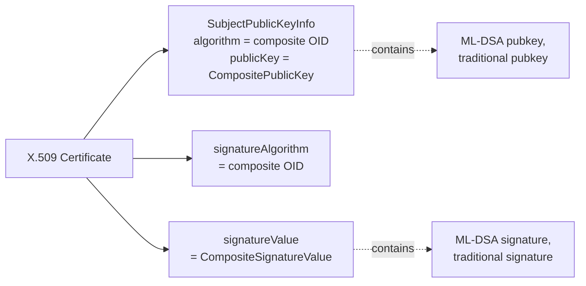
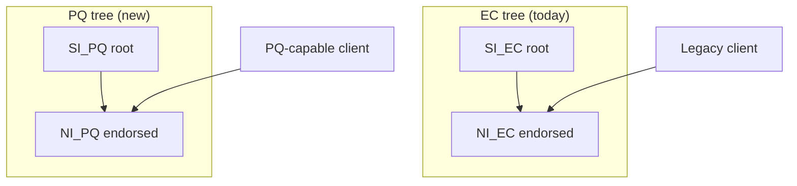
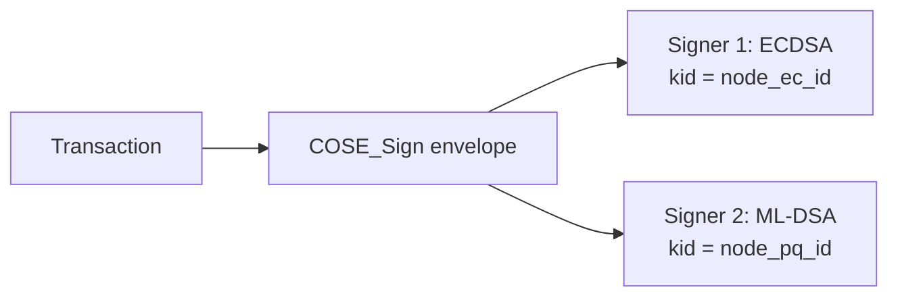
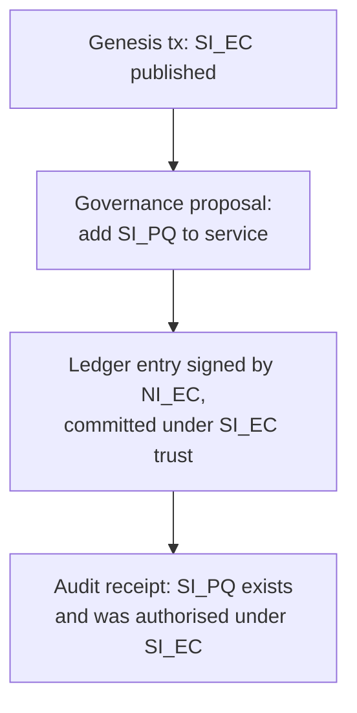

# Composite Certificates and Parallel-Identity Alternatives

*Companion to `pqc_options_recommendation.md`. Focused on the "what does a composite cert actually look like, and what are the realistic alternatives if I keep two parallel signing identities instead?" question.*

---

## Part 1 — Composite certs, in detail ("how to cook them")

The relevant specs:

- **`draft-ietf-lamps-pq-composite-sigs`** (LAMPS WG, stable -06+) — composite **signature** algorithms
- **`draft-ietf-lamps-pq-composite-kem`** — composite **KEM** algorithms (for encryption certs)
- **`draft-reddy-tls-composite-mldsa`** — TLS 1.3 wiring

### 1.1 Anatomy: what's inside a composite cert

A composite cert looks exactly like a normal X.509 cert. The PQC-ness is hidden inside three fields:



ASN.1 essentials:

```asn1
-- Public key
CompositeSignaturePublicKey ::= SEQUENCE SIZE (2) OF BIT STRING
-- Order: ML-DSA first, traditional second

-- Signature value
CompositeSignatureValue ::= SEQUENCE SIZE (2) OF BIT STRING
-- Order matches the public key
```

Both are wrapped as a single OPAQUE BIT STRING in the existing X.509 slots — **no schema change to the cert envelope**, only new OIDs to register.

### 1.2 Registered algorithm OIDs (selected)

Each combination is its own OID — the spec **forbids ad-hoc mixing**:

| Composite OID (short name) | NIST level | Practical fit |
|---|---|---|
| `id-MLDSA44-Ed25519` | L2 | Modern, compact |
| `id-MLDSA65-ECDSA-P256` | L3 | Most likely default for new systems |
| `id-MLDSA65-ECDSA-P384` | L3 | **Matches CCF's current SECP384R1** |
| `id-MLDSA87-ECDSA-P384` | L5 | Higher-assurance |
| `id-MLDSA65-RSA3072-PSS` | L3 | If you must keep RSA |
| `id-MLDSA87-Ed448` | L5 | Future-proof |

The OID itself is **the binding** — you cannot mix-and-match keys with different OIDs in one cert.

### 1.3 The sign/verify recipe (the actual "cooking")

The combiner is intentionally simple, with two non-obvious tricks:

```
SIGN(sk_pq, sk_trad, message):
    r        = random(32)                          -- randomizer
    domain   = bytes(composite OID)                -- fixed bytes per algorithm
    M_prime  = domain || r || PH(message)          -- prehashed for size

    sig_pq   = ML-DSA.Sign(sk_pq,   M_prime, ctx="")
    sig_trad = Trad.Sign  (sk_trad, M_prime)
    return CompositeSignatureValue(sig_pq, sig_trad, r)

VERIFY(pk_pq, pk_trad, message, sig):
    parse  sig_pq, sig_trad, r
    M_prime = domain || r || PH(message)
    return  ML-DSA.Verify(pk_pq, M_prime, sig_pq, ctx="")
        AND Trad.Verify  (pk_trad, M_prime, sig_trad)
```

Three properties to internalise:

1. **AND semantics, always.** A verifier that accepts on either component alone is a downgrade vector.
2. **Domain separator (the OID bytes) prevents stripping.** Without it, an attacker could rebind a composite signature to a single-alg cert ("here, just the ML-DSA part"). The domain commits both halves to the *specific* composite OID.
3. **Randomizer makes the composite a randomized signature** even if one component is deterministic — closes a class of multi-target attacks.

The same pattern works for composite KEMs, just with `combine(ss_pq, ss_trad)` via HKDF and `(ct_pq, ct_trad)` on the wire.

### 1.4 Tooling state (mid-2026)

Be honest about what's actually buildable today:

| Tool | Composite support | Notes |
|---|---|---|
| **oqs-provider** (on OpenSSL 3.x) | Yes | The reference implementation; suitable for prototyping CCF |
| **OpenSSL 3.5 native** | ML-KEM + ML-DSA standalone, **no composite yet** | Composite is on the 3.6/3.7 roadmap |
| **BoringSSL / AWS-LC** | Standalone PQ, composite experimental | Google/AWS targeting hybrid KEX first |
| **BouncyCastle (Java)** | Yes since 1.78 | Useful for tooling/governance scripts |
| **SymCrypt (Microsoft)** | ML-DSA / ML-KEM yes; composite WIP | Relevant for AKV roadmap |
| **Azure Key Vault** | **No composite signing.** Standalone ML-DSA roadmap signal but no GA | **This is the CCF members blocker** |
| **AWS KMS** | No composite signing | Same blocker |
| **YubiHSM / Thales / Entrust** | ML-DSA standalone in some firmware; composite not committed | Patchy |
| **CA software** (smallstep, EJBCA, internal CA) | Issuance possible via oqs-provider | No major commercial CA issues composite to the public yet |
| **`pkilint`** | Validates composite cert profile | Use this in your CI |

The honest answer: **for service identity and node identity (where you control the key store inside the enclave), composite is buildable today on oqs-provider.** For member identity, where the typical operator wants AKV/HSM to hold the key, composite signing **does not exist in production HSM offerings**. This is the largest single reason members are the hardest piece to migrate.

### 1.5 TLS integration

`draft-reddy-tls-composite-mldsa` registers TLS 1.3 `SignatureScheme` values for each composite OID. From the application's perspective:

```
ClientHello.signature_algorithms = [
    mldsa65_ecdsa_secp384r1_sha384,   -- composite
    ecdsa_secp384r1_sha384,            -- legacy
]
```

Server picks whichever it has a matching cert for. The cert chain *itself* is one cert with composite SPKI; the `CertificateVerify` carries one composite signature. **No protocol surgery on the TLS state machine** — composite is opaque to TLS.

CCF impact: `MakeVerifier`, `make_cert_verifier`, `set_member`, `set_user`, and the SNP-attestation pubkey hash all just need to handle a different OID at the SPKI parser layer. Roughly the same code-change footprint as adding any new EC curve.

### 1.6 Pitfalls to know

| Pitfall | Mitigation |
|---|---|
| Cert size: ML-DSA-65 pubkey is **~2 KB**, signature is **~3 KB**; composite cert is ~6–10 KB | Drop the embedded-cert in `src/service/tables/signatures.h:25` first; consider cert chain compression |
| OID variant proliferation — `pure` vs `prehash` (`HashML-DSA…`) variants | Pick **one** variant in your `IdentityAlg` enum; reject others |
| BIT-STRING ordering — ML-DSA first, traditional second; getting this wrong breaks interop silently | Use a tested ASN.1 codec, not hand-rolled |
| `ctx=""` argument to ML-DSA — composite spec uses empty context, **standalone ML-DSA-in-TLS uses a different context value** | Don't share signing routines between standalone and composite paths |
| Test-vector coverage is thin compared to ECDSA | Run the spec's KATs in your unit tests |

---

## Part 2 — If you keep a parallel PQC signing identity, what are the alternatives?

The mental shift: composite collapses "two identities" into one cert that requires both. Parallel keeps two identities; you then need a way to **bind them, prove both, and not let an attacker strip one**.

Here are the five real options.

### 2.1 Alternative 1 — Parallel certificate hierarchies + TLS algorithm negotiation

Two complete PKI trees. Server picks which cert to present per handshake based on `signature_algorithms`. The "Trust Anchor IDs" extension (`draft-ietf-tls-trust-anchor-ids`, §6.7 of the UTA PQC-app draft) lets clients signal which root they trust.



| Pros | Cons |
|---|---|
| Zero new crypto; uses RFC-track building blocks | Two CAs, two rotation cycles, two revocation stories |
| Each client gets exactly one cert chain to validate | TLS server can only present one cert per connection — **the PQ identity protects only PQ-capable clients** |
| Easy to phase in | Stripping attack: attacker forces classical negotiation, gets only EC protection |
| Trust Anchor IDs makes the negotiation efficient | Doesn't solve the SNP `report_data` binding problem on its own |

### 2.2 Alternative 2 — Application-layer multi-signature (COSE `COSE_Sign`)

TLS uses the legacy EC cert for transport. The PQ identity exists *only* at the application layer — every CCF transaction, vote, and ledger signature carries both sigs in a COSE multi-signer envelope.



This is the cheapest parallel design, and the closest to what CCF already does (governance is already COSE Sign1).

| Pros | Cons |
|---|---|
| **Zero TLS/x.509 changes** | TLS endpoint identity remains classical → MITM with CRQC can hijack the transport in real time (§10.1 of the UTA PQC-app draft) |
| Works with today's AKV (composite blocked, COSE multi-signer is fine) | "Both verify required" must be policy-enforced at every reader |
| Auditors can verify PQ chain post-hoc from the ledger alone | Doesn't authenticate joining nodes' attestations under PQ |
| Multi-signer is already a COSE primitive (`COSE_Sign`, RFC 9052) | The PQ key needs its own trust binding — see Alternative 4 |

This is the strongest answer **for ledger integrity** during transition, and a natural fit for CCF.

### 2.3 Alternative 3 — TLS cert "stapling" of a sibling PQ cert (experimental)

There are drafts and experiments for stapling a second cert in TLS, e.g., via a `CertificateEntry` extension carrying a PQ-signed assertion over the classical cert. Not standardized; brittle interop.

| Pros | Cons |
|---|---|
| Keeps two separate keys and certs visible at TLS layer | No deployed standard you can target |
| Verifier can require both | Custom TLS extensions in CCF — large code & test surface |
| | Likely supplanted by composite once HSMs catch up |

Not recommended unless you want to do standards work. Mentioned for completeness.

### 2.4 Alternative 4 — Ledger-mediated cross-binding (the CCF-native answer)

This is the one that uses CCF's structure as the bind. The PQ identity is **introduced into the service by a governance proposal**, which is itself signed by quorum of EC member identities and recorded in the ledger. The ledger entry that establishes `SI_PQ` becomes the authority for any later PQ chain.



For nodes specifically: the SNP `report_data` continues to hash `NI_EC`; a *separate* in-ledger signed statement (signed by `NI_EC` at join time) binds `NI_PQ`. The TEE attests `NI_EC`; `NI_EC` attests `NI_PQ`; the ledger records the chain.

| Pros | Cons |
|---|---|
| Reuses CCF's existing audit primitive — **the ledger** | Only as strong as `SI_EC` until the ledger entry is widely seen |
| No new wire formats | A pure-PQ verifier must still resolve a fragment of the EC chain to bootstrap — full PQ-only verification is not possible until `SI_PQ` becomes the root of a new ledger epoch |
| Operates entirely above TLS — composable with Alt 2 | Cross-binding integrity = `SI_EC`'s classical-crypto integrity (i.e., HNDL-safe for *new* PQ key bindings, but a CRQC at bootstrap could forge an `SI_PQ` binding retroactively unless the ledger entry is timestamped under a PQ-secure source) |

The combination **Alt 2 + Alt 4** is internally consistent and matches CCF's threat model better than any single-mechanism approach.

### 2.5 Alternative 5 — Catalyst / Chameleon certificates (deprecated)

Single-cert designs that carry the PQ pubkey and a second signature in X.509 extensions (`SubjectAltPublicKeyInfo`, `AltSignatureValue`). Originally `draft-truskovsky-lamps-pq-hybrid-x509`, now superseded by composite.

| Pros | Cons |
|---|---|
| Backward compatible: legacy parsers ignore the extensions and see a normal classical cert | **IETF LAMPS has chosen composite over this approach** |
| One cert object, two split signatures (can be extracted) | Verifier policy "must check the alt sig if present" is fragile |

Don't pick this in 2026 — composite has won the standards battle.

---

## Part 3 — Summary table: composite vs the five parallel alternatives

| | Composite | Alt 1: Parallel CAs | Alt 2: COSE multi-sig | Alt 3: TLS stapling | Alt 4: Ledger binding | Alt 5: Catalyst |
|---|---|---|---|---|---|---|
| **Single TLS cert per conn** | Yes | No (one tree picked) | N/A (TLS unchanged) | No (sibling stapled) | N/A | Yes |
| **PQ identity attested by TEE** | Yes (one SPKI) | No (or needs `report_data` rework) | No | Yes-ish | Indirectly via ledger | Yes |
| **Strip-resistant** | Yes (AND in combiner) | Negotiable → no | Verifier policy | Verifier policy | Verifier policy | Verifier policy |
| **Works with current AKV/HSM** | **No** | Yes | Yes | Yes | Yes | Partial |
| **Standardised** | LAMPS WG (advanced) | RFCs only | COSE RFC 9052 | Drafts, experimental | CCF-internal | Deprecated |
| **CCF code surface** | Medium (OID + parsers) | Medium (two PKIs) | Small (governance & sigs only) | Large (custom TLS ext) | Small (governance only) | Medium |
| **Ledger size impact** | Big (large composite certs embedded) | 2× embedded certs | Sig-only growth | TLS-only | Sig-only growth | Medium |
| **Defeats HNDL on records** | No (need PQ KEX) | No | No | No | No | No |
| **Defeats MITM-with-CRQC** | Yes (TLS auth is PQ) | Only PQ-capable clients | **No** (TLS still classical) | Yes-ish | **No** (TLS still classical) | Yes |

---

## Part 4 — Concrete picks for CCF (given a preference for parallel identity)

If you genuinely want to keep a parallel PQ signing identity rather than composite:

1. **Default ledger/governance integrity → Alt 2 (COSE multi-signer).** Smallest change, uses primitives CCF already has, AKV-friendly today, lets all customers verify with either chain. This is the right answer for the next 12–18 months.
2. **Cross-binding of identities → Alt 4 (ledger-mediated).** Use governance proposals to commit `SI_PQ` and `NI_PQ ↔ NI_EC` bindings into the ledger. No new spec; reuses your existing trust root.
3. **Transport-layer PQ authentication → composite (only) when HSMs catch up.** Until AKV/KMS sign composite, the TLS server cert stays classical. Pair with hybrid KEX (Option A) so HNDL is closed even while authentication is classical. Acknowledge §10.1 of the UTA PQC-app draft: there's a residual MITM-with-CRQC risk on the transport that **no parallel scheme can fix without composite or stapling**.
4. **Avoid Alt 1 unless you have customers who are actively allergic to composite.** Two PKIs is twice the operations and doesn't even solve the SNP-binding problem.
5. **Stay away from Alt 3 and Alt 5.**

The cleanest sentence to take home:

> **Composite is the right answer for `(identity ↔ TLS endpoint)` binding; everything else is better solved by COSE multi-signer + the CCF ledger.**

---

## References

- `draft-ietf-lamps-pq-composite-sigs` — composite signatures
- `draft-ietf-lamps-pq-composite-kem` — composite KEMs
- `draft-reddy-tls-composite-mldsa` — composite in TLS 1.3
- `draft-ietf-uta-pqc-app` — UTA PQC application recommendations (esp. §6.3, §6.5, §6.7, §10.1)
- `draft-ietf-tls-trust-anchor-ids` — trust anchor identifier extension
- `draft-ietf-tls-hybrid-design`, `draft-ietf-tls-ecdhe-mlkem`, `draft-ietf-tls-mlkem` — hybrid and pure PQ KEX
- RFC 9052 — COSE (the `COSE_Sign` multi-signer envelope used in Alt 2)
- FIPS 203 (ML-KEM), FIPS 204 (ML-DSA), FIPS 205 (SLH-DSA)
- `src/service/tables/signatures.h:25` — the embedded-node-cert-per-sig-row CCF table that determines ledger-size impact
- `include/ccf/crypto/curve.h:17,38` — `CurveID` enum and `service_identity_curve_choice`
- `include/ccf/pal/report_data.h:50` — 64-byte SNP `report_data` slot (one per attestation)
