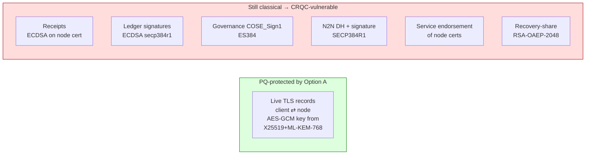
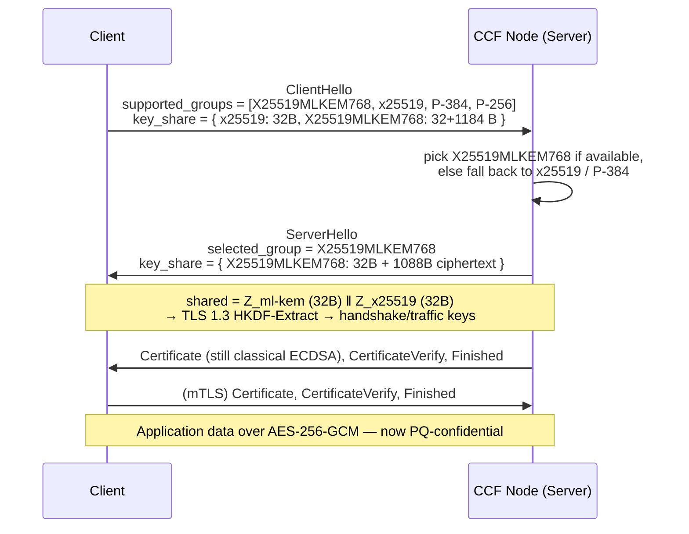
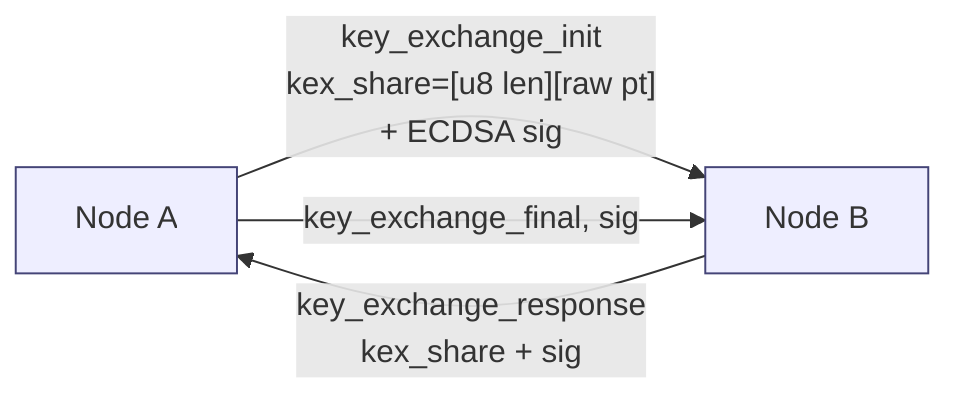

# PQC Option A — Hybrid TLS Only (Smallest Blast Radius)

> Proposes a **post-quantum TLS handshake** for CCF while leaving every
> X.509 identity, COSE_Sign1 envelope, ledger signature and node-to-node
> handshake exactly as it is today. Companion to `ccf_identity_primer.md`;
> assumes the four-class identity model from §1 of that doc. Counterpart
> options (B–E) raise the blast radius progressively.

---

## 1. TL;DR

Add the **`X25519MLKEM768`** named group from
`draft-ietf-tls-mlkem-hybrid` (formerly
`draft-kwiatkowski-tls-ecdhe-mlkem`) to CCF's TLS 1.3 stack and prefer it
when both peers support it. Everything else — service / node / member /
user X.509 certs, ledger Merkle signatures, governance COSE_Sign1,
recovery-share RSA-OAEP, the n2n DH at `src/crypto/key_exchange.h:23` —
stays classical. Net effect: PQ **session confidentiality** without
touching the identity model, the KV, governance, or the ledger format.

---

## 2. Threat coverage

This option defends one threat only: **harvest-now-decrypt-later (HNDL)
of TLS records**. An adversary that today captures every byte of a
client↔node TLS session and gets a CRQC in 2030+ can no longer recover
the AES-256-GCM session key, because the key was derived from a hybrid
secret that includes ML-KEM-768. The classical X25519 half remains, so
a classical break of ML-KEM does not regress security below today's
baseline.

It does **not** defend anything that's signed and persisted. Ledger
signatures (`src/node/history.h:402-425`, ECDSA on `secp384r1`), receipts
(node cert + ECDSA), governance COSE_Sign1 envelopes (`ES384`), service-
identity endorsements of node certs (`src/crypto/certs.h:51-60`), the n2n
DH-share signature (`src/node/channels.h:321`, `:349`, `:384`) and recovery-
share RSA-OAEP wrapping all stay classical and remain forgeable / breakable
by a future CRQC. Anything **persisted** as evidence (the ledger, receipts,
previous-service-identity endorsements at
`src/service/internal_tables_access.h:545-654`) is therefore **not** PQ.

---

## 3. What the handshake looks like

The change is local to TLS 1.3 key exchange. The client advertises both
the classical group it already sends and the hybrid group as additional
`key_share` entries in the ClientHello. The server picks the strongest
mutually supported group; against a legacy client it still picks `x25519`
or `P-384` and behaves identically to today (see allowed list at
`src/tls/context.h:60`).

For `X25519MLKEM768` the wire-format combines an X25519 public value
(32 bytes) with an ML-KEM-768 public key (1184 bytes) in one `key_share`.
The shared secret is the concatenation `Z_ml-kem || Z_x25519` fed straight
into the TLS 1.3 HKDF-Extract — i.e. no extra KDF, per the IETF draft.
The TLS 1.2 cipher list and the TLS 1.3 ciphersuites stay unchanged
(`src/tls/context.h:44-57`); only the named-group / `supported_groups`
extension changes.

Note that the cert / `CertificateVerify` step is still ECDSA over
`secp384r1` — Option A intentionally leaves identity classical.

---

## 4. Where it plugs in CCF code

The change is concentrated in three files, all under `src/tls/`:

1. **`src/tls/context.h:60-61`** — today this restricts the curve list
   to `"P-521:P-384:P-256"` via `SSL_CTX_set1_curves_list` /
   `SSL_set1_curves_list`. Replace with a configurable list that includes
   `X25519MLKEM768` and `x25519` in preference order, e.g.
   `"X25519MLKEM768:x25519:P-384:P-256"`. The function is also called on
   the per-session `ssl` object so both the `SSL_CTX` and per-handshake
   selection see the same preference.

2. **`src/tls/server.h`** and **`src/tls/client.h`** — both just inherit
   `ccf::tls::Context` and add cert/ALPN wiring; no changes needed unless
   the group list is made *per role* (e.g. server enforces minimum, client
   advertises maximum). Default: no change here.

3. **`src/tls/cert.h:76-118`** — `Cert::use` is unchanged because Option
   A does **not** touch mTLS auth. The peer certificate is still verified
   against `peer_ca` exactly as today.

Configuration plumbing:

- **`include/ccf/node/startup_config.h:35-44`** — `CCFConfig::NodeCertificateInfo`
  currently carries `curve_id` for the node identity. Option A is
  orthogonal to that field; add a sibling group preference list, e.g.
  `tls_named_groups: std::vector<std::string>` either next to
  `node_certificate` or under a new `tls` section on `CCFConfig`. The
  JSON schema declaration site to update is
  `src/common/configuration.h:56-63` (the `DECLARE_JSON_OPTIONAL_FIELDS`
  for `NodeCertificateInfo`) plus the top-level optional-fields list at
  `src/common/configuration.h:127-139`.
- **`src/host/configuration.h:96`** — no service-identity-curve change
  needed; `service_subject_name` and `service_identity_curve_choice`
  (`include/ccf/crypto/curve.h:38`) stay as today (`SECP384R1`).

Cipher-suite negotiation: TLS 1.2 and TLS 1.3 cipher strings at
`src/tls/context.h:44-57` are **unchanged** — `X25519MLKEM768` is a
*group*, not a ciphersuite. The handshake still negotiates
`TLS_AES_256_GCM_SHA384` or `TLS_AES_128_GCM_SHA256` for the AEAD.

Mutual-TLS: the joiner path uses `::tls::Client` (`src/enclave/rpc_sessions.h:565`);
the listener path uses `::tls::Server` (`src/enclave/rpc_sessions.h:398`).
Both reach the same `Context` ctor at `src/tls/context.h:23-81`, so a
single edit covers both directions.

---

## 5. OpenSSL provider question

CCF runs on **OpenSSL 3.3** today (`doc/architecture/tls_internals.rst:7`),
which has **no** native ML-KEM. OpenSSL 3.5 (April 2025) added ML-KEM-512
/ 768 / 1024 and the `X25519MLKEM768` hybrid group as a first-class
named group. Two paths:

1. **Stay on 3.3 + `oqs-provider`.** Load the Open Quantum Safe provider
   alongside the default provider; it exposes `X25519MLKEM768` (and
   `p384_mlkem768`, …) through the standard `EVP_KEM` / `EVP_KEYEXCH`
   interfaces and registers them as TLS named groups. No CCF C++ code
   change beyond the group-list edit in §4. Risk: `oqs-provider` is not a
   FIPS module, its CI cadence and ABI guarantees are weaker than
   upstream OpenSSL, and it has had several breaking renames as the IANA
   code-point landed.
2. **Bump to OpenSSL 3.5+.** `X25519MLKEM768` is native, no extra
   provider, and the implementation tracks the final IETF draft. This is
   the recommended path. The bump is independent of Option A and would
   also benefit the existing crypto subsystem (`src/crypto/openssl/`).

**Recommendation:** plan the OpenSSL 3.5 upgrade as a prerequisite, but
keep the `oqs-provider` fallback documented for environments stuck on
3.3 (e.g. some confidential VMs with frozen base images). The
`SSL_CTX_set1_curves_list` call at `src/tls/context.h:60` accepts the
same string in both worlds.

---

## 6. N2N channel (optional extension)

The node-to-node DH at `src/crypto/key_exchange.h:23` is an authenticated
ECDH on `SECP384R1` (hardcoded curve at `src/crypto/key_exchange.h:24`),
**not** TLS. If you want the same PQ confidentiality guarantee on
consensus traffic and forwarded HTTP, you must add ML-KEM here too. This
is an additive layer on top of Option A; pure Option A is TLS only.

The blocker is the wire format. `KeyExchangeContext::get_own_key_share()`
at `src/crypto/key_exchange.h:48-62` returns
`[size_u8] || raw_ec_point` — a **single-byte** length prefix. That
caps the share at 255 bytes. ML-KEM-768 alone is 1184 B public key /
1088 B ciphertext; X25519MLKEM768 is even larger. The decoder at
`src/crypto/key_exchange.h:84-104` performs the inverse `erase(begin())`
unwrap, so both sides must change in lockstep. The outer envelope in
`append_buffer` (`src/node/channels.h:131-140`) already uses a `size_t`
length prefix and would not need to change.

Concrete changes for the N2N extension (not in Option A's minimum
scope):

- Replace the single-byte length with `serialized::write(size_t)` in
  `get_own_key_share` / `load_peer_key_share`
  (`src/crypto/key_exchange.h:60`, `:92`). Bump a wire `protocol_version`
  on the `Channel` (sent at `src/node/channels.h:319`, `:355`) so old
  nodes refuse the new frame rather than silently mis-parsing.
- Wrap `EVP_KEM` (KEM encapsulate/decapsulate) instead of `ECDH_derive`
  in `KeyExchangeContext::compute_shared_secret`
  (`src/crypto/key_exchange.h:27-41`). The initiator publishes the KEM
  public key, the responder returns the ciphertext, the initiator
  decapsulates. This is asymmetric (no longer a symmetric DH), so the
  send/receive state machine in `src/node/channels.h:314-400` needs a
  small refactor.
- The DH-share *signature* (e.g. `node_kp->sign(...)` at
  `src/node/channels.h:321`) still works unchanged — it signs whatever
  the share happens to be. Authentication remains classical ECDSA in
  Option A.

If you only want PQ inside the TEE network, doing TLS *and* N2N is a
defensible scope: TLS protects client traffic, N2N protects consensus
traffic, both via the same hybrid KEM, while signatures stay classical.

---

## 7. Pros

- **No governance, KV, or ledger changes.** Tables in `service/tables/`
  are untouched; the JSON schemas for `nodes.info`, `service.info`,
  `members.certs`, `users.certs` are unchanged; replay of historical
  ledgers continues to verify with the same code path.
- **No cert size impact.** Service / node / member / user certs stay
  EC, so storage and bandwidth costs for `endorsed_certificates`,
  receipts and the join handshake do not change.
- **Immediate HNDL defense** on every live client↔node TLS session as
  soon as both peers negotiate the new group.
- **Backward compatible** via TLS 1.3 group negotiation — a legacy
  client that does not list `X25519MLKEM768` still connects with
  `x25519` / `P-384`. No flag-day.
- **Smallest review burden.** The diff is concentrated in
  `src/tls/context.h` and one config field; the consensus, ledger,
  receipts, governance and recovery code paths are not touched.
- Composes cleanly with later options: B–E can rotate identities to
  PQ signatures while keeping the same hybrid KEM in TLS.

---

## 8. Cons

- **Receipts, ledger signatures, governance COSE_Sign1, n2n auth and
  recovery-share encryption all remain classical**, so there is **no PQ
  guarantee for any post-session evidence**. A CRQC adversary can still
  forge a node-signed ledger entry, a member proposal, or a service
  endorsement — none of those depend on TLS confidentiality.
- **Does not defend the audit trail.** Once a receipt is written, its
  signature is computed with a classical key; the verifier in
  `python/src/ccf/receipt.py` and `src/node/history.h` checks ECDSA.
  Option A buys nothing here.
- **Hybrid-KEM client support is still patchy.** Current Python
  `requests` / `urllib3` stacks used by `tests/infra/` rely on the host
  OpenSSL; until that is 3.5+ they will fall back to `x25519`, which
  silently negates the PQ benefit. Same caveat applies to external IdPs
  used for JWT auth (`ccf.gov.jwt.public_signing_keys`) — JWT does not
  use TLS group negotiation, so Option A is irrelevant to JWT verification.
- **No standards finality yet.** `draft-ietf-tls-mlkem-hybrid` is on
  the standards track but until it is published as RFC the IANA code
  point and the secret-concatenation order could in principle still
  change. `oqs-provider` already exposes the current code point.
- **Operationally subtle to verify.** Whether a given session actually
  used `X25519MLKEM768` is not visible in CCF logs today; an SSL key-log
  callback or a custom log line is needed for assurance.

---

## 9. Code-change footprint

| File | Change | Risk |
|---|---|---|
| `src/tls/context.h:60-61` | Replace static curves list with config-driven, include `X25519MLKEM768` | Low — single OpenSSL call, fall-through if peer doesn't support it |
| `include/ccf/node/startup_config.h:35-44` | Add `tls_named_groups` (or similar) optional field | Low — additive schema |
| `src/common/configuration.h:56-63, 127-139` | Add the new field to `DECLARE_JSON_OPTIONAL_FIELDS` | Low — JSON-schema-only |
| `src/host/configuration.h` | Parse / surface the field to operators | Low |
| Build / CMake (`cmake/`, OpenSSL find) | Bump OpenSSL to 3.5+, or add `oqs-provider` dependency | **Medium** — toolchain change, affects every CI image |
| `doc/architecture/tls_internals.rst:7` | Update "OpenSSL 3.3" reference | Trivial |
| `CHANGELOG.md` | New `Added` entry under `[Unreleased]` | Trivial |
| `tests/infra/` (e2e harness) | Pin a client OpenSSL that speaks `X25519MLKEM768`; assert in at least one test that the selected group was hybrid | **Medium** — harness-wide |
| `src/crypto/key_exchange.h` | Untouched in pure Option A; see §6 for optional N2N extension | — |
| `src/node/channels.h` | Untouched in pure Option A | — |
| `src/node/history.h`, `src/crypto/cose.cpp`, `src/service/tables/*` | Untouched | — |

---

## 10. Migration steps

1. **Bump OpenSSL to 3.5+** in the CCF build images (`cmake/` and the
   container recipes). Verify the existing crypto unit tests under
   `src/crypto/test/` still pass — the API surface CCF uses
   (`EVP_PKEY_*`, `X509_*`, `SSL_*`) is stable across 3.3 → 3.5.
2. **Update `doc/architecture/tls_internals.rst:7`** to name the new
   version.
3. **Add the `tls_named_groups` config field** at
   `include/ccf/node/startup_config.h:44` (sibling of `node_certificate`)
   with the default `["X25519MLKEM768", "x25519", "P-384", "P-256"]`.
   Wire it through `src/common/configuration.h:56-63, 127-139` and the
   host config schema.
4. **Replace the hardcoded curves string** in `src/tls/context.h:60-61`
   with the list from config. Keep the default identical to today's
   string when the field is absent, so existing deployments are
   unaffected.
5. **Add an integration test** under `tests/` that connects a client
   speaking only `X25519MLKEM768` to a CCF node and asserts the
   handshake succeeds and the negotiated group is the hybrid one.
   Use `SSL_get_negotiated_group` (OpenSSL 3.5) or `openssl s_client
   -groups X25519MLKEM768` from the host.
6. **Optional**: surface the negotiated group in a TLS log line
   (`src/enclave/tls_session.h`) for operational assurance.
7. **Update `CHANGELOG.md`** under `[Unreleased]` → `Added`: "TLS 1.3
   hybrid post-quantum key exchange via `X25519MLKEM768`
   (`draft-ietf-tls-mlkem-hybrid`). All identities remain classical."
8. **Optional N2N extension** (§6) as a separate PR — wire-format change
   makes it not backward compatible and it should bump the channel
   `protocol_version` at `src/node/channels.h:319`.

---

## 11. Open questions

- **Provider choice.** OpenSSL 3.5 native vs `oqs-provider` on 3.3 — see
  §5. Decision depends on the base-image cadence for the SNP confidential
  VM the operator runs on; some Azure CC base images are still on 3.3.
- **Fallback policy.** Should the server *refuse* a handshake that ends
  up classical (i.e. enforce PQ), or accept both? A strict mode would
  break legacy clients but make HNDL coverage testable end-to-end.
  Suggested default: accept both, log when classical is selected.
- **mTLS-from-CCF clients.** When CCF itself opens an outbound TLS
  session (e.g. `oe_attestation` endorsements server fetch via
  `src/http/curl.h`), do we want the same hybrid group on those
  connections? Adds value but expands the surface a little.
- **Test interop matrix.** Which client stacks must be supported in CI?
  Python `requests` (which uses host OpenSSL), Go `crypto/tls`, Node.js,
  and the CCF Python SDK (`python/src/ccf/`) all evolve independently.
- **JWT and JWKS.** Should we additionally restrict the OIDC discovery
  fetch to a PQ-capable TLS group? Doesn't help JWT-signature integrity
  (still RS256 / ES256) but does protect the JWKS-in-flight.
- **Cert-chain-only verifiers.** Tools like the ledger viewer
  (`python/src/ccf/ledger.py`) verify receipts entirely offline — Option
  A has no impact on them, but we should clearly document that *they
  are still classical*.

---

## TODOs

- TODO: locate the exact CMake variable that pins OpenSSL — the
  `cmake/` directory has `common.cmake` and `ccf_app.cmake` but the
  OpenSSL version pin was not confirmed within the time budget.
- TODO: verify whether the Python e2e harness (`tests/infra/`) pins
  its own OpenSSL or uses the system one; this determines whether step
  5 in §10 needs a venv-level change.
