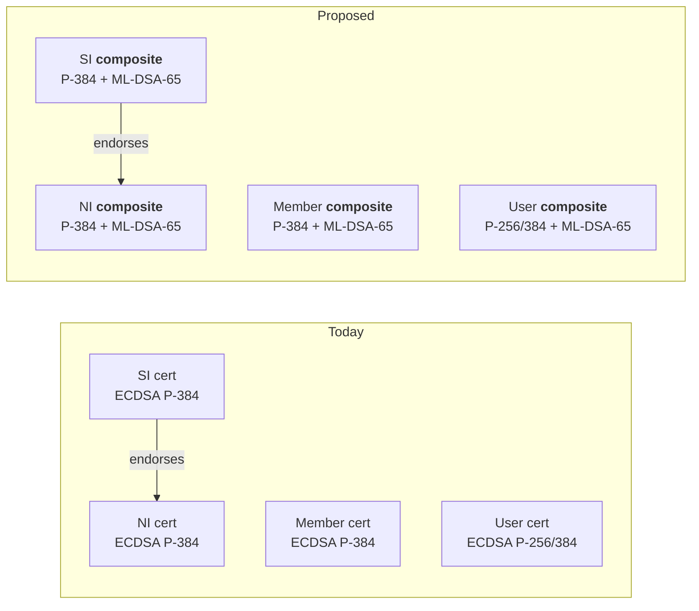
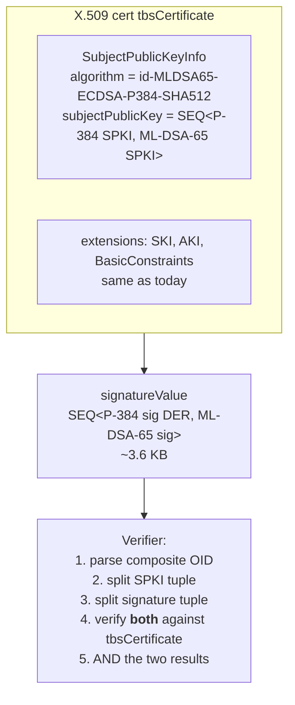
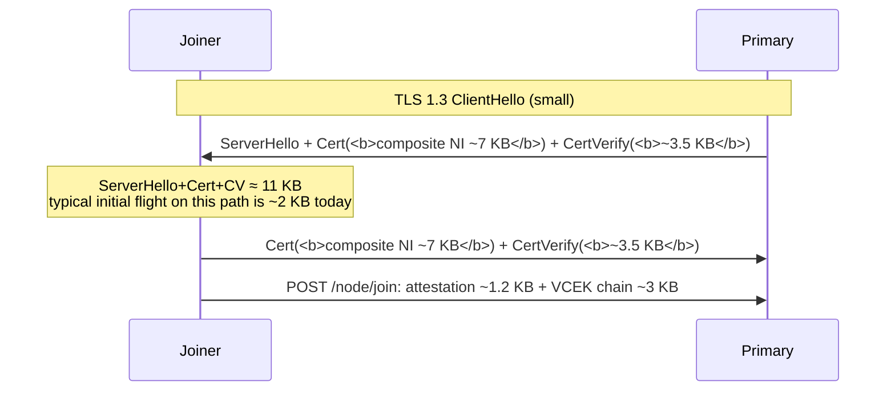
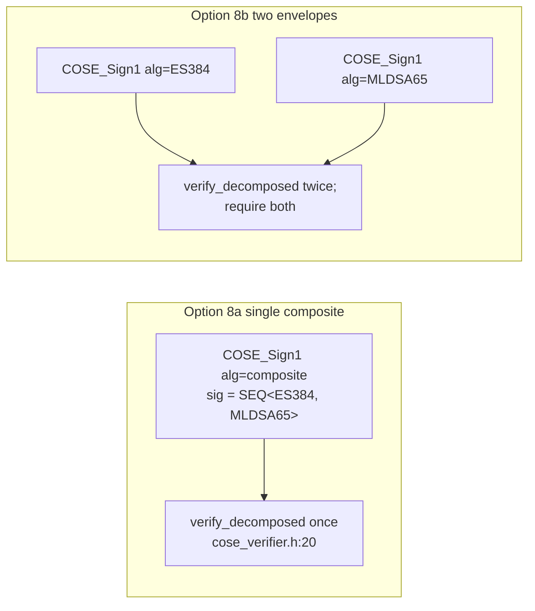

# PQC Option B — Composite Identity Certificates (Lamps Draft)

> Design proposal. Replaces every CCF X.509 cert with an `draft-ietf-lamps-pq-composite-sigs`
> composite carrying a **classical** subject pubkey + signature **and** an
> **ML-DSA-65** subject pubkey + signature. Verifiers must validate *both*
> signatures. Companion read: `gen/ccf_identity_primer.md`,
> `gen/ccf_identity_service.md`, `gen/ccf_identity_node.md`,
> `gen/ccf_identity_member.md`, `gen/ccf_identity_user.md`. This doc describes
> a **proposed change**, not current state.

---

## 1. TL;DR

Every X.509 cert in CCF — Service Identity (SI), Node Identity (NI),
Member, User — becomes a single composite cert with two SPKIs and two
issuer signatures, per `draft-ietf-lamps-pq-composite-sigs`. The composite
algorithm is registered as a single OID (e.g. `id-MLDSA65-ECDSA-P384-SHA512`),
so existing `EVP_PKEY` / `X509_sign` plumbing in
`src/crypto/openssl/ec_key_pair.cpp:449` keeps its shape — what changes is
the OID and the contents inside the SPKI/Signature ASN.1 fields.

**Preserved:** one trust anchor per principal (the SI is still the single
CA for nodes; `ccf.gov.members.certs` is still a flat cert table); governance
flow shape — `set_member`/`set_user` still ship one cert blob per principal
(`samples/constitutions/default/actions.js:443-449,576-582`); receipt chain
shape (cert → SI). Verification dispatch in application code stays a single
`verify()` call.

**Changed everywhere a cert is read or written.** This is the largest
footprint of the five options. The single hardest engineering item is **not**
the crypto — it's that today every ledger signature row embeds the full
service-endorsed NI cert (`src/service/tables/signatures.h:25`), so the
ledger would inflate ~10× under a 6–8 KB composite cert. A separate
cert-drop refactor (Phase 1, §10) is a prerequisite.



---

## 2. Composite cert layout

The composite SPKI carries a SEQUENCE of two `SubjectPublicKeyInfo`
structures; the composite signature carries a SEQUENCE of two BIT STRINGs.
A composite is verified iff **both** component signatures verify under the
matching component pubkeys, per `draft-ietf-lamps-pq-composite-sigs`
(Composite ML-DSA For use in X.509 Public Key Infrastructure and CMS).



A composite cert today on the wire is dominated by the ML-DSA-65 component:
public key 1952 B, signature 3309 B. Add the classical ~700 B for P-384, the
X.509 envelope, and the issuer's composite signature, and a leaf NI cert
runs **6–8 KB** in PEM (vs ~700 B today, `src/crypto/openssl/ec_key_pair.cpp:455-462`).

The composite OID is registered once (currently provisional IDs in the
Lamps draft); CCF treats it as a *single* algorithm at the `EVP_PKEY`
level, so the existing `get_md_type(get_md_for_ec(...))` call at
`src/crypto/openssl/ec_key_pair.cpp:449` becomes a dispatch on
`EVP_PKEY_get0_first_alg(...)`-style probing for composite.

---

## 3. Effect on each identity class

### Service Identity (SI)

The `NetworkIdentity` ctor (`src/node/identity.h:24-40`) today calls
`ECKeyPair_OpenSSL(curve_id)` then `create_self_signed_cert(...)`
(`src/crypto/certs.h:25-49`, `src/node/identity.h:30-39`). Under composite:
generate **two** keypairs (classical + ML-DSA-65), wrap them in a composite
`EVP_PKEY`, and call the same `sign_csr_impl(..., ca=true)`
(`src/crypto/openssl/ec_key_pair.cpp:304-468`) which uses `X509_sign`
(`:450`). The `OPENSSL_cleanse` wipe at `src/node/identity.h:48` must cover
both private keys. Default curve at `include/ccf/crypto/curve.h:38` is no
longer the only knob — there's a new `service_identity_composite_choice`.

### Node Identity (NI)

The NI keypair built in `NodeState::NodeState(...)` at
`src/node/node_state.h:617` (`node_sign_kp = std::make_shared<...>(curve_id_)`)
becomes a composite. `create_self_signed_cert` at
`src/node/node_state.h:965-970` and the service-endorsed cert built via
`ccf.network.generateEndorsedCertificate` (called from
`samples/constitutions/default/actions.js:299-303`) both produce composites.
The CSR for renewal is reused as-is (`actions.js:268-308`, "node's private
key never changes") — for composite this means the *composite* CSR is
preserved unchanged, so re-mint never crosses key shards.

### Member identity

`python/utils/keygenerator.sh:7-9, 77-78` is replaced/augmented: it no
longer can be a 2-line OpenSSL pipeline because stock OpenSSL CLI does not
yet produce composite certs. A new `ccf_keygen_composite` Python tool is
needed (built on `python/src/ccf/cose.py`-adjacent infra) that calls
OpenSSL with `oqs-provider` or an in-process composite implementation, and
writes a single PEM. The SHA-256-of-DER `MemberId` derivation
(`src/js/extensions/ccf/converters.cpp:186-188`,
`src/service/internal_tables_access.h:194-196`) is unaffected — a hash is
a hash, regardless of cert contents.

### User identity

Same generator change as members. The user cert is registered by
`ccf.kv["public:ccf.gov.users.certs"].set(...)` at
`samples/constitutions/default/actions.js:570-597`; the table is
`USER_CERTS = "public:ccf.gov.users.certs"`
(`include/ccf/service/tables/users.h:36`). UserId = `SHA-256(DER(cert))`
(`src/endpoints/authentication/cert_auth.cpp:125`) is unchanged. mTLS
handshake — see §5.

---

## 4. Critical CCF-specific blocker: cert size and ledger growth

`ccf_identity_node.md` §12 (item 2) flagged this. Today the `PrimarySignature`
row carried in `public:ccf.internal.signatures` embeds the *full
service-endorsed NI cert* in field `cert` of type `Pem`
(`src/service/tables/signatures.h:13-50`, specifically `:25` and the ctor
at `:36-49`). A ledger sig row is emitted every `sig_tx_interval = 5000` tx
or every `sig_ms_interval = 1000ms`
(`src/node/rpc/frontend.h:49-50`). Under composite certs at ~6–8 KB plus a
PQ signature blob at ~2.5–3.3 KB inside the same row (the variable-length
`sig` field inherited from `NodeSignature`, `:13`), every sig row grows
from ~1 KB to ~10 KB — a **~10×** ledger inflation on a sig-heavy workload,
unchanged in storage footprint, snapshot size, and replication bandwidth.

**Fix (Phase 1 of any composite rollout):** replace the inline
`ccf::crypto::Pem cert` with `ccf::crypto::Sha256Hash cert_hash`. Store the
cert exactly once, in `public:ccf.gov.nodes.endorsed_certificates`
(`include/ccf/service/tables/nodes.h:26-27`). Receipt construction
(`src/node/history.h:355-369`) looks up the cert by node ID once, the
verifier follows the same indirection. This is a forward-compatible change
even without composite — it just removes a 700 B duplicate per sig row
today.

```mermaid
flowchart LR
    subgraph Now[Today]
        Row1[PrimarySignature row<br/>{seqno, view, root, sig, <b>cert</b>}<br/>~1 KB total]
    end
    subgraph After[After Phase 1 cert-drop]
        Row2[PrimarySignature row<br/>{seqno, view, root, sig, <b>node_id</b>}<br/>~250 B + sig length]
        EC[public:ccf.gov.nodes.<br/>endorsed_certificates<br/>NodeId -> Pem]
        Row2 -. dereference by NodeId .-> EC
    end
    Now --> After
```

After Phase 1, composite NI certs land in `endorsed_certificates` (one 6–8
KB row per node, written once per renewal) and the ledger sig table grows
linearly *only* with the PQ signature size, not with cert size. **This is
the only structural change that gates Phase 2.**

---

## 5. TLS handshake size

The joiner currently presents the self-signed NI cert as its TLS client
cert (`src/node/node_state.h:1054-1058` per `ccf_identity_node.md` §12.8)
and the primary presents the service-endorsed NI cert as its TLS server
cert. On the join path the primary *also* echoes back the joiner's
attestation report. An SNP attestation `Attestation` blob is ~1.2 KB and
the VCEK chain another ~3 KB (`include/ccf/pal/attestation_sev_snp.h:399`,
the SNP report struct; transported through `quote.cpp` paths around
`src/node/quote.cpp:153-220`).



A standard Ethernet path supports TCP MSS ~1460 B. TLS 1.3 fragments
handshake messages into records (max 16 KB plaintext per record), and TCP
fragments records across multiple segments — both are transparent. The
risk is **not** correctness, it's **(a) more round-trips** during the
initial slow-start window and **(b)** any middlebox enforcing a 16 KB
"initial handshake budget" (some load-balancers do, including some Azure
configurations). Today the server-side TLS context lives in
`src/tls/context.h:24-65` and the cert is attached via `src/tls/cert.h`;
neither layer caps cert size, so this is a deployment-layer concern not a
code-layer fix.

Two mitigations worth designing in:
1. Prefer ML-DSA-44 over ML-DSA-65 if the security target allows
   (cert drops ~2 KB).
2. Skip TLS for joiners' first leg — but that breaks the security model
   (`src/node/node_state.h:1048-1058` relies on TLS for service-cert
   pinning before attestation has been verified).

---

## 6. SNP `report_data` — composite doesn't break the binding

This is the cleanest part of the design. The SNP `report_data` slot is
fixed at 64 bytes (`include/ccf/pal/report_data.h:50`) and CCF binds it as
`SHA256(node_sign_kp->public_key_der())`
(`src/node/node_state.h:945-946`). The verifier check in
`src/node/quote.cpp:123-133` is:

```cpp
if (quoted_hash != ccf::crypto::Sha256Hash(expected_node_public_key)) { ... }
```

A composite `public_key_der()` is still a DER byte blob — just a longer
one (~2 KB). `Sha256Hash(blob)` produces 32 bytes regardless of input
length, and the verifier reconstructs the same DER blob from whatever
carrier was used (cert SPKI, raw key). **No `report_data` schema change is
required.** The only adjacent concern is making sure both endpoints agree
on the *exact same DER encoding* of the composite — composite SPKIs have
exactly one canonical DER form per the Lamps draft, but the encoding
implementation must be deterministic; flag this in interop tests.

---

## 7. HSM gap (the real adoption blocker for members)

`doc/governance/hsm_keys.rst:19-27` documents AKV-stored member identities
on `secp384r1`. AKV signs via the REST endpoint
`POST $IDENTITY_AKV_KID/sign?api-version=7.1`
(`doc/governance/hsm_keys.rst:97-101`) and *only* exposes JWA algorithms
ES256, ES384, ES512, PS256, PS384, PS512, RS256, RS384, RS512 — **no
ML-DSA today**. The two-tool offline flow `ccf_cose_sign1_prepare` →
external sign → `ccf_cose_sign1_finish`
(`python/src/ccf/cose.py:119-141, 144-168`) is built around exactly that
JWA `alg` field (`cose.py:141` emits the integer e.g. -35 for ES384).

For composite member certs this means a member **cannot** wholly delegate
signing to AKV. They must either:

1. **Hybrid HSM + local signer.** The classical signature is produced by
   AKV (existing `prepare`/`finish` path); the ML-DSA signature is
   produced by a local PQ signer over the same `Sig_structure` digest
   (`cose.py:135`, `["Signature1", phdr, b"", payload]`); the
   composite signature is assembled by a new
   `ccf_cose_sign1_compose` helper. **Drawback:** the PQ private key is
   in the member's own process memory, not the HSM, partly defeating the
   threat model AKV exists to defend against.
2. **Wait for AKV to ship ML-DSA.** No public roadmap commitment as of
   the date of writing. **Drawback:** blocks production rollout of
   composite member identities.

```mermaid
flowchart LR
    P[proposal.json] --> Prep[ccf_cose_sign1_prepare<br/>cose.py:119-141<br/>emits {alg=-35, value=digest}]
    Prep --> AKV[AKV /sign<br/>returns ES384 sig]
    Prep --> PQ[<b>NEW: local ML-DSA signer</b><br/>signs same digest]
    AKV --> Compose[<b>NEW: compose</b><br/>SEQ&lt;ES384, ML-DSA-65&gt;]
    PQ --> Compose
    Compose --> Fin[ccf_cose_sign1_finish<br/>cose.py:144-168]
    Fin --> CCF[POST /gov/...]
```

Operators piloting composite identities for members must explicitly
document the "PQ key in-process" caveat. For nodes, members are not
involved; the SI signs both halves of the endorsed NI cert from inside the
enclave (`src/node/identity.h:30-39` extended to composite), so there is
**no HSM gap for SI/NI** — only for members and users when they choose
HSM storage.

---

## 8. COSE Sign1 over composite

COSE has registered algs for ML-DSA via `draft-ietf-cose-dilithium`. The
two architectural choices:

### Option 8a — Single composite COSE alg

Register a composite alg int (e.g. `-MLDSA65-ES384-Composite`) and ship a
single `COSE_Sign1` envelope. `COSEVerifier::verify_decomposed`
(`include/ccf/crypto/cose_verifier.h:20-24`,
`src/crypto/openssl/cose_verifier.cpp:248-257`) gains one more case. The
underlying `cose-rs` Rust crate (out-of-tree, see
`gen/ccf_identity_member.md` §14.9 — "**TODO: not found** in this repo")
must learn the composite alg. The allowed-alg gate
`cose::is_ecdsa_alg(phdr.alg)`
(`src/endpoints/authentication/cose_auth.cpp:255-259, 399-401`) widens to
include the composite alg. **One verify call, atomic semantics, smallest
on-wire footprint.**

### Option 8b — Two consecutive COSE_Sign1 envelopes

Send `COSE_Sign1(ES384) + COSE_Sign1(MLDSA65)` over the same payload.
Server requires both to verify, with matching `kid`. **Drawback:** doubles
the protected header storage in `COSE_GOV_HISTORY`
(`src/service/tables/governance_history.h:20`) and breaks the
"one envelope per ack" invariant in
`src/node/gov/handlers/acks.h:247-251` where `cose_sign1_req` is a single
opaque envelope. Recommended only as a transitional measure.



Recommendation: **8a** for production, with cose-rs upstream coordination
as the long-pole dependency.

---

## 9. Code-change footprint

This is intended to be the largest of the five options, by design — every
cert producer/consumer is touched.

| Layer | File | Change | Risk |
|---|---|---|---|
| Crypto core | `src/crypto/openssl/ec_key_pair.cpp:304-468` (`sign_csr_impl`) | Switch from `EVP_PKEY` over EC to composite `EVP_PKEY`. `X509_sign` md selection at `:449` rewired. | High — every cert in CCF goes through here |
| Crypto core | `include/ccf/crypto/curve.h:38` | New `service_identity_composite_choice` enum, plumb everywhere `CurveID` flows | Medium |
| Verifier | `include/ccf/crypto/verifier.h:25` (`cert_der`) | `make_verifier` must recognise composite SPKI | Medium |
| COSE | `include/ccf/crypto/cose_verifier.h:14-24`, `src/crypto/openssl/cose_verifier.cpp:248-257` | Add composite alg dispatch (Option 8a) | Medium |
| COSE allowed-alg gate | `src/endpoints/authentication/cose_auth.cpp:255-259, 399-401` | Widen `is_ecdsa_alg` predicate to accept composite | High — single gate, no per-endpoint allow-list (`ccf_identity_member.md` §14.2) |
| Cose-rs (out of tree) | external | Add composite alg | High — separate crate |
| Identity types | `src/node/identity.h:17-40` | `NetworkIdentity` carries composite priv key; both halves wiped (`:48`) | High |
| NI build | `src/node/node_state.h:617, 945-970, 1054-1058` | Composite keypair, composite self-signed cert | High |
| SI build | `src/node/node_state.h:987-991, 1020-1027` | Composite SI generation on Start/Recover | High |
| Cert helpers | `src/crypto/certs.h:25-49, 51-92` | Both `create_self_signed_cert` and `create_endorsed_cert` parameterised on composite | High |
| **Sig row (Phase 1)** | `src/service/tables/signatures.h:13-50, esp. :25` | Replace `cert` with `cert_hash` / `node_id` | **High — ledger schema change, LTS compatibility (`lts_compatibility` test with `LONG_TESTS=1`)** |
| Receipt construction | `src/node/history.h:355-369` | Look up cert from `endorsed_certificates` | Medium |
| Cert renewal | `samples/constitutions/default/actions.js:268-308, 1380-1418, 1456-1481` | Composite-aware re-issue helper | Medium |
| Set-member action | `samples/constitutions/default/actions.js:417-486` | Validator accepts composite PEM | Low (validator already permissive) |
| MemberId derivation | `src/js/extensions/ccf/converters.cpp:166-197`, `src/service/internal_tables_access.h:194-196` | None — SHA-256 of DER is composite-safe | None |
| `set_user` action | `samples/constitutions/default/actions.js:570-597` | Validator accepts composite PEM | Low |
| UserId derivation | `src/endpoints/authentication/cert_auth.cpp:125` | None | None |
| SDK keygen | `python/utils/keygenerator.sh:7-9, 77-78` | New `ccf_keygen_composite` Python tool | Medium |
| Python COSE tooling | `python/src/ccf/cose.py:57-72, 119-168` | `default_algorithm_for_key`, prepare/finish for composite | Medium |
| TLS context | `src/tls/context.h:53-65` | Optionally widen `set1_curves_list` for hybrid KEM groups (separate to identity composite, but typically rolled together) | Medium |
| SNP binding | `src/node/quote.cpp:123-133`, `src/node/node_state.h:945-946` | None — SHA-256-of-pubkey is algorithm-agnostic | None |
| N2N DH binding | `src/node/channels.h:321,349,384` | Composite NI sig sizes grow KE messages; chunking review only | Medium |
| Governance history table | `src/service/tables/governance_history.h:20` | Envelope size grows ~10× — disk/replication cost only | Medium |
| Recovery shares | `src/crypto/openssl/rsa_public_key.cpp:127-129` | **Out of scope** for Option B (this is a KEM, not a signature) | None |
| Test infra | `tests/infra/*`, `tests/lts_compatibility/*` | LTS roundtrip tests across composite/non-composite boundary | High |

---

## 10. Migration steps

1. **Phase 1 (prerequisite, ship even if Option B never lands).** Land the
   sig-row cert-drop refactor: replace `PrimarySignature::cert` with
   `cert_hash`/`node_id` in `src/service/tables/signatures.h:13-50`, route
   receipt builders through `endorsed_certificates`
   (`include/ccf/service/tables/nodes.h:26-27`), gate behind a KV-schema
   version bump, validate `lts_compatibility` with `LONG_TESTS=1`.
2. **Phase 1.5.** Add a composite-aware `EVP_PKEY` wrapper in
   `src/crypto/openssl/` (likely via `oqs-provider` or bundled liboqs).
   Plumb a new `CurveID`/composite enum through
   `include/ccf/crypto/curve.h:38`.
3. **Phase 2.** Make NI composite first (smallest external surface — only
   nodes are affected, joiners are operator-controlled). Verify ledger sig
   throughput unchanged after Phase 1.
4. **Phase 3.** Make SI composite. Disaster-recovery rotation path
   (`src/node/node_state.h:1020-1027`) rebuilds with a composite, and the
   `previous_service_identity_endorsement` COSE chain
   (`src/service/internal_tables_access.h:545-654`) spans the algorithm
   boundary — explicitly test "old SI = ECDSA, new SI = composite"
   handoff.
5. **Phase 4.** Make user certs accept composite via `set_user`
   (`actions.js:570-597`). Update mTLS context
   (`src/tls/context.h:53-65`) — optionally enable hybrid TLS key-share
   groups. Confirm SNP `report_data` interop unchanged
   (`src/node/quote.cpp:123-133`).
6. **Phase 5 (governance pilot).** Members keep ECDSA initially. Add
   composite acceptance to `set_member` validator
   (`actions.js:417-486`) and ship `ccf_keygen_composite`.
7. **Phase 6 (HSM gap mitigation).** Until AKV ships ML-DSA, deploy the
   `prepare → AKV (classical) + local (PQ) → compose → finish` flow
   (§7). Document the PQ-key-in-process tradeoff for operators.
8. **Phase 7.** Update SDK `python/src/ccf/cose.py:57-72,119-168` so
   non-CCF clients (auditors, ledger verifiers) understand composite
   automatically.

---

## 11. Pros

- **Single trust anchor per principal.** The cert *is* the identity; no
  parallel chain to maintain, no "which signature wins" question. Member
  registration stays `set_member { cert }` — one blob, one row in
  `public:ccf.gov.members.certs`.
- **Mature standards path.** `draft-ietf-lamps-pq-composite-sigs` has IETF
  consensus on the structural design even where OIDs are still pinned
  down (see Open Questions). No CCF-proprietary scheme.
- **Cleanest semantic model.** Verification semantics are atomic — both
  signatures must pass, no application-level "did we check the PQ side?"
  bookkeeping. This is the same threat model improvement Lamps was
  designed for.
- **No double-dispatch in application code.** App handlers calling
  `verify_decomposed` (`cose_verifier.h:20-24`) get one boolean back, not
  two. The `JwtAuthnIdentity`/`UserCertAuthnIdentity` API
  (`include/ccf/endpoints/authentication/*.h`) needs no algorithm field
  (already true today per `ccf_identity_user.md` §C3).
- **`report_data` binding unchanged** (§6).
- **SDK and constitution shape unchanged.** Governance actions
  (`set_user`, `set_member`) carry one PEM as today.
- **Backward-compatible verify-also-classical posture.** A composite cert
  is verifiable by a *PQ-only* future verifier (drop the classical half)
  and by a *classical-only* legacy verifier (drop the PQ half) for the
  same `tbsCertificate`. This is the unique pluggability advantage of
  composite vs. parallel certs.

---

## 12. Cons

- **Biggest code-change footprint** (§9). Every cert producer and
  consumer is touched — including the COSE allowed-alg gate
  (`cose_auth.cpp:255-259`), the cose-rs Rust crate (out of tree), and
  every Python tool in `python/src/ccf/cose.py`.
- **Cert size.** A leaf cert at 6–8 KB inflates TLS handshakes (§5),
  ledger growth (§4 — gated by Phase 1), governance proposal history
  (`COSE_GOV_HISTORY`, `governance_history.h:20`,
  `ccf_identity_member.md` §14.4), and per-`SessionContext` allocations
  (`http_session.h:142-144`, `ccf_identity_user.md` §C3).
- **HSM gap for members** (§7). AKV does not sign ML-DSA. Mitigations
  exist but they're explicitly weaker than today's AKV posture, and the
  gap is real per `doc/governance/hsm_keys.rst:19-27, 97-101`.
- **External clients must understand composite OIDs.** Any auditor
  parsing the ledger with stock OpenSSL ≤ 3.4 will fail to verify the SI
  endorsement chain. Operators distribute `service_cert.pem`
  (`src/host/run.cpp:521-529`, `src/host/configuration.h:88`) to
  external clients today; under composite, the documentation must
  enumerate the OID and the verifier prerequisites.
- **Largest review/test matrix.** LTS compatibility (`lts_compatibility`
  with `LONG_TESTS=1`) must run across composite/non-composite
  boundaries on every Phase boundary.
- **TLS handshake budget risk** (§5). Some middleboxes / load balancers
  have undocumented 16 KB initial flight caps.
- **N2N consensus channels.** The N2N key-exchange signs DH shares with
  the node identity key (`src/node/channels.h:321,349,384`); composite
  signatures balloon every KE round (`ccf_identity_node.md` §12.4),
  though the protocol already supports variable-length sigs.

---

## 13. Open questions

1. **Composite alg OIDs.** NIST has not finalised the composite OIDs.
   The Lamps draft proposes a registry but the IDs may shift. CCF must
   support multiple composite codepoints with a feature-flag during the
   transition.
2. **Interop with non-CCF X.509 tooling.** What's the minimum supported
   OpenSSL / BoringSSL / Go `crypto/x509` version for clients pinning the
   SI? `oqs-provider` is the de-facto path, but it isn't shipped in
   distro OpenSSL packages. Does CCF ship a verifier binary?
3. **Ledger replay-attack surface from cert size.** Even after Phase 1,
   the `COSE_GOV_HISTORY` table
   (`src/service/tables/governance_history.h:17-21`) and proposal
   re-runs (`proposals.h:160-198`) store entire COSE envelopes. A
   compromised governance pipeline that submits N composite-signed
   ballots inflates the ledger by N × (composite sig + composite
   cert) ≈ N × 12 KB — is rate-limiting at the proposal layer
   sufficient?
4. **Joining-node MTU.** Operators on path-MTU 1280 (IPv6 minimum) will
   see a markedly larger number of segments during the join handshake.
   Does the existing reconnect/back-off
   (`src/node/node_state.h:1048-1058`) absorb the extra latency, or do
   we need an explicit "PQ join" tuning knob?
5. **N2N key exchange protocol version bump.** Today
   `protocol_version = 1` (`src/node/channels.h:961`,
   `ccf_identity_node.md` §11). Composite NI signatures alone don't
   require a wire-format change (the existing variable-length-prefixed
   share format already accommodates them), but pairing composite
   identity with a hybrid PQ KEM for the DH itself (out of scope of
   Option B, but operationally bundled) does — see
   `ccf_identity_node.md` §12.3, the 255-byte share cap.
6. **`previous_service_identity_endorsement` algorithm-boundary semantics.**
   When the old SI is ECDSA and the new SI is composite (Phase 3),
   the CoseEndorsement chain in
   `src/service/tables/previous_service_identity.h:13-54` must encode
   *both* signatures retrospectively, or the chain skips at the
   transition. Spec the encoding before Phase 3 begins.

---

*Companion to the `gen/ccf_identity_*.md` series. Citations checked
against the working tree at the time of writing
(`maxtropets/CCF`, `/workspaces/CCF`).*
