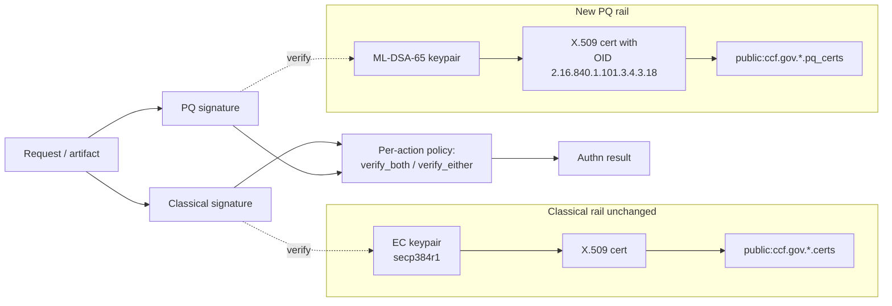
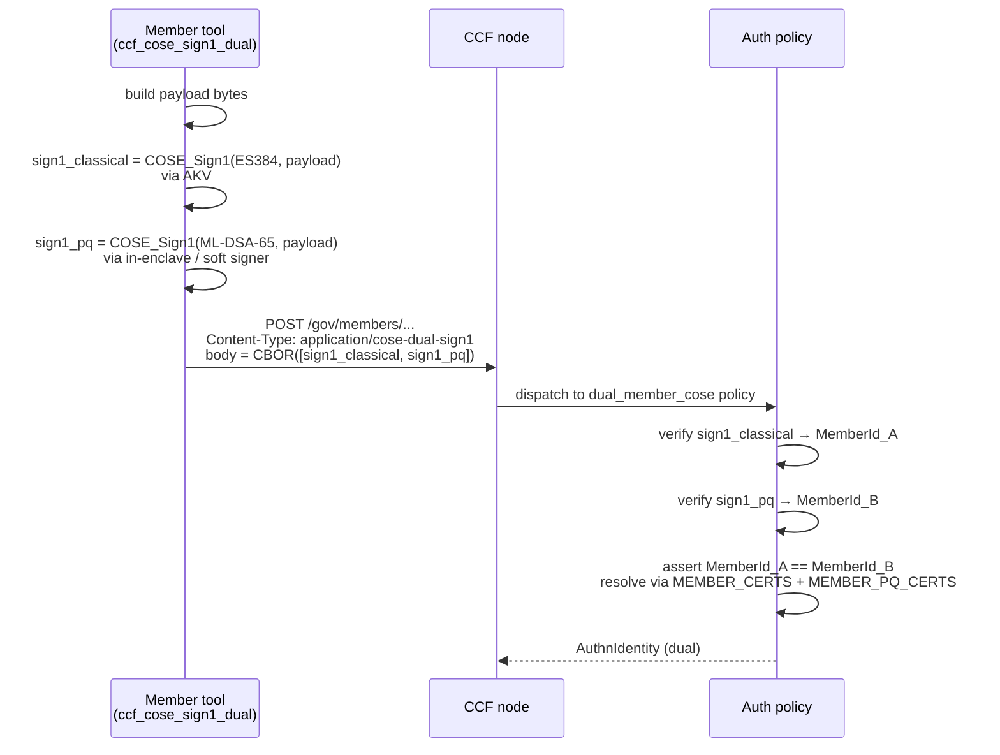
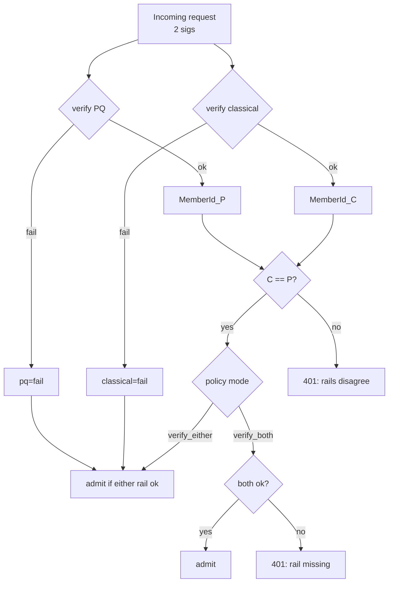
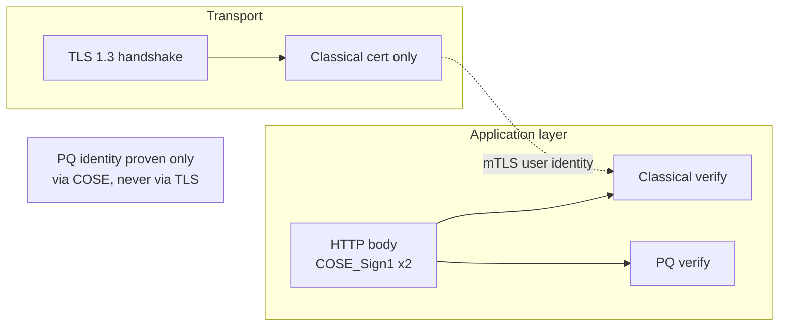
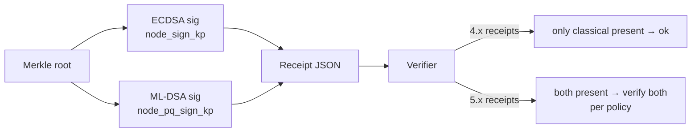
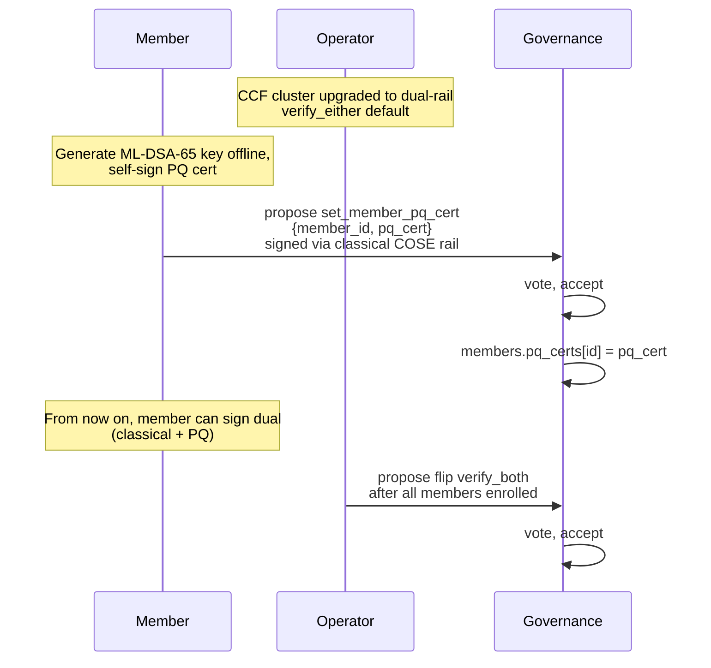

# PQC Option C — Dual-Rail Identities

> One of five PQC design proposals for CCF. **Describes a proposed
> change**, not the current state. Companion to
> `ccf_identity_primer.md`, `ccf_identity_service.md`,
> `ccf_identity_node.md`, `ccf_identity_member.md`,
> `ccf_identity_user.md`. Every citation is a real `path:line` in the
> working tree.

---

## 1. TL;DR

Each of the four CCF principal classes (Service, Node, Member, User)
keeps its classical EC identity exactly as it is today, and gains a
second, **fully independent** PQ identity backed by an ML-DSA-65 key
pair and an X.509 cert published in a new KV table. Authenticated
artifacts — COSE Sign1 governance envelopes, ledger signatures, N2N
DH-share signatures, receipts — gain a **parallel PQ signature**
alongside the classical one. CCF policy decides per-action whether
both rails must verify (`verify_both`) or whether either rail alone is
sufficient (`verify_either`). The default during rollout is
`verify_either`; the eventual target is `verify_both`.

The two rails are **never combined cryptographically**: there is no
composite signature, no hybrid key, no concatenated key blob. This is
the design's headline feature — it sidesteps the IETF
composite-signature debate entirely and lets CCF ship PQC support
**without changing a single classical code path**.



---

## 2. Why this exists — the HSM gap

The single biggest reason for the dual-rail shape is **operational**:
Azure Key Vault, the documented HSM for CCF members, supports `ES384`
(and other classical EC signing algorithms) but does **not** support
ML-DSA today. The CCF guide
`doc/governance/hsm_keys.rst:19` is explicit that "members' identity
certificates should be generated on the `secp384r1` elliptic curve,
using the `az keyvault certificate create` command", and the COSE
signing flow at `doc/governance/hsm_keys.rst:93-95` shows AKV being
called via REST to produce an `ES384` signature. There is no AKV
`/sign` operation that returns an ML-DSA signature.

A *composite* identity (Option B) or a *replacement* identity (Option
D) requires the HSM to do the PQ signing, which AKV cannot. A
**dual-rail** identity does not: the classical half stays in AKV
exactly as today, and the PQ half lives in a separate signer — a
software keystore, an in-enclave signer, or whichever HSM ships
ML-DSA first. Members keep their existing AKV trust envelope and add
PQ proofs on the side.

The same argument applies to the Service and Node identities. The
service key currently lives in-enclave (`src/node/identity.h:17-21`)
and never on disk (`gen/ccf_identity_service.md:124-129`), so the
node-side enclave can carry a PQ signer immediately. Dual-rail does
not push PQ keys into AKV; it explicitly separates the two custodial
domains.

---

## 3. Per-class application

### 3.1 Service Identity

The Service Identity in source is `ccf::NetworkIdentity { Pem priv_key;
Pem cert; }` (`src/node/identity.h:17-21`). It signs three things:
node-cert endorsements (`src/crypto/certs.h:51-60`), COSE Sign1
ledger signatures (`src/node/history.h:402-425`, identity wired in at
`src/node/history.h:613-633`), and COSE endorsements of the previous
service identity after disaster recovery
(`src/service/internal_tables_access.h:545-654`).

| Attribute | Classical rail | New PQ rail |
|---|---|---|
| Algorithm | ECDSA on `secp384r1` (`include/ccf/crypto/curve.h:38`) | ML-DSA-65 |
| Holder of priv key | `NetworkIdentity::priv_key`, in-enclave only | `NetworkIdentity::pq_priv_key`, in-enclave only |
| Holder of cert | `public:ccf.gov.service.info` `ServiceInfo::cert` (`include/ccf/service/tables/service.h:27-58`) | New singleton `public:ccf.gov.service.pq_info`, `ServiceInfo::pq_cert` |
| Endorses | Node EC cert; ledger COSE sigs | Node PQ cert; PQ-rail ledger COSE sigs |
| Joiners receive | `NetworkInfo::identity` (priv + cert) over TLS (`gen/ccf_identity_service.md:148-167`) | Same envelope, with `pq_identity` appended |

The first node generates **both** key pairs at genesis. The
`NetworkIdentity` ctor at `src/node/identity.h:24-40` is extended to
`(curve_id, pq_alg)`, producing two PEMs and two self-signed certs.
Recovery (`StartType::Recover`, `src/node/node_state.h:1020-1027`)
mints fresh keys for both rails. Joiners receive both keys over the
existing TLS channel by extending
`JoinNetworkNodeToNode::Out::NetworkInfo` to include the PQ pair
(`src/node/rpc/node_frontend.h:406-413`).

### 3.2 Node Identity

The node identity today is a single `node_sign_kp` constructed in the
`NodeState` member-init list before the quote is generated
(`src/node/node_state.h:617-618`). The node ID is
`SHA-256(DER(node_pubk))` (`include/ccf/service/tables/nodes.h:30-47`).

Dual-rail adds `node_pq_sign_kp` next to `node_sign_kp` and a second
cert `pq_cert`. Both certs cover the same `NodeId` (see §13 — this is
an open question; the proposed default is "PQ cert ID equals
classical cert ID, both keyed by the classical NodeId in their
respective tables"). The PQ cert is stored in a new
`public:ccf.gov.nodes.pq_endorsed_certificates` (parallel to
`NODE_ENDORSED_CERTIFICATES = "public:ccf.gov.nodes.endorsed_certificates"`,
`include/ccf/service/tables/nodes.h:26-27`).

Attestation binding is unchanged. The SNP `report_data` still carries
`SHA-256(node_pubk_der)` for the **classical** key
(`src/node/node_state.h:945-951`). The PQ public key is not in the
quote; it is attested transitively by being signed by the
service-endorsed classical chain at registration time. (Alternative
binding strategies — second hash slot, manifest commitment — belong
in a follow-up.)

### 3.3 Member Identity

A member today is `{ MemberId, EC cert PEM, optional RSA enc key }`
with `MemberId = SHA-256(DER(cert))` (`src/js/extensions/ccf/converters.cpp:166-197`).
Tables live in `include/ccf/service/tables/members.h:102-108`:
`MEMBER_CERTS = "public:ccf.gov.members.certs"`,
`MEMBER_INFO = "public:ccf.gov.members.info"`,
`MEMBER_ENCRYPTION_PUBLIC_KEYS = "public:ccf.gov.members.encryption_public_keys"`.

Dual-rail adds:

```cpp
namespace ccf::Tables {
  static constexpr auto MEMBER_PQ_CERTS = "public:ccf.gov.members.pq_certs";
}
using MemberPqCerts =
  ccf::kv::RawCopySerialisedMap<MemberId, ccf::crypto::Pem>;
```

keyed by the **same** `MemberId` as `MEMBER_CERTS` so that lookups
during authentication land on the same row whichever rail did the
signing. A governance request now arrives as a single HTTP `POST` with
**two** COSE_Sign1 envelopes (see §4); both are authenticated and
both must resolve to the same MemberId before policy is applied.

### 3.4 User Identity

Users are dual of members on the data plane:
`USER_CERTS = "public:ccf.gov.users.certs"` (`include/ccf/service/tables/users.h:34-37`),
ID is `SHA-256(DER(cert))`
(`samples/constitutions/default/actions.js:570-597`), auth path runs
through `Tables::USER_CERTS` lookup in
`src/endpoints/authentication/cert_auth.cpp:127,159`.

The PQ-rail table is `public:ccf.gov.users.pq_certs` with the same
`UserCerts` value type. User requests can carry a PQ signature in
either of two ways: a second COSE envelope (for the JS COSE path,
`UserCOSESign1AuthnPolicy` —
`include/ccf/endpoints/authentication/cose_auth.h:176-219`) or — for
mTLS users — a `Signature` HTTP header containing a detached COSE
Sign1 over the canonical request. mTLS itself does not carry the PQ
sig; see §6.

---

## 4. COSE governance with a dual signature

The current member request is one COSE_Sign1 envelope
(`alg=ES384`, member cert keyId)
(`gen/ccf_identity_primer.md:128-150`,
`include/ccf/endpoints/authentication/cose_auth.h:31-81`,
`python/src/ccf/cose.py:101-116`). Dual-rail must add the PQ
signature **without breaking the existing envelope** so that mixed
ecosystems (PQ-aware proposers, classical-only verifiers, replay
across LTS boundaries) keep working.

Two encodings are on the table:

**(A) Two consecutive COSE_Sign1 envelopes.** Body is
`application/cose-dual-sign1` → CBOR array `[outer, inner]` where
`outer` is the classical envelope verbatim and `inner` is a second
`COSE_Sign1` over the **same payload** signed with the PQ key. Both
envelopes share their protected header keys (`gov_msg_type`,
`gov_msg_proposal_id`, `gov_msg_created_at`,
`include/ccf/endpoints/authentication/cose_auth.h:18-23`). Trivial
backwards compat: a classical-only verifier can ignore `inner` once
content-type negotiation falls back to `application/cose`.

**(B) `COSE_Sign` (multi-signature, tag 98).** Native CBOR
representation for N signers over one payload — exactly the dual-rail
shape. Each `signer` block carries its own protected header (`alg`,
`kid`). This requires changing the parse path in
`make_cose_verifier_*` (`include/ccf/crypto/cose_verifier.h:32-39`)
and the auth policies' content-type contract.

The proposal recommends **(A)** for the first release because it
preserves wire compatibility with `application/cose` clients and only
the dispatcher needs to learn the new content type:



The COSE verifier interface in
`include/ccf/crypto/cose_verifier.h:11-26` is reusable as-is for each
signature — both calls use `verify_detached(envelope, payload)`. A
new factory `make_cose_verifier_pq_from_pem_cert(...)` returns a
`COSEVerifier` whose backing key is ML-DSA-65; the dispatch chooses
classical vs PQ based on the `alg` in the protected header (IANA
COSE registry, e.g. `-50` for ML-DSA-65 once standardised).

---

## 5. Verification policy: verify-both vs verify-either

CCF policy decides per-action which rail(s) must verify. Two values:

- `verify_either` — the request is admitted if **at least one** rail
  verifies and resolves to the same principal. Rollout default.
- `verify_both` — **both** rails must verify and resolve identically.
  Eventual target once every member has registered a PQ cert.

Per-action policy is set in the constitution. Today, `set_member` at
`samples/constitutions/default/actions.js:417-486` runs unconditionally
against the single `members.certs` table; under dual-rail it gains a
sibling action `set_member_pq_cert` (see §9) and an existing-action
gate that consults a new `public:ccf.gov.policy.pq_verify` map keyed
by action name. The gate is read by the C++ auth policy before
`apply()` is called, so JS authors do not need to encode the choice
themselves.



When `verify_either` is set and only one rail is present (because the
member has not yet registered a PQ cert), the auth policy short-circuits
to the classical path and returns the existing
`MemberCOSESign1AuthnIdentity` — old SDKs keep working.

---

## 6. TLS implications

CCF's TLS layer in `src/tls/cert.h:24-110` is a thin OpenSSL wrapper.
The class `tls::Cert` stores **one** `own_cert` plus **one**
`own_pkey` (`src/tls/cert.h:31-33`); the OpenSSL handshake picks the
cipher suite based on that single key's algorithm. There is no
standardised way today to present a second authentication credential
in the TLS 1.3 handshake — the IETF `tls-cert-with-extern-psk` and
hybrid-cert drafts are not standardised and would force CCF to ship a
custom OpenSSL build.

**Therefore the PQ rail does not participate in the TLS handshake.**
Concretely:

- mTLS to application endpoints (`src/tls/cert.h:88-110`,
  `auth_required = true`) continues to authenticate the **classical**
  user cert. The PQ proof, when required, is carried at the
  COSE/application layer as a detached signature header.
- N2N channels in `src/node/channels.h:314-328` continue to sign the
  DH share with `node_kp` (the classical EC key). The PQ signature
  on the share is appended as an optional payload field (see §13 —
  open question).
- The service cert distributed to clients
  (`gen/ccf_identity_service.md:130-145`) remains the classical
  cert. The PQ service cert is **not** a TLS server cert; it lives
  only in the KV.

This is acceptable because every PQ-protected artifact in CCF is
ultimately a COSE_Sign1 or a ledger entry, both of which are
application-layer constructs and can carry a second signature. The
TLS channel is treated as integrity-only for the PQ rail.



---

## 7. New auth policies

Dual-rail introduces composite policies that wrap the existing
single-rail ones in
`include/ccf/endpoints/authentication/cose_auth.h:108-252` and
`include/ccf/endpoints/authentication/cert_auth.h:60-86`. They live
alongside the existing policies, so individual endpoints opt in.

| Policy | Role | Built from |
|---|---|---|
| `MemberDualSig1AuthnPolicy` | Members: governance, dual COSE | `MemberCOSESign1AuthnPolicy` (`cose_auth.h:114-146`) + new `MemberPqCOSESign1AuthnPolicy` |
| `ActiveMemberDualSig1AuthnPolicy` | Members: governance restricted to ACTIVE | wraps `ActiveMemberCOSESign1AuthnPolicy` (`cose_auth.h:153-169`) |
| `UserCOSEDualSig1AuthnPolicy` | Users: app COSE | wraps `UserCOSESign1AuthnPolicy` (`cose_auth.h:176-219`) |
| `UserCertPqAuthnPolicy` | Users: mTLS + detached PQ header | wraps `UserCertAuthnPolicy` (`cert_auth.h:26-52`) + new `pq_sig` header parser |
| `MemberCertPqAuthnPolicy` | Members: mTLS + detached PQ header | wraps `MemberCertAuthnPolicy` (`cert_auth.h:60-86`) |
| `NodeCertPqAuthnPolicy` | Nodes (admin endpoints) | wraps `NodeCertAuthnPolicy` (`cert_auth.h:93-113`) |

The composite policies' `authenticate()` runs the two children, then
applies the active mode from `public:ccf.gov.policy.pq_verify`. They
return a new `AuthnIdentity` shape:

```cpp
struct MemberDualSigAuthnIdentity : public AuthnIdentity {
  MemberId member_id;
  ccf::crypto::Pem classical_cert;
  std::optional<ccf::crypto::Pem> pq_cert;
  GovernanceProtectedHeader classical_protected_header;
  std::optional<GovernanceProtectedHeader> pq_protected_header;
  enum class Rails { ClassicalOnly, PqOnly, Both } rails;
};
```

`rails` is propagated to endpoints so apps can require both rails for
high-value actions even when the global policy is `verify_either`.

---

## 8. Receipts

A receipt today is `{leaf_components, Merkle proof, node cert,
signature}` produced from the node identity key
(`gen/ccf_identity_primer.md:204-222`,
`src/node/historical_queries.h:534-571`,
`src/node/historical_queries_adapter.cpp:66-134`, Python verifier in
`python/src/ccf/receipt.py:26-37`). The signature is over the Merkle
root and the cert chain ends in the Service Identity
(`src/node/historical_queries_utils.cpp:124-189`).

Dual-rail extends `TxReceiptImpl` with an **optional** second
signature signed by the node's PQ key, plus the PQ cert and a chain of
PQ service-cert endorsements through the COSE endorsement table:

```cpp
struct TxReceiptImpl {
  // existing fields ...
  std::optional<std::vector<uint8_t>> pq_signature;
  std::optional<ccf::crypto::Pem> pq_node_cert;
  std::optional<std::vector<ccf::crypto::Pem>> pq_service_endorsements;
};
```

`describe_receipt_v1`
(`src/node/historical_queries_adapter.cpp:66-134`) emits the new
fields as `pq_signature`, `pq_cert`, `pq_endorsements`. **Receipts
written before the upgrade remain valid** because the new fields are
optional and the verifier in
`python/src/ccf/receipt.py:26-37` checks only what is present —
authors add a `verify_pq(...)` symmetric function next to `verify`.

`fill_receipts_from_signature`
(`src/node/historical_queries.h:493-571`) is the writer-side hook:
once the PQ rail is on, every ledger signature transaction records
**both** the EC sig and the ML-DSA sig (alongside in
`public:ccf.internal.signatures` and a parallel
`public:ccf.internal.pq_signatures`). The history machinery in
`src/node/history.h:613-633` is initialised with **both** signing
identities via a renamed `set_service_signing_identities(...)`.



---

## 9. Migration mechanics

A network upgrades to a CCF release that ships dual-rail without any
PQ keys present. Members and users continue to operate on the
classical rail. A member that wants to enrol on the PQ rail does so
through a new governance proposal:

```js
// new entry in samples/constitutions/default/actions.js, alongside set_member at :417-486
[
  "set_member_pq_cert",
  new Action(
    function (args) {
      checkEntityId(args.member_id, "member_id");
      checkX509CertBundle(args.pq_cert, "pq_cert");
      // also: check the cert's SPKI carries an ML-DSA OID
    },
    function (args) {
      const rawId = ccf.strToBuf(args.member_id);
      // member must already exist in MEMBER_CERTS
      if (ccf.kv["public:ccf.gov.members.certs"].get(rawId) === undefined) {
        throw new Error("Cannot add a PQ cert for an unknown member");
      }
      ccf.kv["public:ccf.gov.members.pq_certs"].set(
        rawId, ccf.strToBuf(args.pq_cert));
    },
  ),
],
```

The implementation mirrors `set_member`
(`samples/constitutions/default/actions.js:443-485`). A sibling
`remove_member_pq_cert` deletes the row and a `set_user_pq_cert` /
`remove_user_pq_cert` pair handles users (modelled on
`samples/constitutions/default/actions.js:570-633`). The C++
internal helper `InternalTablesAccess::add_member`
(`src/service/internal_tables_access.h:187-264`) gains a sibling
`set_member_pq_cert` taking `(MemberId, Pem)` and writing to the new
table only.

The constitution also gains a single proposal to flip the global
verify mode from `verify_either` to `verify_both`. Until that flip,
the network silently tolerates missing PQ certs.



---

## 10. Code-change footprint

| Area | Files / paths | Change shape |
|---|---|---|
| New KV tables | `include/ccf/service/tables/members.h:102-108`, `users.h:34-38`, `nodes.h:23-28`, `service.h:56-59` | Add `MEMBER_PQ_CERTS`, `USER_PQ_CERTS`, `NODE_PQ_ENDORSED_CERTIFICATES`, `SERVICE_PQ_INFO` constants + type aliases |
| Network identity struct | `src/node/identity.h:17-49` | `pq_priv_key`, `pq_cert`, second `OPENSSL_cleanse` |
| Service id ctor / recover | `src/node/node_state.h:987-1027` | Generate both keypairs at genesis and recovery |
| Join payload | `src/node/rpc/node_frontend.h:406-413` | Add `pq_identity` to `NetworkInfo`; install on joiner at `node_state.h:1207-1208` |
| Node identity | `src/node/node_state.h:617-619` | Add `node_pq_sign_kp` |
| Node certs (self-signed + endorsed) | `src/crypto/certs.h:25-92`, `src/node/node_state.h:965-970,2493-2518` | Build PQ self-signed + PQ service-endorsed certs |
| N2N channel signing | `src/node/channels.h:314-389,612-674` | Optional second signature on the DH share; verifier reads peer's PQ cert |
| Ledger sigs / receipts | `src/node/history.h:187-633`, `src/node/historical_queries.h:493-855`, `historical_queries_adapter.cpp:66-134` | Add `set_service_signing_identities(ec_kp, pq_kp, config)`, sign + persist both |
| COSE verifier | `include/ccf/crypto/cose_verifier.h:30-39` | Add `make_cose_verifier_pq_from_pem_cert(...)`, `make_cose_verifier_pq_from_key(...)` |
| Auth policies | `include/ccf/endpoints/authentication/cose_auth.h`, `cert_auth.h` | Add `Member/User Dual* policies` + per-action policy lookup |
| Governance actions | `samples/constitutions/default/actions.js:417-633` | New `set_member_pq_cert`, `remove_member_pq_cert`, `set_user_pq_cert`, `remove_user_pq_cert`, and a `set_pq_verify_mode` |
| Python SDK | `python/src/ccf/cose.py:101-168`, `python/src/ccf/receipt.py:26-87` | Add `create_cose_dual_sign1`, `verify_cose_dual_sign1`, `verify_pq` |
| Internal helper | `src/service/internal_tables_access.h:187-264` | `set_member_pq_cert(...)`, mirror for users |
| HSM doc | `doc/governance/hsm_keys.rst` | New section "Registering a PQ identity" explaining the second signer |
| Changelog | `CHANGELOG.md` | `Added` entry under current `[Unreleased]` |

No file under `src/tls/` changes — TLS stays single-cert (§6).

---

## 11. Pros

- **HSM gap is sidestepped.** Classical key continues to live in AKV
  (`doc/governance/hsm_keys.rst:19-78`); PQ key lives in any signer
  that supports ML-DSA. Members do not need to migrate AKV at all.
- **No standards risk.** No dependency on the IETF
  composite-signature drafts. ML-DSA-65 is FIPS 204 final and the
  COSE algorithm assignments are well advanced.
- **Per-class incremental rollout.** Service can adopt the PQ rail
  on day one (in-enclave signer is trivial), nodes next, members
  whenever they choose, users last. Each class is independent.
- **Independent revocation.** A compromised classical cert can be
  retired via `remove_member` (`actions.js:489-547`) without
  touching the PQ rail, and vice-versa.
- **Existing tooling keeps working.** Any client signing with
  `ccf_cose_sign1` (`python/src/ccf/cose.py:101-116`) keeps working
  during the `verify_either` phase. Clients only need updating once
  the network flips to `verify_both`.
- **No `KV` rewrites of pre-existing tables.** `MEMBER_CERTS` /
  `USER_CERTS` / `NODES` / `SERVICE` are byte-for-byte unchanged;
  pre-upgrade snapshots and ledgers replay verbatim against the new
  code.

---

## 12. Cons

- **Doubled key management.** Every principal class now has two keys
  to rotate, expire, audit. Recovery procedures
  (`gen/ccf_identity_member.md`) get longer.
- **Doubled tables and governance actions.** `set_member_pq_cert` /
  `remove_member_pq_cert` for members, and the same pair for users,
  plus per-action policy entries. The constitution grows by ~120
  lines.
- **Per-request dispatch becomes 2 verifies.** ML-DSA-65 verification
  is ~10× the cost of ECDSA verification, and signature payloads grow
  from 72 bytes to ~3300 bytes. KV growth from storing PQ certs (each
  ML-DSA-65 SPKI is ~2 KB; `MEMBER_CERTS` rows go from ~600 B to
  ~3 KB combined).
- **Possible inconsistent rail state.** `verify_either` admits a
  request whose PQ rail is intact even though the classical cert was
  revoked yesterday, and vice-versa. Operators must decide what
  cross-rail consistency means and bake it into the constitution
  (e.g. a `remove_member` action that deletes from **both**
  `members.certs` and `members.pq_certs`).
- **Two custodial domains.** Operators must keep two HSMs (or one
  HSM + one in-enclave signer) and ship the PQ private key out of
  band — a new attack surface that did not exist before. The Python
  helper `keygenerator.sh` (`gen/ccf_identity_member.md:50-77`) does
  not yet emit PQ keys.
- **Doc and audit burden.** Every existing piece of identity
  documentation (`doc/governance/`, `doc/architecture/`,
  `gen/ccf_identity_*.md`) must grow a "and also PQ" section, and
  every existing test gains a dual-rail variant.

---

## 13. Open questions

**Q1. `verify_both` vs `verify_either` default.** The proposal sets
`verify_either` as the rollout default, but a security review may
demand `verify_both` for any action whose authorisation matters
(governance, recovery share submission). Concretely: should the
constitution ship a static allowlist of actions that always require
both rails, or is the global per-mode switch sufficient? Pointer:
the existing per-action map in
`samples/constitutions/default/actions.js:415-547` is the natural
extension point.

**Q2. Node identity dual-rail on the N2N DH share.** Today's
key-exchange messages
(`src/node/channels.h:314-389`) carry **one** signature on the DH
share, signed with `node_kp`. Dual-rail would either (a) append a PQ
signature to the same message, growing it by ~3.2 KB per exchange
and changing the wire format
(`gen/ccf_identity_primer.md:115-124`), or (b) leave N2N single-rail
on the grounds that the channel keys are short-lived (rotated per
RFC 8446 §5.5 timing) and the long-term node identity used for
ledger sigs is already dual. The proposal recommends (b) for v1 and
revisits N2N PQ when SNP supports a PQ-attestation primitive.

**Q3. Cert-ID collision.** `MemberId = SHA-256(DER(cert))`
(`src/js/extensions/ccf/converters.cpp:166-197`, mirrored at
`src/service/internal_tables_access.h:194-196`); `UserId` is the same
(`samples/constitutions/default/actions.js:570-597`); `NodeId =
SHA-256(DER(node_pubk))`
(`include/ccf/service/tables/nodes.h:30-47`). The PQ cert has a
different DER, hence a different hash. **Does the PQ cert get its
own ID, or does it share the classical one?** The proposal forces
the latter — `MEMBER_PQ_CERTS` is keyed by the *classical*
`MemberId` — so an `Authn` lookup yields one principal regardless of
which rail signed. The cost is that the PQ cert's identity is
**not** self-derived; if the classical cert is removed, the PQ row
must be removed too (handled by extending `remove_member` at
`actions.js:489-547`). The alternative (each cert gets its own ID,
both are members, both vote) doubles every quorum count and is
explicitly rejected.

**Q4. Recovery shares.** Members today receive RSA-OAEP-encrypted
shares (`gen/ccf_identity_primer.md:154-179`,
`include/ccf/service/tables/members.h:106-107`). Dual-rail does not
say anything about encryption; the PQ rail is signing-only. A
separate proposal must address Kyber / ML-KEM for share encryption;
treat that as out of scope for this option.

---

## Appendix — Algorithm picks

| Role | Classical (today) | PQ (proposed) |
|---|---|---|
| Identity signing | ECDSA `secp384r1` (`include/ccf/crypto/curve.h:38`) | ML-DSA-65 (FIPS 204) |
| COSE alg ID | `ES384` (`python/src/ccf/cose.py:101-116`) | `-50` (provisional, IANA COSE) |
| Hash | SHA-384 / SHA-256 | SHAKE-256 internal to ML-DSA; SHA-256 elsewhere |
| Public key size | ~120 B | ~1952 B |
| Signature size | ~96 B | ~3309 B |

ML-DSA-65 was picked over ML-DSA-87 to keep KV growth in check and
because the NIST PQC migration guidance currently lists ML-DSA-65 as
the recommended balanced security level. Section §13 Q3 is the most
load-bearing of the open questions: it determines the data model.
