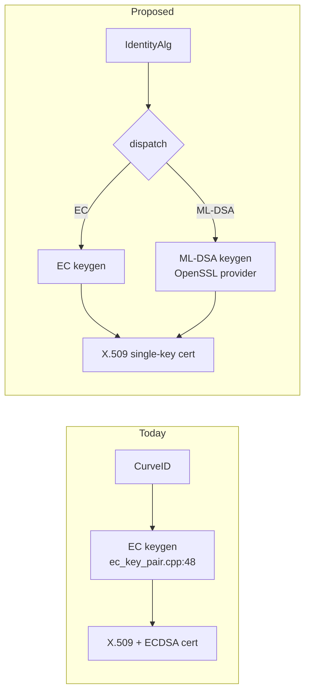
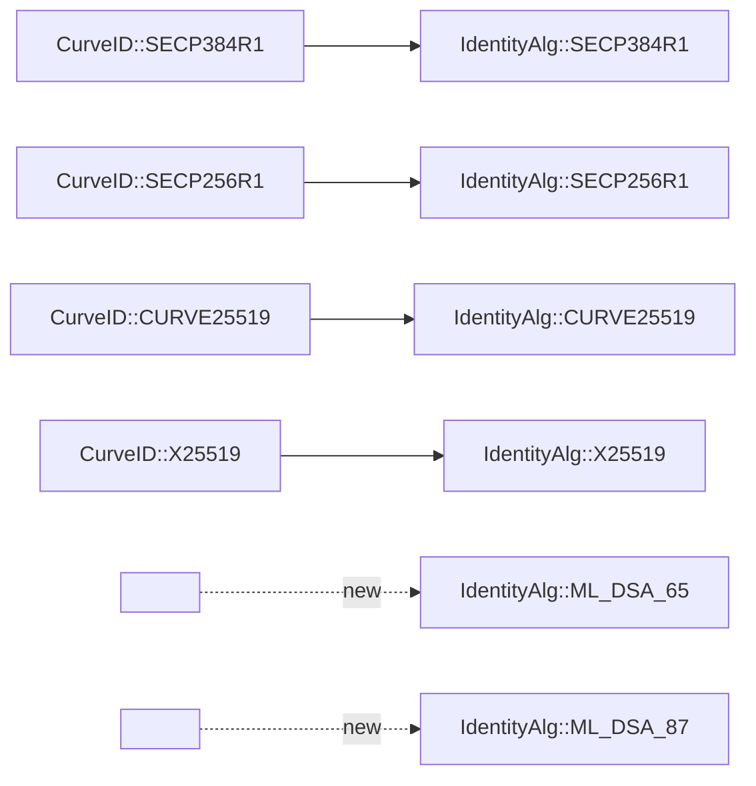
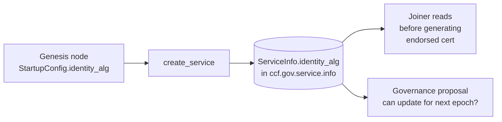
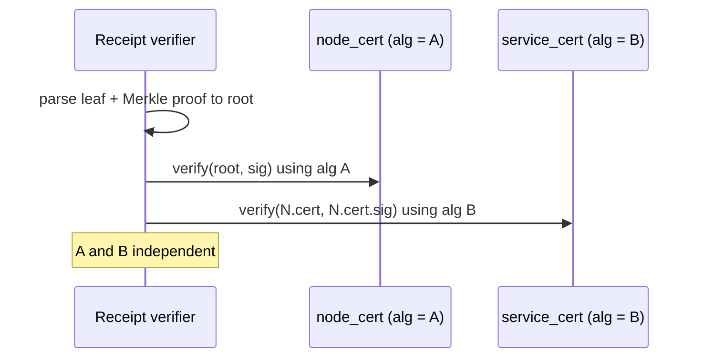
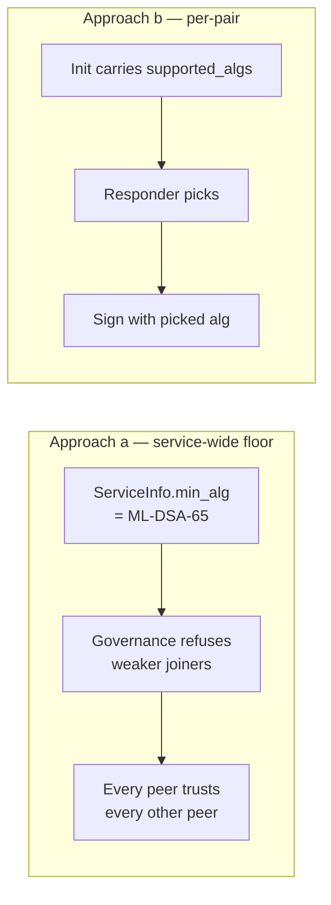
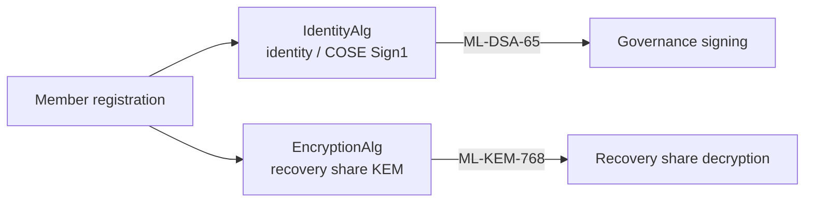

# PQC Option D — Per-identity-class Pluggable Algorithm

> Proposed change. Companion to `gen/ccf_identity_primer.md` and the four
> deep-dive docs (`ccf_identity_service.md`, `_node.md`, `_member.md`,
> `_user.md`) which describe **today**. This document describes a
> migration path where the existing `CurveID` enum is widened into a
> general `IdentityAlg` enum that also names pure-PQ algorithms
> (ML-DSA-65, ML-DSA-87, optionally SLH-DSA), and every consumer
> dispatches on it. Certs stay *single-key, single-sig* — pure PQ, not
> composite/hybrid.

---

## 1. TL;DR

Keep the existing code path. Every principal (Service, Node, Member,
User) is already constructed with a `ccf::crypto::CurveID` value
(`include/ccf/crypto/curve.h:17`) that names its algorithm. Generalise
the enum into `IdentityAlg` with new entries `ML_DSA_65`, `ML_DSA_87`,
and gate every signer/verifier on the alg field carried inside the
key-pair wrapper or read from the cert SPKI. Pure-PQ certs throughout —
no hybrid / no double signature. One new enum value carries the choice
end-to-end; every existing `switch (CurveID)` site grows two cases.



Nothing else in the architecture moves: report_data is still
`SHA256(SubjectPublicKeyInfo_DER)`
(`src/node/node_state.h:945-951`, hash size invariant), the KV cert
tables (`MEMBER_CERTS`, `USER_CERTS`, `endorsed_certificates`) still
store a single `Pem`, ledger receipts still have one `signature` and
one `cert`, COSE_Sign1 envelopes still carry one `alg` header.

---

## 2. Current enum, proposed enum, mapping

`ccf::crypto::CurveID` lives at `include/ccf/crypto/curve.h:17-28`:

```cpp
enum class CurveID : uint8_t
{
  NONE = 0,
  SECP384R1,
  SECP256R1,
  CURVE25519,
  X25519
};
```

The `DECLARE_JSON_ENUM` mapping follows
(`include/ccf/crypto/curve.h:30-36`); the JSON labels are how the enum
ends up in `startup_config.json`, in the ledger
(`NodeCertificateInfo::curve_id`, `include/ccf/node/startup_config.h:39`),
and in the KV.

Proposed widening:

```cpp
enum class IdentityAlg : uint8_t
{
  NONE = 0,
  SECP384R1,   // was CurveID::SECP384R1
  SECP256R1,   // was CurveID::SECP256R1
  CURVE25519,  // EdDSA
  X25519,      // X25519 KEX only
  ML_DSA_65,   // FIPS 204 (Dilithium3)
  ML_DSA_87,   // FIPS 204 (Dilithium5)
  // SLH_DSA_SHA2_128S,  // optional, FIPS 205 — slow but conservative
};
```



Rename (or just typedef) the existing symbol; legacy JSON values
(`"Secp384R1"`, …) must keep deserialising for backward-compatible
ledger replay.

---

## 3. Plumbing — every `CurveID` consumer is touched

Each site below currently consumes `CurveID` and must grow either a
new switch arm or polymorphic dispatch. The list is exhaustive
(workspace-wide `rg "CurveID"`).

| Layer | File:line | What it does today |
|---|---|---|
| Public enum | `include/ccf/crypto/curve.h:17-39` | Defines enum, JSON map, `service_identity_curve_choice`, `get_md_for_ec` |
| EC key-pair API | `include/ccf/crypto/ec_key_pair.h:136,154` | `make_ec_key_pair(CurveID)`; `get_curve_id()` |
| EC public-key API | `include/ccf/crypto/ec_public_key.h:141` | `get_curve_id()` |
| EdDSA key-pair API | `include/ccf/crypto/eddsa_key_pair.h:50,82` | `make_eddsa_key_pair(CurveID)`; `get_curve_id()` |
| EdDSA public-key API | `include/ccf/crypto/eddsa_public_key.h:51` | `get_curve_id()` |
| ECDSA helper | `include/ccf/crypto/ecdsa.h:35` | `ecdsa_sig_p1363_to_der(sig, CurveID)` |
| JWK conversion | `include/ccf/crypto/jwk.h:68-122` | `curve_id_to_jwk_curve` / inverse / EdDSA variant |
| EC OpenSSL impl | `src/crypto/openssl/ec_key_pair.cpp:48,471,484,530` | `EVP_PKEY_CTX_set_ec_paramgen_curve_nid`; `derive_shared_secret` |
| EC OpenSSL pub | `src/crypto/openssl/ec_public_key.cpp:121-169` | `get_openssl_group_id(CurveID)`, NID mapping |
| EdDSA OpenSSL impl | `src/crypto/openssl/eddsa_key_pair.cpp:10,104` and `.../eddsa_public_key.cpp:90-117` | Same as above for Ed25519 |
| ECDSA sig conv | `src/crypto/ecdsa.cpp:56` | DER↔p1363 conversion |
| EdDSA factory | `src/crypto/eddsa_key_pair.cpp:27` | `make_eddsa_key_pair(CurveID)` |
| Service identity | `src/node/identity.h:24-40` | `NetworkIdentity` ctor passes `curve_id` to `ECKeyPair_OpenSSL` |
| Node identity | `src/node/node_state.h:405,614-619` | `curve_id_` plumbed from config into `node_sign_kp` |
| Startup config | `include/ccf/node/startup_config.h:39` | `NodeCertificateInfo::curve_id` (the JSON field operators set) |
| N2N key exchange | `src/crypto/key_exchange.h:24,94` | DH curve hard-coded `SECP384R1`; raw EC point on the wire |
| N2N channel sigs | `src/node/channels.h:321,349,384,502,617,674` | Sign / verify key shares with the node key |
| Enclave bootstrap | `src/enclave/enclave.h:88` | Receives `curve_id` from host, dispatches into node creation |
| JS crypto bindings | `src/js/extensions/ccf/crypto.cpp:148-213` | Maps JS strings `"secp256r1"`, `"ed25519"`, `"x25519"` to `CurveID` |
| Docs | `doc/build_apps/crypto.rst:30,49,52` | `:cpp:func:` references that must be updated |
| Tests | `src/crypto/test/{crypto,bench,cose,cose_bench}.cpp`, `src/node/test/channels.cpp:760-784`, `src/kv/test/kv_test.cpp:2272,3372`, `src/pal/test/verify_uvm_attestation_and_endorsements.cpp:210`, `src/cose/test/cose_ffi_test.cpp:23` | All bake `CurveID::SECP*R1` constants |

The dispatch chain in practice is:
`StartupConfig.node_certificate.curve_id` (`startup_config.h:39`) →
`enclave.h:88` → `NodeState` ctor (`node_state.h:614`) →
`node_sign_kp` (`node_state.h:617`) and `NetworkIdentity`
(`identity.h:24`) → N2N sign/verify (`channels.h:321,502`),
ledger signatures (`src/node/history.h`), endorse node certs
(`certs.h:51`), and COSE_Sign1 over Merkle root (`history.h:402`).
In option D *every node on this chain* has to switch on `IdentityAlg`
rather than pass a single `CurveID` literal through. Each branch is
small (≤ 30 lines) but there are many of them — the footprint is
**wide and shallow** (cf. §11).

---

## 4. Service / network algorithm constant

Today `service_identity_curve_choice` is a `static constexpr CurveID
service_identity_curve_choice = CurveID::SECP384R1;` at
`include/ccf/crypto/curve.h:38` — i.e. a compile-time constant baked
into every binary. It is consumed as the default `curve_id` argument
of `make_ec_key_pair` (`include/ccf/crypto/ec_key_pair.h:154`) and as
the curve passed to `NetworkIdentity` from `NodeState::create`
(`src/node/node_state.h:987-991`, by way of `curve_id_`). Two paths:

1. **Keep as a compile-time constant per build.** One service =
   one alg. Algorithm migration = redeploy binary + new network.
   Simple, but defeats half the value of having a pluggable enum and
   prevents a single binary from supporting multiple deployments.
2. **Move to a service-config field, set at network start.** Add
   `ServiceInfo::identity_alg` (`include/ccf/service/tables/service.h:27`),
   written by genesis-node `create_service`. All later joiners read it
   from the ledger. The genesis node still picks the alg from
   `StartupConfig`, which means CLI / config tooling must expose it.

**Recommendation: (2).** The constant currently exists only because
nothing else needed it; once `IdentityAlg::ML_DSA_*` is on the menu,
operators will want to choose at network creation without recompiling.
Backward compatibility is easy because `ServiceInfo` already has
`DECLARE_JSON_TYPE_WITH_OPTIONAL_FIELDS` semantics
(`include/ccf/service/tables/service.h:44-51`) — a missing
`identity_alg` field on an old ledger means `SECP384R1`.



---

## 5. Node-identity alg need not equal Service-identity alg

Today the operator picks `node_certificate.curve_id` and conventionally
matches it to `service_identity_curve_choice`, but the code path does
*not* require equality. The endorsement is built by
`create_endorsed_cert` which delegates to
`make_ec_key_pair(issuer_private_key)->sign_csr(issuer_cert, csr, ...)`
(`src/crypto/certs.h:51-60`): the *issuer* key (service) chooses the
signature MD via `get_md_for_ec(get_curve_id())`
(`src/crypto/openssl/ec_key_pair.cpp:449`) on the issuer's curve, while
the *subject* key (node) only contributes the public key inside the
CSR (`src/node/node_state.h:1346`). Two different algorithms, two
independent calls. The same is true on the verifier side: the receipt
verifier walks `node_cert → service_cert`, calling
`make_verifier(pem)` (`include/ccf/crypto/verifier.h:181`) on each
which dispatches by the cert's SPKI OID, not by a global setting.

So in option D the matrix is:

| SI alg | NI alg | Works? |
|---|---|---|
| SECP384R1 | SECP384R1 | yes (today) |
| ML-DSA-65 | SECP384R1 | yes (NI signed by SI with ML-DSA) |
| SECP384R1 | ML-DSA-65 | yes (NI signs receipts with ML-DSA, SI endorses with ECDSA) |
| ML-DSA-87 | ML-DSA-65 | yes |

The only constraint is: the **issuer** alg must be present in the
**verifier's** library at the time the chain is checked — which for
clients means their CCF SDK (Python `python/ccf/`, JS `js/`) must
understand ML-DSA when the service cert is ML-DSA. For receipts the
verifier needs to handle both algs simultaneously (`node_cert` ML-DSA,
`service_cert` ECDSA, or vice versa).



This decoupling is what makes option D **actually deployable** in
phases (e.g. operate SI on legacy ECDSA for a transition window while
nodes mint ML-DSA Merkle signatures).

---

## 6. N2N negotiation problem — the killer issue

This is the hard part. Each side's DH share is signed with its node
identity private key (`src/node/channels.h:321,349,384`) and verified
on receipt with the peer cert's verifier
(`src/node/channels.h:502,617,674` → `verify_peer_signature`,
`channels.h:744-753`). If node A's key is ML-DSA-65 and node B's is
SECP384R1, **both nodes must support both algorithms** to interoperate
— this is asymmetric because A signs with ML-DSA (B must verify
ML-DSA) and B signs with ECDSA (A must verify ECDSA).

There is no in-handshake alg negotiation today. The kex protocol
(declared at `src/node/channels.h:993-998`,
`src/crypto/key_exchange.h:19-115`) is fixed-shape: init / response /
final, each carries a key share + signature; the alg of the signature
is whatever the local node was started with.

Two ways to make this safe:

**(a) Service-wide alg floor in `ccf.gov.service.info`.** Add
`ServiceInfo::min_node_identity_alg` (sibling of the §4 field). On
`transition_node_to_trusted` the governance action refuses any joiner
whose CSR public key is below the floor. Every existing node, by
construction, already meets the floor (the floor was set at create
time, or raised via a governance action which itself rolled the older
nodes). Therefore at any in-flight moment **all currently-trusted
nodes share an algorithm or strictly above** — peers may not match
but each one knows that any peer cert it sees is ≥ floor, so as long
as it links the right OpenSSL provider it can verify.

**(b) Per-pair negotiation in the kex.** Extend the kex wire format
with an `alg_id` field in the init message; the responder picks the
intersection of the two nodes' capability sets and replies with the
chosen alg, then both sides sign with it. Adds a round trip's worth
of state but does not require ledger coordination.



**Recommendation:** **(a)**, because (i) CCF already has a strong
"network-wide configuration via governance" pattern (cf.
`set_service_certificate_validity`, JWT issuers, etc.), (ii) the
intersection-negotiation in (b) doubles the state machine in
`channels.h` (already complex around the
`key_exchange_init`/`response`/`final` priority handling at
`channels.h:507-513,993-998`), and (iii) the per-pair approach hides
"some-of-my-peers-are-weak" attack-surface choices behind handshake
defaults instead of governance.

---

## 7. Wire format must change anyway

The kex key share is currently serialised with a **1-byte** size
prefix inside the EC-point blob, for mbedTLS-era compatibility:

```cpp
auto tmp = own_key->public_key_raw();
tmp.insert(tmp.begin(), tmp.size());   // 1-byte prefix
```
(`src/crypto/key_exchange.h:59-61`; symmetric `tmp.erase(tmp.begin())`
at `:91-92` on receive). secp384r1 uncompressed point is 97 bytes, so
the 1-byte prefix is fine — but it silently truncates anything > 255.

Outside that blob, the surrounding `append_buffer` packer in
`src/node/channels.h:131-140` uses an 8-byte `size_t` length prefix,
so the *outer* kex frame fields (signature, cert, salt) are not
length-constrained at the channels layer.

Algorithm-sized blobs:

| Object | secp384r1 | ML-DSA-65 | ML-DSA-87 |
|---|---|---|---|
| Public key (raw) | 97 B | 1952 B | 2592 B |
| Signature | ~96 B (DER ECDSA) | 3309 B | 4627 B |
| Cert (X.509) | ~700 B | ~3 KB | ~5 KB |

**Public keys exceed 255 B → the 1-byte prefix in `key_exchange.h:60`
breaks for any PQ identity.** The fix is mandatory even for an
ECDSA-only world if we ever revisit that header: switch to a 2- or
4-byte prefix (option D's chance to do it once, cleanly).

Signature length on the channel wire is fine (size_t prefix), but
note `node_kp->sign(...)` returns 3.3 KB or 4.6 KB per handshake
message — the message buffer sizing in the channel manager
(`src/node/node_to_node_channel_manager.h`) should be reviewed to
ensure it does not have a hidden upper bound.

---

## 8. TLS

OpenSSL 3.x (CCF builds against 3.3, see `src/tls/context.h:28`)
negotiates signature algorithms via the TLS 1.3 `signature_algorithms`
extension, which is exactly the right mechanism for option D: the
server cert's SPKI carries the alg OID, OpenSSL's verifier matches it
against the client's offered list. The hard parts are:

1. **OpenSSL provider for ML-DSA.** Today the only TLS algorithms
   permitted are P-521 / P-384 / P-256 via
   `SSL_CTX_set1_curves_list(cfg, "P-521:P-384:P-256")`
   (`src/tls/context.h:60-61`) and the ECDHE-ECDSA cipher list at
   `:44-49`. The `set1_curves_list` is for KEX groups, not signature
   algs — to allow ML-DSA we need `SSL_CTX_set1_sigalgs_list` (or the
   client-side `SSL_set1_client_sigalgs_list`) including the new
   NIST-defined ML-DSA codepoints, plus an OpenSSL provider that
   implements them (oqs-provider, or a future built-in).
2. **`SSL_CTX_use_cert_and_key`** at `src/tls/cert.h:115` already
   accepts whatever `EVP_PKEY` we hand it — that line does not need to
   change as long as the upstream `Pem`→`EVP_PKEY` parser knows the
   new OIDs.

For node-to-node we do **not** use TLS (cf.
`gen/ccf_identity_primer.md:107`), so the TLS work is only at the
client edge.

---

## 9. JWT

The JWT verifier at `src/http/http_jwt.h:18-26` constrains the alg to
two values:

```cpp
enum class JwtCryptoAlgorithm : uint8_t
{
  RS256,
  ES256,
};
DECLARE_JSON_ENUM(
  JwtCryptoAlgorithm,
  {{JwtCryptoAlgorithm::RS256, "RS256"},
   {JwtCryptoAlgorithm::ES256, "ES256"}});
```

`JwtHeader::alg` is required (`http_jwt.h:30-34`); anything outside
`RS256`/`ES256` fails JSON parsing in
`header.get<JwtHeader>()` at `http_jwt.h:177-187`. To accept a
PQ-signed JWT we widen the enum to include `ML_DSA_65` (label
`"ML-DSA-65"` per the in-flight IETF JOSE PQ draft
`draft-ietf-cose-dilithium`) and add a dispatch arm in
`src/endpoints/authentication/jwt_auth.cpp:162-170` to feed the new
alg into the right `make_verifier`. Note CCF does **not** mint these
JWTs — it only verifies tokens issued by an external IdP and cached in
`ccf.gov.jwt.public_signing_keys`, so the changes are verification-only
and depend on whichever provider (e.g. Entra) is first to publish
PQ-signed JWKs. **Don't gate Option D on this — implement once the
JOSE draft is RFC-stable.**

---

## 10. Sealing & recovery encryption keys (RSA-OAEP today)

Two RSA-OAEP-2048 dependencies sit alongside the signature stack and
are *not* covered by widening a *signature* enum:

- **Recovery-share encryption.** `share_manager.h:186-189` and
  `:205-207` build a member's `make_rsa_public_key(enc_pub_key)` and
  call `rsa_oaep_wrap(...)` on each share.
- **Sealed recovery (experimental SNP-only).**
  `src/node/local_sealing.cpp:93,135-137,167,201` generates an RSA
  recovery keypair per node and uses `rsa_oaep_wrap` / `rsa_oaep_unwrap`
  for the AES-GCM-sealed copy of the wrapping key.

These are KEM operations, not signatures. If we lift `IdentityAlg`
into a sibling `EncryptionAlg` enum at the same time (with values
`RSA_2048`, `ML_KEM_768`, `ML_KEM_1024`) we get the KEM swap for free
— member registration grows an alg field next to `enc_pub_key`,
`rsa_oaep_wrap` becomes `kem_wrap` with a switch arm. **Strongly
recommended** to land both enums together: members hold both a
signing key (governance COSE_Sign1) and an encryption key (recovery
share), and operationally those should be migratable independently
but on the same release.



---

## 11. Code-change footprint

| Area | Files / lines (estimate) | Mechanical or design? |
|---|---|---|
| Enum + JSON map | `include/ccf/crypto/curve.h` (+ rename header) | mechanical |
| EC / EdDSA factories | `src/crypto/openssl/ec_key_pair.cpp`, `eddsa_key_pair.cpp`, headers | mechanical (add ML-DSA factory next to EC factory) |
| `get_md_for_ec` → `get_md_for_alg` | `curve.h:42-60` | mechanical |
| OpenSSL NID maps | `ec_public_key.cpp:157-169`, `eddsa_public_key.cpp:90-100` | mechanical, **needs OpenSSL provider** |
| Wire-format prefix widening | `src/crypto/key_exchange.h:59-61, 91-92` | small, mandatory |
| N2N alg-floor enforcement | new `ServiceInfo::min_node_identity_alg`, governance action | **design** |
| TLS `sigalgs_list` | `src/tls/context.h:60-61` | small, needs provider |
| JWT alg widening | `src/http/http_jwt.h:18-26`, `jwt_auth.cpp:162` | small, gated on JOSE PQ RFC |
| KEM widening (recovery) | `src/node/share_manager.h:186-207`, `src/node/local_sealing.cpp:93,135,167,201`, member table schema | **design + mechanical** |
| Cert build (`Signer`/`sign_csr`) | `src/crypto/openssl/ec_key_pair.cpp:304-468` | medium; sign with ML-DSA needs different `EVP_DigestSignInit` path |
| Test matrix | `src/crypto/test/*`, `src/node/test/channels.cpp:760-784`, `src/kv/test/kv_test.cpp` | wide; see §13 |
| JS bindings | `src/js/extensions/ccf/crypto.cpp:148-213` | mechanical |
| Docs | `doc/build_apps/crypto.rst:30,49,52` | mechanical |
| SDKs (Python + JS) | `python/ccf/`, ts-ccf | medium — must know ML-DSA cert OIDs to verify receipts |

The depth of any single change is small. The width is the cost.

---

## 12. Pros

- **One code path.** Existing signer/verifier API surfaces
  (`make_verifier`, `node_kp->sign`, `Verifier::verify`) keep their
  shapes; behaviour switches inside.
- **No double-signature dispatch.** Pure-PQ certs mean one signature
  per cert; receipts stay `{leaf, proof, node_cert, sig}` with a
  single sig field.
- **Clean fallback path.** A single `make_verifier(pem)` call dispatches
  by SPKI OID; no branching at every receipt-verification site
  outside the verifier itself.
- **Trivially extensible.** Adding SLH-DSA later is appending one
  enum entry plus one EVP factory arm.
- **SI/NI decoupling for free.** §5 shows the existing cert-build code
  already supports unequal algs; no refactor required.
- **report_data binding is hash-stable.** §2 of
  `gen/ccf_identity_node.md` notes the binding is
  `SHA256(SubjectPublicKeyInfo_DER)` — invariant under PQ key growth.

---

## 13. Cons

- **Cross-product test matrix explodes.** Today the `channels.cpp`
  test suite at `src/node/test/channels.cpp:760-784` already tests
  4 combinations of `{network, node_1, node_2}` curves. Adding two
  PQ algs takes that to 27 combinations per flow, multiplied by the
  number of flows (join, n2n, receipt verify, COSE_Sign1, JWT, mTLS).
- **Every consumer touched (cross-cutting).** See §3 — wide and
  shallow. PR review burden is real; the wins are diffuse.
- **N2N alg negotiation is hard.** §6 — the service-wide-floor
  approach pushes the problem to governance, which is the right
  place, but designing the governance action and the joiner
  rejection logic is non-trivial and has migration footguns (raising
  the floor must not lock out currently-trusted nodes).
- **Tooling and SDKs must understand multiple cert types.** Today
  every external pinner (`service_cert.pem`) parses an ECDSA cert;
  switching the service identity to ML-DSA breaks every client SDK
  that doesn't have a PQC-aware X.509 stack. This is a *deployment*
  cost more than a code cost.
- **OpenSSL provider dependency.** ML-DSA isn't in upstream OpenSSL
  3.3 by default; CCF would either pin `oqs-provider` or wait for
  the 3.4/3.5 built-in. This is the single biggest blocker on calendar
  time.
- **No hybrid hedge.** Pure-PQ means a flaw in ML-DSA is unmitigated.
  Option D explicitly trades hedging for simplicity; if hedging is
  required, see option C (composite) or option E (dual-sig).

---

## 14. Open questions

1. **Per-class restricted algorithm subsets.** Does each identity class
   get its own subset of `IdentityAlg`? e.g. NI restricted to algs the
   TEE platform can sign with in-enclave (some HSM-bound algs are not
   yet supported by SNP virtual-TPM paths), Member restricted to algs
   that Azure Key Vault exposes (HSM dependency, primer §6), User
   unrestricted, Service ≥ Node? Adding a `supported_for(class)`
   helper alongside the enum would make this enforceable in code.
2. **Governance design for the alg floor (§6).** Action name —
   `set_minimum_node_identity_alg`? — pre-conditions (must be ≥
   current floor; all currently-trusted nodes must already be ≥ new
   floor or be removed first); audit trail; downgrade-attack
   resistance. Probably mirrors the existing
   `set_service_certificate_validity` shape.
3. **Recovery member key rotation.** Today members can re-register
   their RSA enc key by re-running `set_recovery_member`. With
   `EncryptionAlg`, do we allow heterogeneous algs across recovery
   members within a single epoch (recovery_threshold members holding
   ML-KEM, others holding RSA)? The k-of-n sharing in
   `src/node/share_manager.h:172-215` is alg-agnostic so the answer
   is technically yes, but the operational story (who can be
   compromised?) is messier.
4. **Sealed-recovery RSA → ML-KEM swap timing.** Sealed recovery is
   experimental (cf. `gen/ccf_identity_primer.md:226-244`). Should it
   ship PQ-only, since it's not yet production?
5. **JS-side enum.** `src/js/extensions/ccf/crypto.cpp:148-213` maps
   strings like `"secp256r1"` to curves; what string is canonical for
   ML-DSA — `"ml-dsa-65"`, `"ML-DSA-65"`, `"dilithium3"`? Pick once
   and document.
6. **Lts-compatibility matrix.** Per repo guidance, changes to
   identity-bearing code must be tested by `lts_compatibility` with
   `LONG_TESTS=1`. What is the upgrade path for a service that was
   created at version N with `SECP384R1` and rolls forward to version
   N+1 that supports `ML_DSA_65`? Presumably no change unless an
   operator proposes a service-identity rotation; document the
   no-op upgrade explicitly.

---

> Citations are all to files in `/workspaces/CCF` at the time of
> writing. Where a function is referenced by *behaviour* rather than
> exact line (e.g. "the kex protocol state machine") the path:line
> is the entry point; follow the dispatch table at
> `src/node/channels.h:1119-1145` for the full transition graph.
