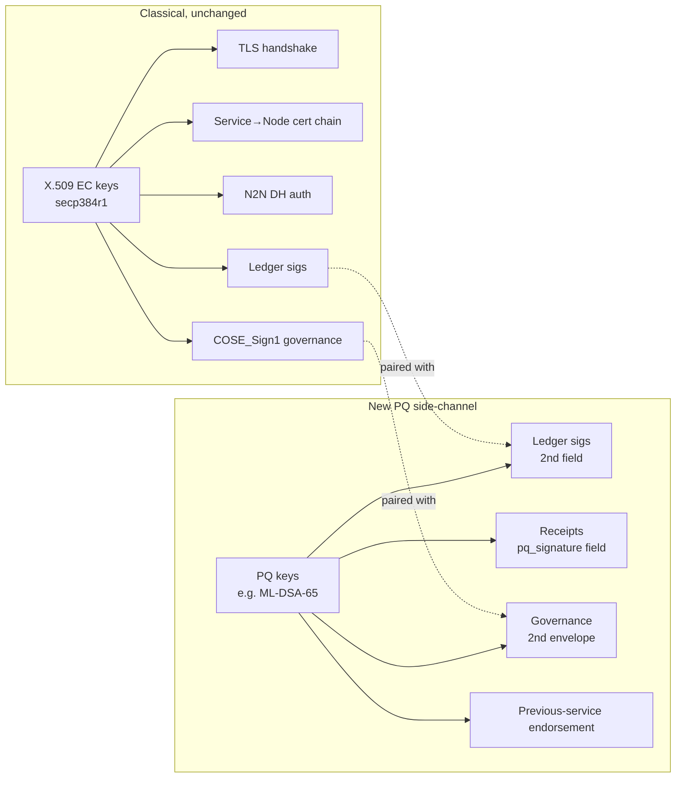
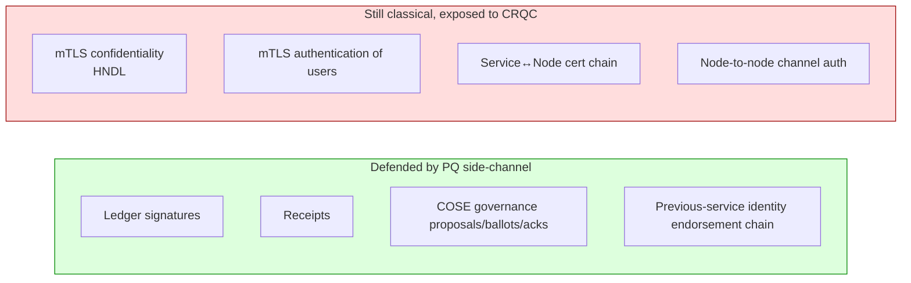
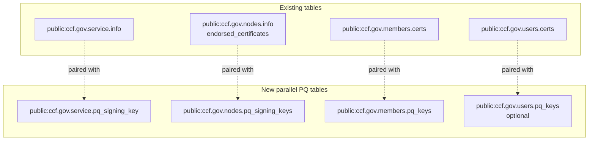
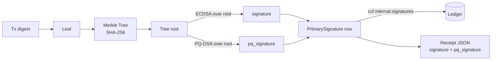
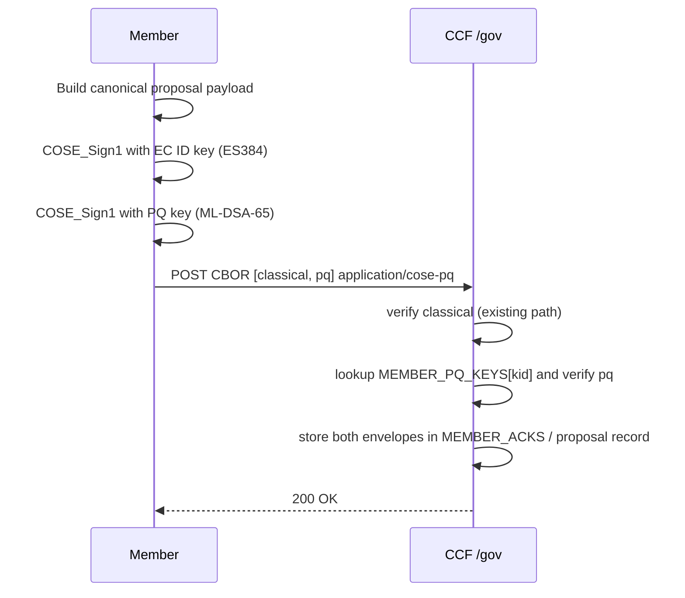
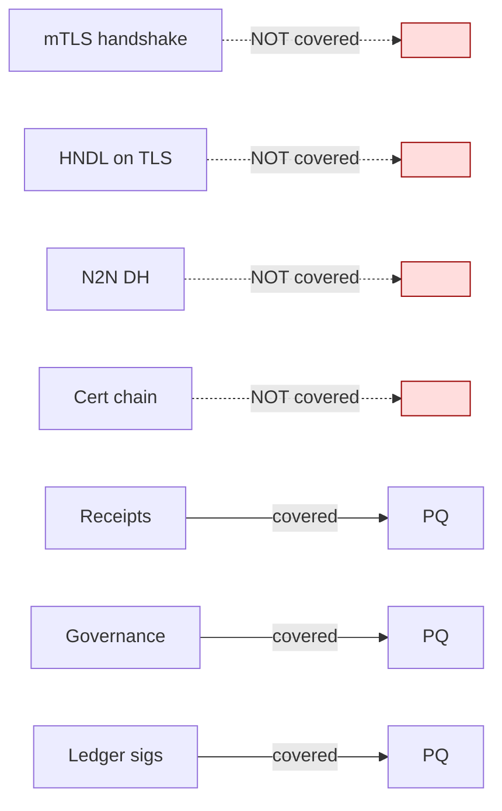

# PQC Option E — Side-channel PQ Envelope

> Proposal. Companion to the five `ccf_identity_*.md` docs (primer + service +
> node + member + user). Those describe the **current** state; this file
> describes a **proposed** post-quantum option that leaves X.509/EC untouched
> and adds a parallel PQ signature on every ledger-committed artifact.

---

## 1. TL;DR

Keep every X.509 EC identity exactly as it is today: TLS handshakes, the
service-cert / node-cert chain, `tls::CA` (`src/tls/ca.h`), the COSE-Sign1
`ES256/384/512` policy for member auth — all unchanged. **Add one new PQ
signing key per identity class** (one for the service, one per node,
optionally one per member, optionally per user). For every artifact that
gets *committed to the ledger and later audited* — ledger signatures,
receipts, COSE governance, the previous-service endorsement chain — emit a
**second, side-channel PQ signature** alongside the existing EC one.

This is the smallest realistic step that gives an auditor a real PQ
guarantee on every committed artifact, without touching the parts of the
stack that are hardest to migrate (OpenSSL TLS, X.509, the n2n DH
handshake). It does **not** defend live TLS sessions from HNDL capture,
and it does not authenticate the n2n channel post-quantum (see §5).



---

## 2. Threat model coverage

What this defends: **post-session forgery** of any ledger-committed
artifact by an adversary holding a future quantum break of the EC keys.
After the CRQC is real, the EC ledger signatures and EC COSE governance
envelopes are forgeable, but the **PQ side-channel signatures over the
exact same payload bytes** remain unforgeable. An offline auditor with the
service's PQ public key (registered through governance, stored in the KV)
can still verify any historical receipt, any governance ACK, and any
previous-service endorsement.

What this does **not** defend:

- **Live mTLS confidentiality / authentication.** TLS still uses ECDHE +
  ECDSA (`src/tls/cert.h`, `src/tls/ca.h:63-74`). An adversary recording
  ciphertexts today (HNDL) breaks them on Q-day.
- **N2N channel authentication.** The DH handshake is still
  EC-signed by the node identity (`src/node/channels.h:714-731`); a CRQC
  attacker can impersonate nodes online.
- **The cert chain itself.** Forging a service-endorsed node cert
  remains classically-hard only.



---

## 3. New KV tables

Three new public governance tables hold the PQ public material. All KV
entries; all governance-writeable; all replicated through normal ledger.
Names follow the existing `ccf.gov.{service,nodes,members,users}.*`
conventions (cf. `include/ccf/service/tables/service.h:56-59`,
`nodes.h:23-28`, `members.h:102-108`, `users.h:34-38`).

```cpp
// Service-wide PQ signing key (parallels Tables::SERVICE).
struct PqSigningKey {
  std::vector<uint8_t> public_key;  // SPKI/DER for the chosen PQ scheme
  std::string algorithm;            // "ML-DSA-65" | "SLH-DSA-SHA2-128s" | ...
  std::optional<ccf::TxID> created_at;
};
using ServicePqSigningKey = ServiceValue<PqSigningKey>;
namespace Tables {
  static constexpr auto SERVICE_PQ_SIGNING_KEY =
    "public:ccf.gov.service.pq_signing_key";
}
```

Per-node table parallels `NODE_ENDORSED_CERTIFICATES`
(`include/ccf/service/tables/nodes.h:26-27`):

```cpp
using NodePqSigningKeys =
    ccf::kv::RawCopySerialisedMap<NodeId, PqSigningKey>;
namespace Tables {
  static constexpr auto NODE_PQ_SIGNING_KEYS =
    "public:ccf.gov.nodes.pq_signing_keys";
}
```

Per-member table parallels `MEMBER_CERTS`
(`include/ccf/service/tables/members.h:98,105`):

```cpp
// One PQ public key (or self-signed PQ-only cert) per member.
using MemberPqKeys =
    ccf::kv::RawCopySerialisedMap<MemberId, PqSigningKey>;
namespace Tables {
  static constexpr auto MEMBER_PQ_KEYS =
    "public:ccf.gov.members.pq_keys";
}
```

Optional per-user table (only if PQ user attestation is desired —
`include/ccf/service/tables/users.h:31-37`):

```cpp
using UserPqKeys =
    ccf::kv::RawCopySerialisedMap<UserId, PqSigningKey>;
namespace Tables {
  static constexpr auto USER_PQ_KEYS = "public:ccf.gov.users.pq_keys";
}
```

The `algorithm` string is per-row, so the service can ratchet from e.g.
ML-DSA-65 to ML-DSA-87 via governance without a schema change. No
existing table is modified, so old verifiers keep parsing the existing
rows.



---

## 4. Per-artifact application

### Ledger signatures

The existing primary-signature row is `ccf::PrimarySignature` carrying an
EC signature over the Merkle root
(`src/service/tables/signatures.h:13-50`). Extend it with an *optional*
`pq_signature` field:

```cpp
struct PrimarySignature : public NodeSignature {
  // ... existing fields ...
  std::optional<std::vector<uint8_t>> pq_signature = std::nullopt;
  std::optional<std::string> pq_algorithm = std::nullopt;
};
DECLARE_JSON_OPTIONAL_FIELDS(PrimarySignature, cert, pq_signature, pq_algorithm);
```

The signing call site is `MerkleTreeHistoryPendingTx::call`
(`src/node/history.h:345-432`). Right after computing
`primary_sig = node_kp.sign_hash(root_hash...)` at
`src/node/history.h:358`, add a second call against the node's PQ key
fetched from a new `node_pq_kp` handle held alongside `node_sign_kp`
(`src/node/node_state.h:408,617`). Same `root_hash` is signed — bit-for-bit
the same payload, two signatures.

The companion COSE ledger signature (`Tables::COSE_SIGNATURES`,
`src/service/tables/signatures.h:67-73`) is produced at
`src/node/history.h:402-425`. Mirror it: write a second, parallel
`pq_cose_signatures` table whose payload is the same `tx_id || root_hash`,
signed with the **service** PQ key (the one in
`SERVICE_PQ_SIGNING_KEY`). Receipt verifiers that recognise the new key
verify both; old verifiers ignore the new table.

### Receipts

The in-process receipt struct `TxReceiptImpl`
(`src/node/tx_receipt_impl.h:13-57`) already has an optional
`cose_signature` field. Add a parallel:

```cpp
std::optional<std::vector<uint8_t>> pq_signature = std::nullopt;
std::optional<std::string>          pq_algorithm = std::nullopt;
std::optional<std::vector<uint8_t>> pq_cose_signature = std::nullopt;
```

The historical-query path that builds receipts
(`src/node/historical_queries.h:69-92` reads `Signatures` and
`CoseSignatures`) gains a third read against the new PQ-COSE table; the
fields are forwarded into the receipt JSON in `src/node/receipt.cpp:178-208`.

The Python verifier (`python/src/ccf/receipt.py`) currently does
`verify(root, signature, cert)` (`:26-37`) with `ECDSA(Prehashed(SHA-256))`.
Add a parallel `verify_pq(root, pq_signature, pq_pubkey, algorithm)`. A
receipt is "PQ-valid" iff **both** the EC and the PQ signatures verify
against keys registered for the signing node *at the relevant seqno*. The
PQ public key is fetched from the new
`NODE_PQ_SIGNING_KEYS` snapshot bundled with the receipt.



### COSE governance

A member signs a proposal/ballot/ack as a `COSE_Sign1` with `ES384`
(`python/src/ccf/cose.py:101-116`), submitted with `Content-Type:
application/cose` (`src/endpoints/authentication/cose_auth.cpp:244-249`).
The proposal is identified by the cert's SHA-256 (the `kid` =
`MemberId`).

Side-channel proposal: members sign the **same payload bytes** a second
time with their PQ key, and wrap the result as a *second* `COSE_Sign1`
envelope. The two envelopes are bundled in a small CBOR array
`[classical_cose, pq_cose]` and posted as the request body. The server
verifies the classical envelope through the existing
`ActiveMemberCOSESign1AuthnPolicy` pipeline first (unchanged); then —
if the request body is the new array shape — it additionally verifies
the PQ envelope against `MEMBER_PQ_KEYS[kid]`. If the PQ envelope is
present but invalid, the request is rejected. If absent, the request is
still accepted (matching the migration strategy in §7).

When the action is committed, the *raw bytes of the PQ envelope* are
stored alongside the existing classical envelope in `MEMBER_ACKS`
(`include/ccf/service/tables/members.h:127-159`), making both available
to later audit. Note this requires no change to the COSE alg gate at
`src/node/cose_common.h` — the classical envelope still goes through
ES256/384/512; the PQ envelope is verified by a separate code path
keyed off a new `algorithm` string in the PQ table row.



### Service identity / node identity

The service today holds a single EC key pair in `NetworkIdentity`
(`src/node/identity.h:17-21`). Add a sibling **`pq_signing_kp`** kept in
the same enclave memory (cleansed on dtor with `OPENSSL_cleanse` the same
way `priv_key` is at `src/node/identity.h:46-49`). Persist its public
half in `SERVICE_PQ_SIGNING_KEY` at the same moment the service cert is
written into `ServiceInfo` — i.e. inside `NodeState::create()` for both
`StartType::Start` and `StartType::Recover`
(`src/node/node_state.h:954-1038`, esp. `:987-991` and `:1023-1027`).
Hand it to `history->set_service_signing_identity(...)` at
`src/node/node_state.h:995-996` (extend that API to take two key
pairs).

The node holds `node_sign_kp` (`src/node/node_state.h:408,617`) plus
RSA `node_encrypt_kp` (`:619`). Add `node_pq_sign_kp` constructed at the
same point, plumb it through the join handshake the same way other node
state is, and write its public half to `NODE_PQ_SIGNING_KEYS` during
`transition_node_to_trusted`. Importantly, **bind it to the SNP report**
the same way the EC public is bound today via `report_data` at
`src/node/node_state.h:945-946` — either include the PQ pubkey hash in
the same `report_data` (concatenated then SHA-256'd) or add a service
KV row capturing `sha256(node_pq_pubkey)` and surface it via a new
attestation extension. See §10 open question.

---

## 5. What is NOT covered

- **TLS handshake authentication.** The TLS server cert is still EC, and
  `tls::CA` (`src/tls/ca.h:14,63-74`) still pins the EC service cert. A
  CRQC adversary can mint a forged server cert and intercept live
  traffic.
- **TLS confidentiality / HNDL.** ECDHE-derived session keys are
  recoverable post-CRQC. Option E does nothing here; that requires a
  hybrid KEM in TLS itself (a separate, larger workstream).
- **Mutual-TLS user identity.** Users still authenticate to application
  endpoints by presenting their EC cert during the handshake
  (`src/endpoints/authentication/cert_auth.cpp:127,159`); the PQ
  side-channel is request-body-only, not handshake-level. A PQ-only
  user can still register a PQ key but it gives them no live-session
  authenticity.
- **Node-to-node channel auth.** The DH share is signed by the node EC
  key (`src/node/channels.h:714-731`); replacing this is its own
  workstream.
- **Node cert chain.** `create_endorsed_cert`
  (`src/crypto/certs.h:51-60`) still uses the service EC key to sign
  node CSRs.



---

## 6. Code-change footprint

| Area | Change | Anchor |
|---|---|---|
| New KV tables (4) | `ServicePqSigningKey`, `NodePqSigningKeys`, `MemberPqKeys`, optional `UserPqKeys` | parallels `service.h:56-59`, `nodes.h:23-28`, `members.h:102-108`, `users.h:34-38` |
| `NetworkIdentity` | Add `pq_signing_kp` member, dtor cleanses, new ctor arg | `src/node/identity.h:17-49` |
| `NodeState` | Add `node_pq_sign_kp` shared_ptr; init alongside `node_sign_kp` | `src/node/node_state.h:408,617-619` |
| `PrimarySignature` row | Optional `pq_signature`, `pq_algorithm` | `src/service/tables/signatures.h:13-55` |
| New `PqCoseSignatures` table | Parallel to `COSE_SIGNATURES` | `src/service/tables/signatures.h:64-73` |
| `MerkleTreeHistoryPendingTx::call` | Emit second EC + PQ ledger sig | `src/node/history.h:345-432` |
| `IHistory::set_service_signing_identity` | Take a second `pq_kp` | `src/node/history.h:613-634` |
| `TxReceiptImpl` | `pq_signature`, `pq_cose_signature`, `pq_algorithm` | `src/node/tx_receipt_impl.h:13-56` |
| Historical-query receipt builder | Read new PQ table | `src/node/historical_queries.h:69-92` |
| Receipt JSON serdes | Emit / parse new optional fields | `src/node/receipt.cpp:178-208` |
| `cose_auth` body shape | Accept `[classical, pq]` CBOR array; verify both | `src/endpoints/authentication/cose_auth.cpp:244-263` |
| Python receipt SDK | `verify_pq(root, pq_sig, pq_pubkey, alg)` next to `verify(...)` | `python/src/ccf/receipt.py:26-87` |
| Python COSE SDK | `create_cose_sign1_pq(...)` returning bytes; wrapper that bundles both | `python/src/ccf/cose.py:101-189` |
| Constitution | New actions `set_service_pq_key`, `set_node_pq_key`, `set_member_pq_key` | `samples/constitutions/default/actions.js` (alongside `set_member` `:417-486`, `set_user` `:570-597`) |

**Auth-policy widening: none.** TLS is unchanged; `cert_auth.cpp` is
unchanged; the COSE-Sign1 alg gate
(`src/node/cose_common.h:22-30`) is unchanged. The PQ envelope is an
*additional* check, not a replacement.

---

## 7. Migration mechanics

- **Phase 0 — code rollout.** Deploy a CCF version that *knows* about
  the new tables and the optional fields. Existing artifacts produced by
  this version still have empty PQ fields. No verifier change is forced.
- **Phase 1 — service PQ key.** Operator runs the recovery / first-boot
  step that creates a fresh `pq_signing_kp` inside the enclave. Members
  submit a `set_service_pq_key` proposal whose payload is the new
  public key. On apply, the service starts dual-signing ledger
  signatures.
- **Phase 2 — node PQ keys.** Each node, on `transition_node_to_trusted`
  (or on the next renewal), generates its own PQ key in-enclave and
  publishes the pubkey via a node-state proposal. Once a node row is
  populated in `NODE_PQ_SIGNING_KEYS`, that node's ledger signatures
  start carrying `pq_signature`. Mixed populations are fine —
  consumers gate on table presence.
- **Phase 3 — member PQ keys.** Members generate PQ key pairs out of
  band, submit `set_member_pq_key` (signed classically by their existing
  EC member key as a COSE_Sign1 — bootstrapping). After acceptance, their
  governance traffic is *required* to include the second envelope.
- **Phase 4 — auditor cutover.** Auditors update their Python receipt
  verifier to call `verify_pq` and treat receipts lacking PQ signatures
  as "classical-only" (warned, not rejected) until the consortium
  declares cutover.
- **Rolling upgrade safety.** No artifact format incompatibility:
  `pq_signature` is `optional`, the new tables are read with `ro` only
  by code that knows about them, and old verifiers see receipts with
  unknown optional fields (already tolerated by
  `DECLARE_JSON_OPTIONAL_FIELDS`).
- **DR.** Disaster recovery generates a fresh EC key **and** a fresh PQ
  key; the previous-service endorsement chain
  (`src/service/tables/previous_service_identity.h:17-44`) signs the
  previous PQ pubkey alongside the previous EC pubkey, so the COSE
  endorsement chain becomes a dual-key chain.

---

## 8. Pros

- **Surgical.** No change to TLS, X.509, CSR shape, cert chain,
  `tls::CA`, or the node-to-node channel. Crypto-review surface is
  scoped to artifact builders and KV serdes.
- **No HSM blocker on the TLS path.** Azure Key Vault still signs the
  EC member key for governance over its existing path. The PQ side
  signature can be produced by any local PQ signer (a software
  ML-DSA library, a smart card, a new KV-only AKV key type) since it
  is not bound to the TLS handshake.
- **Real auditor guarantee.** Anything written to the ledger — every
  receipt the auditor consumes — carries a PQ signature over the same
  bytes the classical signature covers. Q-day does not retroactively
  invalidate the audit trail.
- **Per-class crypto-agility.** The `algorithm` string is per KV row;
  different identity classes can upgrade independently. A future
  ML-DSA-87 cutover is a governance proposal, not a code change.
- **Lowest review surface of the five PQC options.** No new code in
  consensus, no new code in TLS, no new code in attestation parsing
  (modulo the `report_data` question, §10).

---

## 9. Cons

- **HNDL on TLS is untouched.** Bulk-encrypted application payloads
  recorded today are recoverable on Q-day. For tenants where
  confidentiality is the primary asset, option E is **not** sufficient.
- **N2N channel auth is untouched.** A future CRQC attacker can
  impersonate nodes online; consensus integrity in the post-CRQC world
  is **not** defended by option E.
- **Receipt size grows.** ML-DSA-65 signatures are ~3.3 KB. Receipts
  embedded in HTTPs responses get larger; bandwidth-sensitive
  workloads will notice.
- **Two signing operations per artifact.** Latency on the signature
  emit path (`src/node/history.h:937-976`) effectively doubles for the
  EC + PQ pair (more for SLH-DSA). The signer is on the hot path
  for ledger commit.
- **Two-key operational burden.** Operators must rotate, back up, and
  attest both keys per class. Forgetting the PQ key after a disaster
  recovery silently degrades back to classical-only, with no failure
  signal beyond "verifiers report PQ missing".
- **Member tooling complexity.** `python/src/ccf/cose.py` grows a
  second signer; CLI flags, key file conventions, and AKV bindings
  multiply. Members not yet enrolled in PQ are second-class until
  Phase 3 completes.

---

## 10. Open questions

1. **TEE binding of the node PQ key.** Today the EC node pubkey hash
   is written into the SNP attestation `report_data` (`src/node/node_state.h:945-952`).
   For Q-day-resistant attestation, the PQ pubkey must also be bound:
   either concatenate `sha256(ec_pub_der) || sha256(pq_pub_der)` and hash
   into `report_data` (changes the report format and breaks older
   verifiers), or publish `sha256(pq_pub_der)` in a new service-internal
   KV row checked at trust-transition time by another node that has
   already verified the report. The second option keeps `report_data`
   unchanged but is weaker — it relies on classical SNP signatures of
   the original quote.
2. **COSE wire format for the side-channel envelope.** Two viable
   shapes: (a) a *header field* on the existing `COSE_Sign1`
   (unprotected header, custom label) carrying `(alg, pq_sig)`; (b) a
   separate `COSE_Sign1` envelope bundled with the classical one as
   `[classical, pq]` CBOR array. Option (b) is cleaner because the PQ
   alg label space is not yet finalised in IANA registries; option (a)
   may break existing strict CBOR-canonical parsers.
3. **Receipt format compat for older verifiers.** Optional JSON fields
   are tolerated, but tools that do strict-JSON-schema validation
   (e.g. `populate_service_endorsements` consumers) need a schema
   bump. Do we ship a v2 receipt schema and keep v1 as the fallback,
   or extend v1 in place?
4. **Should `kid_from_key` cover both keys?** Ledger COSE signatures
   compute `kid` from the service pubkey DER bytes
   (`src/node/history.h:375`). With two service keys, the PQ-COSE
   envelope needs its own `kid`. Trivial — but worth specifying so the
   two envelopes are unambiguously demuxable by an offline auditor.
5. **User opt-in.** Should the per-user table `USER_PQ_KEYS` be
   mandatory, or stay optional even after Phase 4? Mandatory implies
   re-registering every user via governance; optional means user-level
   PQ guarantees are best-effort.
6. **Algorithm choice.** ML-DSA (Dilithium) keeps signatures small but
   keys are still kilobytes; SLH-DSA (SPHINCS+) has tiny keys but
   12-50 KB signatures, which is impractical for ledger sigs every
   tx-interval. A hybrid: ML-DSA for hot-path ledger sigs, SLH-DSA
   only for once-per-DR `previous_service_identity_endorsement`
   entries. This needs a `pq_algorithm` per-table choice rather than a
   single service-wide setting.
