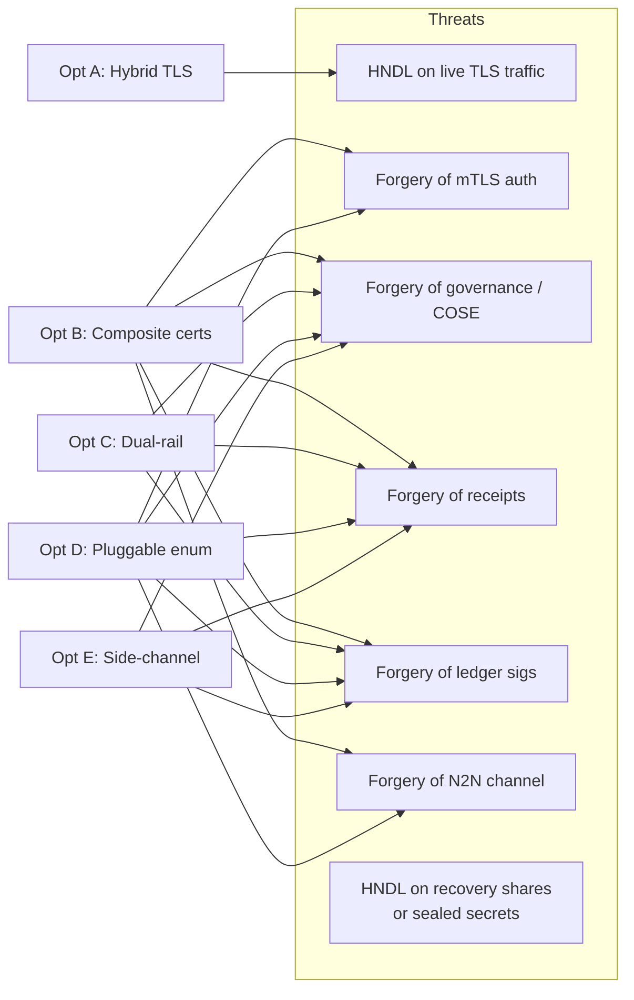
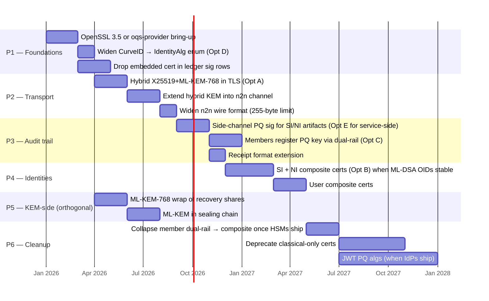

# PQC Identity in CCF — Options Comparison & Recommendation

> This is the wrap-up. The five option docs in `gen/pqc_option_*.md` each describe
> one design in depth, in the same style as the existing identity deep-dives.
> This document compares them side-by-side, picks favorites, explains why, and
> sketches a phased rollout that mixes the best parts.

---

## The five options at a glance

| Option | One-liner | Doc |
|---|---|---|
| **A** | Hybrid TLS only (X25519+ML-KEM-768) | `gen/pqc_option_a_hybrid_tls.md` |
| **B** | Composite X.509 certs (Lamps draft) for every identity | `gen/pqc_option_b_composite_certs.md` |
| **C** | Dual-rail identities — two certs per principal, two signatures per artifact | `gen/pqc_option_c_dual_rail.md` |
| **D** | Pluggable algorithm enum — same code path, alg-per-principal | `gen/pqc_option_d_pluggable_alg.md` |
| **E** | Side-channel PQ envelope — keep all X.509 EC, add PQ sigs on committed artifacts | `gen/pqc_option_e_side_channel.md` |

---

## What each option defends (and what it doesn't)

Three threats are addressed by *no* single option in isolation:
- **T1** (TLS HNDL) — only Opt A covers it. B/C/D/E don't touch the KEM.
- **T7** (recovery share + sealing HNDL) — none of the five covers it because it's
  a *KEM* concern, not a signature one. Needs an ML-KEM swap of RSA-OAEP — see
  the existing deep-dive `gen/ccf_identity_member.md` §9 and §11. This is treated
  separately below in §6 ("Orthogonal track").
- **T6** (N2N channel) — Opt A covers the *confidentiality* of node-to-node
  traffic if extended to the n2n layer; Opt B / D cover the *authentication*.
  Both halves are needed.

---

## Coverage matrix (the most important table in this doc)

|  | TLS conf | mTLS auth | Governance sig | Receipt sig | Ledger sig | N2N channel | Recovery enc | Sealing |
|---|---|---|---|---|---|---|---|---|
| **A** Hybrid TLS | ✅ | — | — | — | — | (ext) | — | — |
| **B** Composite | ✅* | ✅ | ✅ | ✅ | ✅ | ✅ | — | — |
| **C** Dual-rail | — | (cls) | ✅ | ✅ | ✅ | — | — | — |
| **D** Pluggable | ✅* | ✅ | ✅ | ✅ | ✅ | ✅ | (ext) | (ext) |
| **E** Side-channel | — | — | ✅ | ✅ | ✅ | — | — | — |

- ✅ = covered when this option is fully applied to that surface.
- ✅* = covered only because the composite cert lets TLS negotiate a hybrid handshake; not the option's primary contribution.
- (cls) = TLS handshake still authenticates with classical cert, even though governance is PQ-protected.
- (ext) = covered if the enum is extended to KEM/encryption algorithms (see Opt D §10).
- — = not addressed.

---

## Cost-effort matrix

|  | Code footprint | Standards risk | HSM dependency | Cert size / ledger growth | Test matrix |
|---|---|---|---|---|---|
| A | XS — `src/tls/*` and config schema only | Low — TLS hybrid KEM is well-specced | None | None | Small |
| B | XL — every cert builder, n2n wire, sig rows, COSE verifier | Medium — Lamps composite-sig draft still maturing | **High** — AKV does not sign ML-DSA today | **High** — ML-DSA-65 cert ~6–8 KB; ledger sig rows need cert-hash refactor first (`src/service/tables/signatures.h`) | Large |
| C | L — new KV tables, new auth policies, new COSE dispatch, no TLS work | Low — uses well-specced primitives, no draft RFCs | Sidesteps it (classical key stays in AKV) | Medium — new tables, larger receipts | Medium |
| D | XL — every `CurveID` consumer (~35 files) becomes alg-aware | Low — pure-PQ certs (NIST OIDs only) | Same as B for member ML-DSA signing | Medium — sig sizes grow but cert size only grows for the principals that pick PQ | Large |
| E | M — extend artifact schemas + builders, no auth-policy widening | Low — additive only | Same as B for member side-channel signing | Low | Small |

---

## My favorites (and why)

I picked these by asking *"what gives the most PQ value per unit of integration pain,
given today's HSM gap and today's standards landscape?"*

### 🥇 Favorite #1 — **Option A** (hybrid TLS only)

The cheapest, most additive change that delivers a real threat reduction
*immediately*. HNDL on TLS sessions is the **closest** practical PQ threat to a CCF
deployment today — an attacker recording your traffic now can decrypt it later
when a CRQC arrives. Every other PQ threat (forging governance, faking a receipt)
requires a CRQC at the time of attack, which gives years of buffer.

Opt A also has the smallest review burden by an order of magnitude
(`gen/pqc_option_a_hybrid_tls.md` §9 — file count is single-digit) and unlocks
the rest of the roadmap via the OpenSSL provider choice. **Do this first.**

### 🥈 Favorite #2 — **Option E** (side-channel PQ envelope) for the audit trail

Once TLS is safe, the next thing worth protecting is *committed-to-ledger
authenticity*: receipts, ledger signatures, governance proposals. These artifacts
*outlive* the TLS session and become signed evidence consumed by external
auditors years later. A CRQC in 2035 could forge a receipt that today's verifiers
accept.

Opt E is surgical: it does **not** touch X.509, TLS, or the cert chain.
It adds one PQ key per principal class (registered via existing governance) and
extends the artifact schemas with an optional `pq_signature` field. Old receipts
keep validating; new ones get a PQ sibling-signature.

Crucially, Opt E sidesteps the HSM gap for the most painful surface — the SI and
node-side artifacts are signed in-enclave, not via AKV, so HSM ML-DSA support
isn't on the critical path. Members are slightly trickier (see §6 below), but
manageable.

### 🥉 Favorite #3 — **Option D** (pluggable algorithm enum) as the *foundation*

D is not a deliverable on its own — it's a structural refactor that makes A, B,
C, and E *easier to ship cleanly*. Widening `CurveID` → `IdentityAlg` is
mechanical, well-bounded, and unblocks every other PQ change. If you only have
budget for **one** internal refactor, this is it.

Opt D §3 inventories ~35 `CurveID` consumers. About half are trivial switch-case
additions; the rest are concentrated in `src/crypto/openssl/`, `src/node/`, and
the cert builders — exactly the files everyone else touches anyway. Doing this
once upfront avoids three subsequent retrofits.

### Honourable mention — **Option C** (dual-rail) for members specifically

Members are the only identity class today where **someone external holds the key
in an HSM** (Azure Key Vault — see `doc/governance/hsm_keys.rst`). AKV does
not sign ML-DSA. So a composite member cert (Opt B) is blocked on AKV
roadmap, and a pluggable pure-PQ member cert (Opt D) is blocked on AKV roadmap.
Opt C lets members keep ES384 in AKV *and* register a PQ key in a separate
signer — the only realistic path for members until HSM vendors catch up.

I would only use C **for members** and migrate to composite when HSM support
arrives. For SI/NI/User the dual-rail bookkeeping is overkill.

### Not picked — Option B (composite) on its own

B is the cleanest semantic model, but pure-B today runs into:
1. AKV doesn't sign ML-DSA → can't issue composite member certs in AKV.
2. Ledger sig rows embed the node cert (see `gen/ccf_identity_node.md` §12) → with composite NI certs, ledger growth ~10×. Must do the cert-hash refactor first.
3. Composite OID set is still in IETF draft state.

It becomes correct once HSMs and OIDs land, but **not on day 1**.

---

## The recommended mix: Phase plan

I'd ship the following in order. Each phase is independently mergeable and
shippable, and each is justified on its own — you can stop at the end of any
phase if priorities change.

Notes on the phasing:

- **P1 ships almost no user-visible behaviour**. It is *all* internal scaffolding
  (provider, enum, ledger schema). This is where most of the regression risk lives;
  doing it once and well pays off in every later phase.

- **P2 ships the biggest single threat reduction** — HNDL on TLS sessions. It is
  also the most "demonstrable" PQ feature for stakeholders.

- **P3 is the audit-trail story**. Use Opt E *only on service-side artifacts*
  (ledger sigs, receipts) because those are in-enclave and HSM-free. Use Opt C
  *only for members*, because that is where AKV blocks Opts B/D. This split
  scopes Opt C's bookkeeping cost narrowly.

- **P4 is the full identity story** — only attempt once Lamps composite-sig OIDs
  are stable and at least one HSM vendor has shipped ML-DSA (for members). At
  that point, members migrate from dual-rail to composite.

- **P5 is *orthogonal*** — ML-KEM replacement of RSA-OAEP for recovery shares
  and sealing. Independent of P1–P4 because it is a different primitive (KEM,
  not signature) and a different code path. **HNDL on recovery shares is the
  highest-stakes PQ threat in CCF**: a recovery share compromise leaks the
  ledger-secret-wrapping key, which leaks the ledger secret, which leaks the
  entire history. Move P5 *forward* if your threat model weights this heavily.

- **P6 is consolidation**. The end-state is composite everywhere, no dual-rail,
  no classical-only.

---

## Per-identity-class final recommendation

| Identity | Phase | Approach | Why |
|---|---|---|---|
| **SI** | P3 → P4 | Side-channel PQ sig first; composite later | In-enclave key, no HSM gap; can lead the migration |
| **NI** | P2 → P3 → P4 | Hybrid KEM in n2n (P2); side-channel sig (P3); composite (P4) | SHA-256(pubkey) in `report_data` is alg-agnostic — SNP binding works for any pubkey |
| **N2N channel** | P2 | Hybrid X25519+ML-KEM-768; fix the 255-byte length-prefix | This is the only place needing a true KEM; hardcoded `SECP384R1` at `src/crypto/key_exchange.h:23` |
| **Member** | P3 → P6 | Dual-rail (Opt C) initially; collapse to composite when HSMs ship | HSM gap is the only blocker — Opt C is the workaround |
| **User mTLS** | P2 → P4 | Hybrid KEM in TLS (P2); composite cert later (P4) | Standard PKI, no special handling |
| **JWT** | P6 | Just widen the verifier allow-list at `src/http/http_jwt.h:18-26` | External IdPs control the issuer side; we just need to be ready |
| **Recovery share enc** | P5 (orthogonal) | RSA-OAEP → ML-KEM-768 | Highest HNDL stakes; not a signature, parallel track |
| **Sealing** | P5 (orthogonal) | RSA-OAEP → ML-KEM-768 | Same KEM swap, in-enclave |

---

## Orthogonal track — the KEM problem

Two crypto primitives in CCF are KEMs, not signatures, and none of Opts A–E
addresses them directly:

1. **Recovery member share encryption** — `RSA-2048-OAEP-SHA256` today
   (`gen/ccf_identity_member.md` §9). The wrapping key is encrypted per recovery
   member with their RSA public key.
2. **Sealing of the ledger-secret wrapping key** — `RSA-2048-OAEP-SHA256` again,
   per node (`gen/ccf_identity_member.md` §11).

Both should be replaced with **ML-KEM-768** following NIST FIPS 203. This is a
separate workstream from the signature options. It can be done concurrently
with Opt A (since both touch different parts of the codebase) and is gated on
the same OpenSSL provider work as P1.

Note: ML-KEM is a KEM (key encapsulation), not direct encryption. The pattern
is: encapsulate to derive a shared secret, derive an AES key via KDF, wrap the
payload (wrapping key / private key) with AES-GCM. The existing code already
uses AES-GCM as an inner layer for sealing, so the integration is local.

---

## Sharp edges I'd want resolved before committing to the plan

1. **OpenSSL 3.5 vs oqs-provider on 3.3.** Pick one before P1 starts. 3.5
   native is cleaner long-term but is a bigger version bump for the project.
   Cite `doc/architecture/tls_internals.rst:7`.
2. **N2N negotiation policy.** Pluggable enum makes mixed-alg networks
   possible; need a service-wide alg floor in `ccf.gov.service.info` to
   prevent partitions. See `gen/pqc_option_d_pluggable_alg.md` §6.
3. **Member ID stability.** `member_id = sha256(DER(cert))`. If a member
   adopts dual-rail, do they get one ID or two? Strong recommend "one ID
   tied to the classical cert; PQ cert is a satellite". See
   `gen/pqc_option_c_dual_rail.md` §13.
4. **Receipt versioning.** External Python verifiers must be told which
   format they're reading. Either stamp `version` in receipt body or use
   feature flags. See `gen/pqc_option_e_side_channel.md` §10.
5. **AKV roadmap for ML-DSA.** Confirm before P6. If it never lands,
   member identities stay dual-rail permanently.
6. **TEE attestation binding for the new keys.** The PQ side-channel key
   *must* be in-enclave like NI is, and *must* be attested. Decide whether to
   extend the SNP `report_data` semantics or store the PQ key's hash in a
   ledger entry signed by NI (transitively attested). See
   `gen/pqc_option_e_side_channel.md` §10 open question #1.
7. **Migration of pre-existing recovery shares.** When swapping RSA-OAEP →
   ML-KEM, the current shares (encrypted with RSA) must remain decryptable by
   their holders. Dual-encrypt new shares during the transition window
   exactly the way `historical_encrypted_ledger_secret` already handles
   ledger-secret rotation (`gen/ccf_identity_member.md` §9).

---

## How to use these docs

| If you want… | Read |
|---|---|
| Today's identity model | `gen/ccf_identity_primer.md` |
| Deep dive on a single class | `gen/ccf_identity_{service,node,member,user}.md` |
| A specific design option | `gen/pqc_option_{a,b,c,d,e}_*.md` |
| Comparison & recommendation | **this doc** |
| The phased plan you can present to stakeholders | §"The recommended mix" above |

Each option doc is self-contained and follows the same structure (TL;DR,
mermaid coverage, per-class effect, code-change footprint, pros/cons, open
questions) — so you can drop one of them into a design review independent of
the others.
